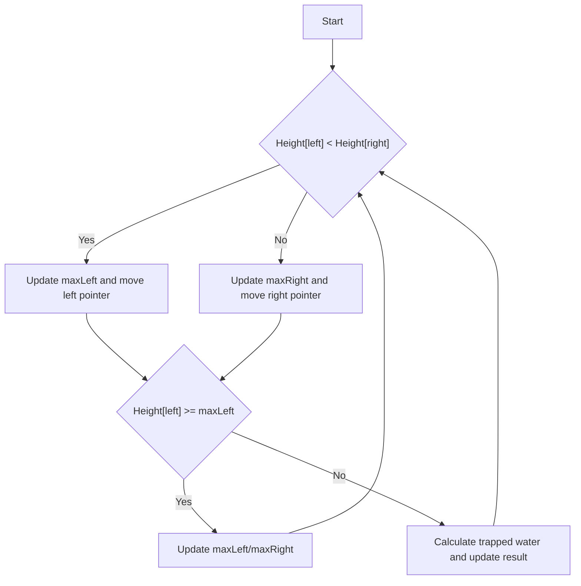

# Trapping Rain Water

## Problem Understanding
The problem of Trapping Rain Water is asking to find the total amount of rainwater that can be trapped between a series of bars of different heights. The key constraint is that the water can only be trapped if there is a bar on both the left and right sides that is higher than the current bar. The problem is non-trivial because a naive approach would be to iterate through the array and check for each bar if it can trap water, but this would result in a time complexity of O(n^2) due to the nested loops required. The problem requires a more efficient solution that can handle large inputs.

## Approach
The algorithm strategy used to solve this problem is the two-pointer technique with dynamic maximum height tracking. The intuition behind this approach is to start from both ends of the array and move towards the center, keeping track of the maximum height from both ends. By comparing the heights of the bars at the current positions of the two pointers, we can determine which pointer to move and whether to update the maximum height or calculate the trapped water. This approach works because it ensures that we always consider the maximum height from both ends when calculating the trapped water. The data structures used are simple variables to store the maximum heights and the result, which makes the space complexity O(1).

## Complexity Analysis
| Metric | Value | Detailed Reason |
|--------|-------|----------------|
| Time   | O(n)  | The algorithm makes two passes through the array, one from the left and one from the right, resulting in a linear time complexity. The while loop iterates through the array once, and the operations inside the loop take constant time. |
| Space  | O(1)  | The algorithm uses a constant amount of space to store the maximum heights from the left and right, as well as the result variable. The space used does not grow with the size of the input array. |

## Algorithm Walkthrough
```
Input: height = [0,1,0,2,1,0,1,3,2,1,2,1]
Step 1: left = 0, right = 11, maxLeft = 0, maxRight = 1, result = 0
Step 2: Since height[left] < height[right], we move the left pointer to the right.
        left = 1, maxLeft = 1, result = 0
Step 3: Since height[left] > height[right], we move the right pointer to the left.
        right = 10, maxRight = 2, result = 0
Step 4: Since height[left] < height[right], we move the left pointer to the right.
        left = 2, maxLeft = 1, result = 1 (trapped water at height[2])
Step 5: We continue this process until the left and right pointers meet.
Output: result = 6
```
This walkthrough demonstrates how the algorithm calculates the trapped water by moving the pointers and updating the maximum heights.

## Visual Flow

This flowchart illustrates the decision-making process of the algorithm, showing how the pointers are moved and the maximum heights are updated based on the comparison of the heights at the current positions.

## Key Insight
> **Tip:** The key insight is to realize that the water can only be trapped if there is a bar on both the left and right sides that is higher than the current bar, and to use the two-pointer technique to efficiently track the maximum heights from both ends.

## Edge Cases
- **Empty input**: If the input array is empty, the algorithm returns 0, as there is no water to trap.
- **Single element**: If the input array has only one element, the algorithm returns 0, as there is no water to trap.
- **All bars have the same height**: If all bars have the same height, the algorithm returns 0, as there is no water to trap.

## Common Mistakes
- **Mistake 1**: Not initializing the maximum heights correctly, leading to incorrect calculations of trapped water. To avoid this, make sure to initialize the maximum heights with the first and last elements of the array.
- **Mistake 2**: Not moving the pointers correctly, leading to infinite loops or incorrect calculations. To avoid this, make sure to move the pointers based on the comparison of the heights at the current positions.

## Interview Follow-ups
> **Interview:** These are the exact follow-up questions interviewers ask:
- "What if the input is sorted?" → The algorithm still works correctly, as it only relies on the comparison of the heights at the current positions of the pointers.
- "Can you do it in O(1) space?" → The algorithm already uses O(1) space, as it only uses a constant amount of space to store the maximum heights and the result.
- "What if there are duplicates?" → The algorithm handles duplicates correctly, as it only considers the maximum height from both ends when calculating the trapped water.

## Javascript Solution

```javascript
// Problem: Trapping Rain Water
// Language: javascript
// Difficulty: Hard
// Time Complexity: O(n) — two passes through array, one from left and one from right
// Space Complexity: O(1) — only use a constant amount of space to store the maximum heights from left and right
// Approach: Two-pointer technique with dynamic maximum height tracking — track the maximum height from both ends and calculate the trapped water

class Solution {
    /**
     * @param {number[]} height
     * @return {number}
     */
    trap(height) {
        // Edge case: empty input → return 0
        if (height.length === 0) {
            return 0;
        }

        // Initialize variables to track the maximum height from left and right
        let maxLeft = height[0]; // Maximum height from the left
        let maxRight = height[height.length - 1]; // Maximum height from the right
        let left = 0; // Left pointer
        let right = height.length - 1; // Right pointer
        let result = 0; // Result variable to store the total trapped water

        // Traverse the array from both ends
        while (left <= right) {
            // Update the maximum heights from left and right
            if (height[left] < height[right]) {
                // If the current height from the left is less than the maximum height from the left, update the result
                if (height[left] >= maxLeft) {
                    maxLeft = height[left]; // Update the maximum height from the left
                } else {
                    result += maxLeft - height[left]; // Add the trapped water to the result
                }
                left++; // Move the left pointer to the right
            } else {
                // If the current height from the right is less than the maximum height from the right, update the result
                if (height[right] >= maxRight) {
                    maxRight = height[right]; // Update the maximum height from the right
                } else {
                    result += maxRight - height[right]; // Add the trapped water to the result
                }
                right--; // Move the right pointer to the left
            }
        }

        return result; // Return the total trapped water
    }
}

// Example usage:
let solution = new Solution();
let height = [0,1,0,2,1,0,1,3,2,1,2,1];
console.log(solution.trap(height)); // Output: 6
```
