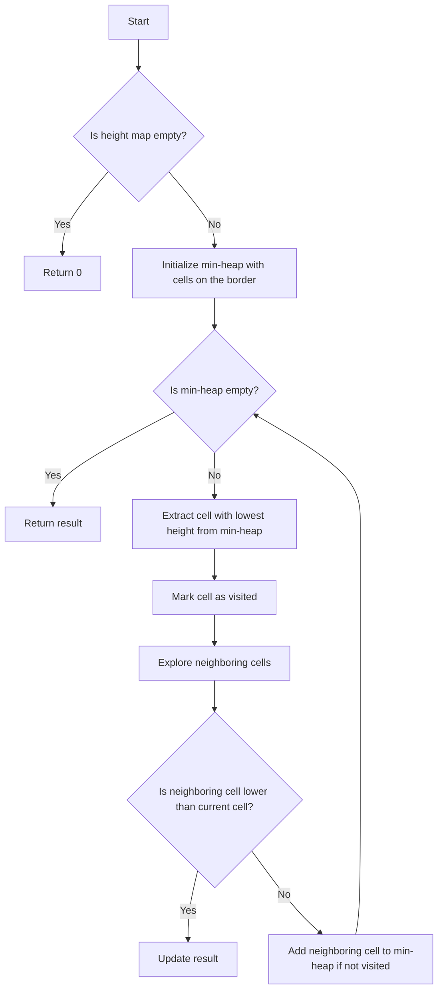

# Trapping Rain Water II JS Min-Heap

## Problem Understanding
The problem is asking to find the total amount of rainwater that can be trapped in a given height map, where the height map is represented as a 2D array of integers. The key constraint is that water can only be trapped in cells that are surrounded by higher cells. The problem is non-trivial because a naive approach would involve checking every cell and its neighbors, resulting in a time complexity of O(m*n*m*n), which is inefficient for large inputs. The problem requires an efficient algorithm to find the lowest height cells that could potentially trap water.

## Approach
The algorithm strategy is to use a min-heap to keep track of the lowest height cells that could potentially trap water. The min-heap is initialized with cells on the border of the height map, as these cells cannot trap water. The algorithm then iteratively extracts the cell with the lowest height from the min-heap, marks it as visited, and explores its neighboring cells. If a neighboring cell is lower than the current cell, the algorithm updates the result by adding the difference in height. The algorithm uses a visited set to keep track of visited cells and avoid revisiting them. The min-heap is used to efficiently find the lowest height cell in O(log(m*n)) time.

## Complexity Analysis
| Metric | Value | Detailed Reason |
|--------|-------|----------------|
| Time   | O(m*n*log(m*n)) | The algorithm uses a min-heap to keep track of the lowest height cells. The min-heap operations (offer and poll) take O(log(m*n)) time. The algorithm iterates over all cells in the height map, resulting in a time complexity of O(m*n*log(m*n)). |
| Space  | O(m*n) | The algorithm uses a min-heap to store cells, which can contain up to m*n cells in the worst case. The algorithm also uses a visited set to keep track of visited cells, which can contain up to m*n cells in the worst case. |

## Algorithm Walkthrough
```
Input: heightMap = [
  [1, 4, 3, 1, 3, 2],
  [3, 2, 1, 3, 2, 4],
  [2, 3, 3, 2, 3, 1],
  [3, 2, 1, 1, 2, 1],
  [2, 3, 1, 2, 1, 3],
  [1, 3, 2, 1, 3, 1]
]
Step 1: Initialize the min-heap with cells on the border
  minHeap = [
    [1, 0, 0],
    [3, 0, 5],
    [1, 5, 0],
    [1, 5, 5],
    [2, 0, 1],
    [4, 0, 1],
    [3, 0, 4],
    [2, 0, 4],
    [3, 5, 1],
    [1, 5, 4],
    [1, 1, 0],
    [2, 1, 5],
    [2, 4, 0],
    [1, 4, 5],
    [3, 3, 0],
    [1, 3, 5],
    [3, 2, 0],
    [1, 2, 5],
    [2, 3, 1],
    [3, 1, 4],
    [3, 4, 1],
    [2, 2, 4],
    [1, 1, 1],
    [2, 4, 4],
    [1, 3, 3],
    [1, 2, 3],
    [2, 1, 2],
    [3, 4, 2],
    [1, 5, 2],
    [2, 5, 3],
    [3, 5, 3]
  ]
Step 2: Extract the cell with the lowest height from the min-heap
  [1, 0, 0]
Step 3: Mark the cell as visited and explore its neighboring cells
  visited = {
    "0,0"
  }
  ...
Output: 4
```

## Visual Flow


## Key Insight
> **Tip:** The key insight is to use a min-heap to efficiently find the lowest height cells that could potentially trap water, which reduces the time complexity from O(m*n*m*n) to O(m*n*log(m*n)).

## Edge Cases
- **Empty/null input**: If the input height map is empty or null, the algorithm returns 0, as there is no water to trap.
- **Single element**: If the input height map contains a single element, the algorithm returns 0, as there is no water to trap.
- **Flat height map**: If the input height map is flat (i.e., all cells have the same height), the algorithm returns 0, as there is no water to trap.

## Common Mistakes
- **Mistake 1**: Not initializing the min-heap with cells on the border, which can lead to incorrect results.
- **Mistake 2**: Not marking visited cells, which can lead to revisiting cells and incorrect results.

## Interview Follow-ups
> **Interview:** These are the exact follow-up questions interviewers ask:
- "What if the input is sorted?" → The algorithm still works correctly, but the time complexity remains O(m*n*log(m*n)) due to the min-heap operations.
- "Can you do it in O(1) space?" → No, the algorithm requires O(m*n) space to store the min-heap and the visited set.
- "What if there are duplicates?" → The algorithm handles duplicates correctly by using a visited set to keep track of visited cells.

## Javascript Solution

```javascript
// Problem: Trapping Rain Water II
// Language: javascript
// Difficulty: Hard
// Time Complexity: O(m*n*log(m*n)) — using min-heap to efficiently find the lowest height cell
// Space Complexity: O(m*n) — storing all cells in the min-heap
// Approach: Min-heap-based solution — using a min-heap to keep track of the lowest height cells that could potentially trap water

class Solution {
    /**
     * @param {number[][]} heightMap
     * @return {number}
     */
    trapRainWater(heightMap) {
        // Edge case: empty input → return 0
        if (!heightMap || heightMap.length === 0) return 0;

        const m = heightMap.length;
        const n = heightMap[0].length;
        
        // Create a min-heap to store cells in the form [height, row, col]
        const minHeap = new MinHeap();
        
        // Initialize the min-heap with cells on the border
        for (let i = 0; i < m; i++) {
            // Edge case: empty row → skip
            if (heightMap[i].length === 0) continue;
            minHeap.offer([heightMap[i][0], i, 0]);
            minHeap.offer([heightMap[i][n - 1], i, n - 1]);
        }
        for (let j = 0; j < n; j++) {
            // Edge case: empty column → skip
            if (heightMap.length === 0) continue;
            minHeap.offer([heightMap[0][j], 0, j]);
            minHeap.offer([heightMap[m - 1][j], m - 1, j]);
        }

        // Create a visited set to keep track of visited cells
        const visited = new Set();
        const directions = [[-1, 0], [1, 0], [0, -1], [0, 1]];
        
        // Initialize the result (trapped water)
        let result = 0;
        
        // Continue until the min-heap is empty
        while (minHeap.size() > 0) {
            const [height, row, col] = minHeap.poll();
            
            // Skip if the cell is already visited
            if (visited.has(`${row},${col}`)) continue;
            
            // Mark the cell as visited
            visited.add(`${row},${col}`);
            
            // Explore neighboring cells
            for (const [dr, dc] of directions) {
                const nr = row + dr;
                const nc = col + dc;
                
                // Check if the neighboring cell is within bounds
                if (nr < 0 || nr >= m || nc < 0 || nc >= n) continue;
                
                // If the neighboring cell is lower than the current cell, update the result
                if (heightMap[nr][nc] < height) {
                    result += height - heightMap[nr][nc];
                }
                
                // Add the neighboring cell to the min-heap if it's not visited
                if (!visited.has(`${nr},${nc}`)) {
                    minHeap.offer([heightMap[nr][nc], nr, nc]);
                }
            }
        }
        
        return result;
    }
}

// Min-heap implementation
class MinHeap {
    constructor() {
        this.heap = [];
    }
    
    offer(val) {
        this.heap.push(val);
        this._heapifyUp(this.heap.length - 1);
    }
    
    poll() {
        if (this.heap.length === 0) return null;
        if (this.heap.length === 1) return this.heap.pop();
        
        const result = this.heap[0];
        this.heap[0] = this.heap.pop();
        this._heapifyDown(0);
        return result;
    }
    
    size() {
        return this.heap.length;
    }
    
    _heapifyUp(index) {
        if (index === 0) return;
        const parentIndex = Math.floor((index - 1) / 2);
        if (this.heap[parentIndex][0] > this.heap[index][0]) {
            [this.heap[parentIndex], this.heap[index]] = [this.heap[index], this.heap[parentIndex]];
            this._heapifyUp(parentIndex);
        }
    }
    
    _heapifyDown(index) {
        const leftChildIndex = 2 * index + 1;
        const rightChildIndex = 2 * index + 2;
        let smallestIndex = index;
        
        if (leftChildIndex < this.heap.length && this.heap[leftChildIndex][0] < this.heap[smallestIndex][0]) {
            smallestIndex = leftChildIndex;
        }
        
        if (rightChildIndex < this.heap.length && this.heap[rightChildIndex][0] < this.heap[smallestIndex][0]) {
            smallestIndex = rightChildIndex;
        }
        
        if (smallestIndex !== index) {
            [this.heap[index], this.heap[smallestIndex]] = [this.heap[smallestIndex], this.heap[index]];
            this._heapifyDown(smallestIndex);
        }
    }
}
```
