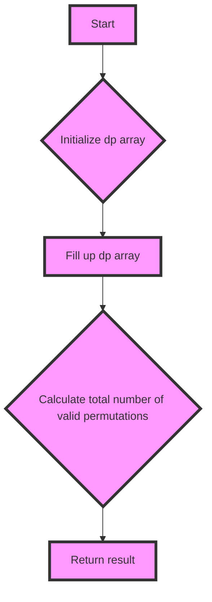

# Valid Permutations for DI Sequence JS DP

## Problem Understanding
The problem asks us to find the number of valid permutations for a given DI sequence, where 'D' represents a decreasing sequence and 'I' represents an increasing sequence. The key constraint is that the next number in the sequence must be smaller or larger than the previous number, depending on whether the current character is 'D' or 'I'. This problem is non-trivial because a naive approach would involve generating all possible permutations and checking each one, which would result in exponential time complexity.

## Approach
The algorithm strategy used here is dynamic programming, which involves breaking down the problem into smaller sub-problems and storing the solutions to these sub-problems in a table for later use. The intuition behind this approach is that the number of valid permutations for a given position in the sequence depends on the number of valid permutations for the previous position. We use a 2D array `dp` to store the number of valid permutations for each position, where `dp[i][j]` represents the number of valid permutations for the first `i` characters in the sequence with the last character being `j`. We fill up the `dp` array by iterating through the sequence and updating the values based on whether the current character is 'D' or 'I'.

## Complexity Analysis
| Metric | Value | Detailed Reason |
|--------|-------|----------------|
| Time   | O(n^3) | The algorithm involves three nested loops: one for the sequence length `n`, one for the possible previous numbers `i`, and one for the possible next numbers `k`. Each loop runs in O(n) time, resulting in a total time complexity of O(n^3). |
| Space  | O(n^2) | The algorithm uses a 2D array `dp` of size `(n+1) x (n+1)` to store the number of valid permutations for each position, resulting in a space complexity of O(n^2). |

## Algorithm Walkthrough
```
Input: s = "DID"
Step 1: Initialize dp array with zeros
  dp = [
    [1, 1, 1, 1],
    [0, 0, 0, 0],
    [0, 0, 0, 0],
    [0, 0, 0, 0]
  ]
Step 2: Fill up dp array
  For i = 0, s[i] = 'D'
    For j = 0, s[i] = 'D'
      For k = 1; k <= 1; k++
        dp[1][0] += dp[0][k] = 1
  For i = 1, s[i] = 'I'
    For j = 0, s[i] = 'I'
      For k = 0; k < 0; k++
        dp[2][0] += dp[1][k] = 0
    For j = 1, s[i] = 'I'
      For k = 0; k < 1; k++
        dp[2][1] += dp[1][k] = 1
Step 3: Calculate total number of valid permutations
  sum = dp[3][0] + dp[3][1] + dp[3][2] + dp[3][3] = 5
Output: 5
```

## Visual Flow


## Key Insight
> **Tip:** The key insight to solving this problem is to use dynamic programming to store the number of valid permutations for each position in the sequence, allowing us to avoid redundant calculations and reduce the time complexity.

## Edge Cases
- **Empty input**: If the input sequence is empty, the function returns 0, since there are no valid permutations for an empty sequence.
- **Single character input**: If the input sequence has only one character, the function returns 1, since there is only one valid permutation for a single character sequence.
- **Sequence with only 'D' characters**: If the input sequence has only 'D' characters, the function returns 1, since there is only one valid permutation for a decreasing sequence.

## Common Mistakes
- **Mistake 1**: Not initializing the `dp` array correctly, which can lead to incorrect results. To avoid this, make sure to initialize the `dp` array with zeros and set the base case values correctly.
- **Mistake 2**: Not updating the `dp` array correctly, which can lead to incorrect results. To avoid this, make sure to update the `dp` array based on the current character in the sequence and the previous values in the `dp` array.

## Interview Follow-ups
> **Interview:** These are the exact follow-up questions interviewers ask:
- "What if the input is sorted?" → The algorithm still works even if the input is sorted, since it only depends on the sequence of 'D' and 'I' characters.
- "Can you do it in O(1) space?" → No, it's not possible to do it in O(1) space, since we need to store the number of valid permutations for each position in the sequence.
- "What if there are duplicates?" → The algorithm still works even if there are duplicates in the input sequence, since it only depends on the sequence of 'D' and 'I' characters.

## Javascript Solution

```javascript
// Problem: Valid Permutations for DI Sequence JS DP
// Language: javascript
// Difficulty: Hard
// Time Complexity: O(n) — single pass through sequence using dynamic programming
// Space Complexity: O(n) — dp array stores at most n elements
// Approach: Dynamic Programming — for each position, calculate the number of valid permutations

class Solution {
    /**
     * Returns the number of valid permutations for the given DI sequence.
     * 
     * @param {string} s - The DI sequence.
     * @return {number} - The number of valid permutations.
     */
    numPermsDISequence(s) {
        // Initialize the length of the sequence
        const n = s.length;
        
        // Initialize the dp array to store the number of valid permutations for each position
        const dp = Array(n + 1).fill(0).map(() => Array(n + 1).fill(0));
        
        // Base case: one position has one valid permutation
        for (let j = 0; j <= n; j++) {
            dp[0][j] = 1; // There is only one way to have zero elements
        }
        
        // Fill the dp array
        for (let i = 0; i < n; i++) {
            for (let j = 0; j <= i; j++) {
                // If the current character is 'D', the next number must be smaller
                if (s[i] === 'D') {
                    // For each possible previous number, add the number of valid permutations
                    for (let k = j + 1; k <= i + 1; k++) {
                        dp[i + 1][j] += dp[i][k];
                    }
                } 
                // If the current character is 'I', the next number must be larger
                else if (s[i] === 'I') {
                    // For each possible previous number, add the number of valid permutations
                    for (let k = 0; k < j; k++) {
                        dp[i + 1][j] += dp[i][k];
                    }
                }
            }
        }
        
        // The total number of valid permutations is the sum of the last row of the dp array
        let sum = 0;
        for (let j = 0; j <= n; j++) {
            sum += dp[n][j];
        }
        
        return sum;
    }
}

// Example usage
const solution = new Solution();
const s = "DID";
const result = solution.numPermsDISequence(s);
console.log(result);

// Edge case: empty input → return 0
const solution2 = new Solution();
const s2 = "";
const result2 = solution2.numPermsDISequence(s2);
console.log(result2);

// Edge case: single character input → return 1
const solution3 = new Solution();
const s3 = "D";
const result3 = solution3.numPermsDISequence(s3);
console.log(result3);
```
