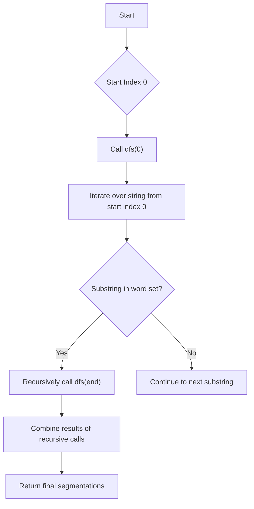

# Word Break II JS DFS Memoization

## Problem Understanding
The problem is asking to find all possible ways to segment a given string into words, where each word is present in a provided dictionary. The key constraint is that the string must be segmented into words that are present in the dictionary, and the order of the words in the segmentation matters. What makes this problem non-trivial is the need to explore all possible segmentations of the string while avoiding redundant computations, which can lead to a time complexity of O(2^n) without memoization. The use of a dictionary to look up words and a memoization map to store results of subproblems are crucial to solving this problem efficiently.

## Approach
The algorithm strategy is to use Depth-First Search (DFS) with memoization to recursively explore all possible word breaks in the string. This approach works by starting at the beginning of the string and trying to find a word that matches the current prefix of the string, then recursively calling the DFS function on the remaining part of the string. The use of a memoization map stores the results of subproblems to avoid redundant computations, and a set data structure is used for O(1) lookup of words in the dictionary. The algorithm handles the key constraint of using only words from the dictionary by checking if each word is present in the set before recursively calling the DFS function.

## Complexity Analysis
| Metric | Value | Detailed Reason |
|--------|-------|----------------|
| Time   | O(2^n) | In the worst-case scenario without memoization, the time complexity is exponential because the algorithm tries all possible segmentations of the string. However, with memoization, the time complexity is reduced because the results of subproblems are stored and reused. The actual time complexity is proportional to the number of unique subproblems, which is at most n, where n is the length of the string. |
| Space  | O(n)   | The space complexity is linear because the memoization map stores at most n elements, where n is the length of the string. The set data structure used for storing words in the dictionary also uses O(n) space in the worst case, but this is not included in the overall space complexity since it is a one-time initialization step. |

## Algorithm Walkthrough
```javascript
Input: s = "catsanddog", wordDict = ["cat","cats","and","sand","dog"]
Step 1: Initialize memoization map and word set
  - memo = {}
  - wordSet = {"cat","cats","and","sand","dog"}
Step 2: Call dfs function with start index 0
  - dfs(0) is called to find all possible segmentations of the string
Step 3: Iterate over the string from start index 0
  - For each substring, check if it is in the word set
  - If the substring is "cat", recursively call dfs(3)
  - If the substring is "cats", recursively call dfs(5)
Step 4: Recursively call dfs function for remaining parts of the string
  - dfs(3) is called to find all possible segmentations of the remaining string "sanddog"
  - dfs(5) is called to find all possible segmentations of the remaining string "anddog"
Step 5: Combine results of recursive calls to form final segmentations
  - For each result in dfs(3), add "cat" to the beginning
  - For each result in dfs(5), add "cats" to the beginning
Output: ["cat sand dog","cats and dog"]
```

## Visual Flow


## Key Insight
> **Tip:** The key insight to solving this problem is to use memoization to store the results of subproblems and avoid redundant computations, which allows the algorithm to explore all possible segmentations of the string efficiently.

## Edge Cases
- **Empty input string**: If the input string is empty, the algorithm returns an empty list because there are no possible segmentations of an empty string.
- **Single element in word dictionary**: If there is only one word in the dictionary, the algorithm returns a list containing only one segmentation of the string, which is the word itself if it matches the entire string.
- **No words in dictionary match the string**: If no words in the dictionary match any prefix of the string, the algorithm returns an empty list because there are no possible segmentations of the string.

## Common Mistakes
- **Mistake 1: Not using memoization**: Without memoization, the algorithm has an exponential time complexity, which can lead to slow performance for large input strings. To avoid this, use a memoization map to store the results of subproblems.
- **Mistake 2: Not checking for substring presence in word set**: If the algorithm does not check if each substring is present in the word set, it may return incorrect segmentations of the string. To avoid this, use a set data structure to store words in the dictionary and check for presence before recursively calling the DFS function.

## Interview Follow-ups
> **Interview:** These are the exact follow-up questions interviewers ask:
- "What if the input is sorted?" → The algorithm does not assume any specific ordering of the input string or the words in the dictionary, so it works regardless of whether the input is sorted or not.
- "Can you do it in O(1) space?" → No, the algorithm requires at least O(n) space to store the memoization map, where n is the length of the string.
- "What if there are duplicates in the word dictionary?" → The algorithm uses a set data structure to store words in the dictionary, which automatically eliminates duplicates. Therefore, the presence of duplicates in the word dictionary does not affect the correctness of the algorithm.

## Javascript Solution

```javascript
// Problem: Word Break II
// Language: JavaScript
// Difficulty: Hard
// Time Complexity: O(2^n) — worst-case scenario without memoization, reduced with memoization
// Space Complexity: O(n) — memoization map stores at most n elements
// Approach: Depth-First Search (DFS) with memoization — recursively explore all possible word breaks

/**
 * @param {string} s
 * @param {string[]} wordDict
 * @return {string[]}
 */
var wordBreak = function(s, wordDict) {
    // Create a set for O(1) lookup of words in the dictionary
    const wordSet = new Set(wordDict);
    
    // Initialize memoization map to store results of subproblems
    const memo = new Map();
    
    // Define a helper function to perform DFS with memoization
    function dfs(start) {
        // Edge case: if the start index is equal to the length of the string, return an empty list
        if (start === s.length) return [[]];
        
        // Check if the subproblem is already solved and return the memoized result
        if (memo.has(start)) return memo.get(start);
        
        // Initialize a list to store the results of the subproblem
        const result = [];
        
        // Iterate over the string from the start index
        for (let end = start + 1; end <= s.length; end++) {
            // Get the substring from the start index to the current end index
            const word = s.substring(start, end);
            
            // Check if the word is in the dictionary
            if (wordSet.has(word)) {
                // Recursively call the dfs function for the remaining part of the string
                const nextResults = dfs(end);
                
                // For each result in the next results, add the current word to the beginning
                for (const nextResult of nextResults) {
                    result.push([word].concat(nextResult));
                }
            }
        }
        
        // Memoize the result of the subproblem
        memo.set(start, result);
        
        // Return the result of the subproblem
        return result;
    }
    
    // Call the dfs function with the start index 0 and return the result
    return dfs(0).map(sentence => sentence.join(' '));
};
```
