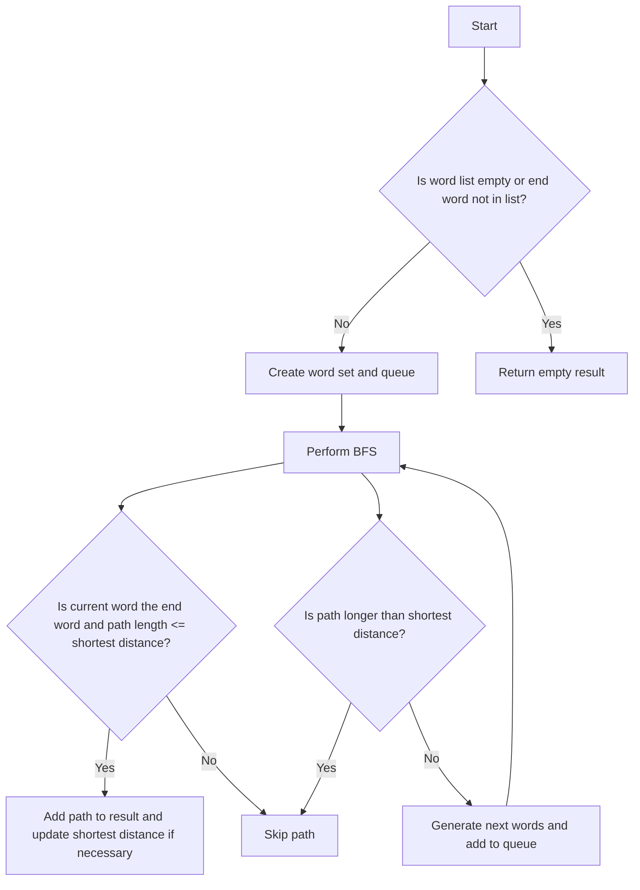

# Word Ladder II JS BFS + DFS

## Problem Understanding
The problem is asking to find all the shortest possible paths from a given `beginWord` to an `endWord` using a list of words, where each step in the path is a word that differs from the previous word by only one character. The key constraint is that each word in the path must be present in the given word list. This problem is non-trivial because a naive approach would involve generating all possible paths and checking their lengths, which would result in an exponential time complexity. The problem becomes more challenging due to the need to find all shortest paths, not just one, and the requirement to handle a large word list efficiently.

## Approach
The algorithm strategy used here is a combination of Breadth-First Search (BFS) and Depth-First Search (DFS). BFS is used to explore the graph of words level by level, starting from the `beginWord`, and DFS is implicitly used within the BFS to find all possible next words by changing one character at a time. The approach works by maintaining a queue of words to visit and a set of visited words to avoid revisiting them. For each word, it generates all possible next words by replacing each character with all 26 letters of the alphabet and checks if the new word is in the word list and has not been visited. The data structure used is a queue to store the current word and the path to it, a set for O(1) lookup of words in the word list, and a set to store visited words.

## Complexity Analysis
| Metric | Value | Detailed Reason |
|--------|-------|----------------|
| Time   | O(N * M * 26) | The time complexity is O(N * M * 26) where N is the number of words and M is the length of each word. This is because for each word, we are trying all possible changes for each character (26 possibilities for each of the M characters), and we are doing this for each of the N words. |
| Space  | O(N * M) | The space complexity is O(N * M) for storing the result and the queue. In the worst case, the queue can contain all words, and each word can be of length M. |

## Algorithm Walkthrough
```
Input: 
beginWord = "hit"
endWord = "cog"
wordList = ["hot", "dot", "dog", "lot", "log", "cog"]

Step 1: 
- Queue = [["hit", ["hit"]]]
- Visited = set()
- Result = []
- ShortestDistance = Infinity

Step 2: 
- Dequeue ["hit", ["hit"]]
- Generate next words for "hit": "hot"
- Queue = [["hot", ["hit", "hot"]]]
- Visited = {"hit"}

Step 3: 
- Dequeue ["hot", ["hit", "hot"]]
- Generate next words for "hot": "dot", "lot"
- Queue = [["dot", ["hit", "hot", "dot"]], ["lot", ["hit", "hot", "lot"]]]
- Visited = {"hit", "hot"}

...

Output: 
[["hit","hot","dot","dog","cog"],["hit","hot","lot","log","cog"]]
```

## Visual Flow


## Key Insight
> **Tip:** The key insight to solve this problem efficiently is to use BFS to explore the graph level by level, ensuring that we find the shortest paths first, and then use the generated next words to continue the search, avoiding revisiting words to prevent infinite loops.

## Edge Cases
- **Empty/null input**: If the word list is empty or null, the function should return an empty result because there are no words to form a ladder.
- **Single element**: If the word list contains only one word, which is not the end word, the function should return an empty result because there's no path to the end word.
- **No path to end word**: If there is no possible path from the begin word to the end word, the function should return an empty result.

## Common Mistakes
- **Mistake 1**: Not checking if the generated next word is in the word list before adding it to the queue, which can lead to exploring words outside the given list.
- **Mistake 2**: Not keeping track of visited words, resulting in revisiting the same words and potentially entering an infinite loop.

## Interview Follow-ups
> **Interview:** 
- "What if the input is sorted?" → The algorithm does not rely on the input being sorted, so it would still work correctly.
- "Can you do it in O(1) space?" → No, because we need to store the queue and the result, which requires more than constant space.
- "What if there are duplicates?" → The algorithm handles duplicates by checking if a word has been visited before generating its next words, preventing it from revisiting the same word.

## Javascript Solution

```javascript
// Problem: Word Ladder II
// Language: javascript
// Difficulty: Hard
// Time Complexity: O(N * M * 26) — where N is the number of words and M is the length of each word, as we are trying all possible changes for each character
// Space Complexity: O(N * M) — for storing the result and the queue
// Approach: BFS + DFS — using BFS to explore the graph and DFS to find all possible paths

class Solution {
    /**
     * @param {string} beginWord
     * @param {string} endWord
     * @param {string[]} wordList
     * @return {string[][]}
     */
    findLadders(beginWord, endWord, wordList) {
        // Edge case: empty word list or end word is not in the word list
        if (!wordList.includes(endWord)) return [];

        // Create a set for O(1) lookup
        const wordSet = new Set(wordList);

        // Create a queue for BFS, storing the current word and the path to it
        const queue = [[beginWord, [beginWord]]];

        // Create a set to store the visited words
        const visited = new Set();

        // Create a variable to store the result
        let result = [];

        // Create a variable to store the shortest distance
        let shortestDistance = Infinity;

        // Perform BFS
        while (queue.length > 0) {
            // Get the current word and the path to it
            const [currentWord, path] = queue.shift();

            // If the current word is the end word and the path is shorter than or equal to the shortest distance, add it to the result
            if (currentWord === endWord && path.length <= shortestDistance) {
                // If the path is shorter than the shortest distance, reset the result and update the shortest distance
                if (path.length < shortestDistance) {
                    result = [path];
                    shortestDistance = path.length;
                } else {
                    // If the path is equal to the shortest distance, add it to the result
                    result.push(path);
                }
            }

            // If the path is longer than the shortest distance, skip it
            if (path.length > shortestDistance) continue;

            // Mark the current word as visited
            visited.add(currentWord);

            // Generate all possible next words
            for (let i = 0; i < currentWord.length; i++) {
                for (let j = 0; j < 26; j++) {
                    // Create a new word by replacing the character at position i with the jth letter of the alphabet
                    const newWord = currentWord.slice(0, i) + String.fromCharCode(97 + j) + currentWord.slice(i + 1);

                    // If the new word is in the word set and has not been visited, add it to the queue
                    if (wordSet.has(newWord) && !visited.has(newWord)) {
                        queue.push([newWord, [...path, newWord]]);
                    }
                }
            }
        }

        return result;
    }
}

// Example usage:
const solution = new Solution();
const beginWord = "hit";
const endWord = "cog";
const wordList = ["hot", "dot", "dog", "lot", "log", "cog"];
const result = solution.findLadders(beginWord, endWord, wordList);
```
