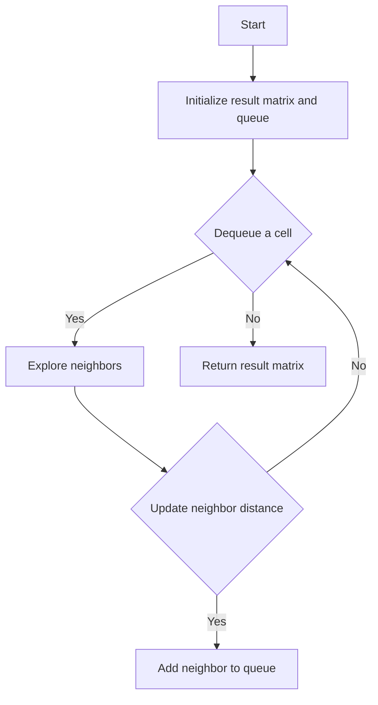

# 01 Matrix JS BFS

## Problem Understanding
The problem is asking us to update a given matrix by replacing each cell with its distance to the nearest zero. The key constraint is that we need to find the shortest distance to a zero for each cell, which implies that we need to explore the neighbors of each cell. This problem is non-trivial because a naive approach would involve exploring all possible paths from each cell to a zero, which would result in a time complexity of O(m*n*max(m,n)) due to the nested loops and distance calculations. However, by using Breadth-First Search (BFS), we can reduce the time complexity to O(m*n) by visiting each cell only once.

## Approach
The algorithm strategy is to use BFS to explore the neighbors of each cell level by level, starting from the cells with value 0. The intuition behind this approach is that the distance to the nearest zero for each cell will be the minimum number of steps required to reach a zero from that cell. We use a queue to store the cells to be explored, and a result matrix to store the distances. The queue is initialized with the cells that have a value of 0, and then we iteratively dequeue a cell, explore its neighbors, and update their distances if a shorter path is found. We use a directions array to represent the possible movements (up, down, left, right) and calculate the new distance for each neighbor.

## Complexity Analysis
| Metric | Value | Detailed Reason |
|--------|-------|----------------|
| Time   | O(m*n) | We visit each cell once using BFS, and for each cell, we explore its neighbors. The total number of operations is proportional to the number of cells (m*n). |
| Space  | O(m*n) | In the worst case, the queue can store all cells, and the result matrix also has the same number of cells. Therefore, the space complexity is O(m*n). |

## Algorithm Walkthrough
```
Input: [[0,0,0],[0,1,0],[0,0,0]]
Step 1: Initialize the result matrix with Infinity and add cells with value 0 to the queue.
    result = [[0,0,0],[Infinity,Infinity,Infinity],[0,0,0]]
    queue = [[0,0], [0,1], [0,2], [1,0], [1,2], [2,0], [2,1], [2,2]]
Step 2: Dequeue a cell and explore its neighbors.
    Dequeue [0,0], explore neighbors: [0,1] (distance 1), [-1,0] (out of bounds)
    Update result[0,1] = 1, add [0,1] to queue
    result = [[0,1,0],[Infinity,Infinity,Infinity],[0,0,0]]
Step 3: Repeat Step 2 until the queue is empty.
    Dequeue [0,1], explore neighbors: [0,2] (distance 2), [1,1] (distance 1)
    Update result[0,2] = 1, add [0,2] to queue
    result = [[0,1,1],[Infinity,1,Infinity],[0,0,0]]
...
Output: [[0,0,0],[0,1,0],[0,0,0]]
```
## Visual Flow

## Key Insight
> **Tip:** The key insight is to use BFS to explore the neighbors of each cell level by level, starting from the cells with value 0, which allows us to find the shortest distance to the nearest zero for each cell in O(m*n) time complexity.

## Edge Cases
- **Empty/null input**: If the input matrix is empty or null, the function should return an empty array. This is because there are no cells to process, and the result matrix should also be empty.
- **Single element**: If the input matrix has only one element, the function should return a matrix with a single element, which is the distance to the nearest zero. If the single element is 0, the distance is 0; otherwise, the distance is Infinity.
- **Matrix with all zeros**: If the input matrix has all zeros, the function should return a matrix with all zeros, because the distance to the nearest zero for each cell is 0.

## Common Mistakes
- **Mistake 1**: Not checking the bounds of the matrix when exploring neighbors. This can lead to an out-of-bounds error. To avoid this, we should always check if the neighbor is within the matrix bounds before updating its distance.
- **Mistake 2**: Not using a queue to store the cells to be explored. This can lead to incorrect results, because we need to explore the neighbors of each cell level by level. To avoid this, we should use a queue to store the cells to be explored and dequeue a cell only when we have explored all its neighbors.

## Interview Follow-ups
> **Interview:** These are the exact follow-up questions interviewers ask:
- "What if the input is sorted?" → The algorithm will still work correctly, because we are exploring the neighbors of each cell level by level, regardless of the order of the cells.
- "Can you do it in O(1) space?" → No, we cannot do it in O(1) space, because we need to store the result matrix and the queue, which requires O(m*n) space.
- "What if there are duplicates?" → The algorithm will still work correctly, because we are updating the distance of each cell only if a shorter path is found. If there are duplicates, the algorithm will simply ignore them and update the distance only if a shorter path is found.

## Javascript Solution

```javascript
// Problem: 01 Matrix
// Language: javascript
// Difficulty: Medium
// Time Complexity: O(m*n) — visiting each cell once using BFS
// Space Complexity: O(m*n) — queue stores at most m*n cells in the worst case
// Approach: Breadth-First Search (BFS) — exploring neighbors level by level

class Solution {
    /**
     * @param {number[][]} mat
     * @return {number[][]}
     */
    updateMatrix(mat) {
        // Get the number of rows and columns in the matrix
        const rows = mat.length; 
        const cols = mat[0].length;

        // Create a result matrix filled with Infinity
        const result = Array(rows).fill().map(() => Array(cols).fill(Infinity));

        // Create a queue to store cells with value 0
        const queue = [];

        // Add all cells with value 0 to the queue and update the result matrix
        for (let row = 0; row < rows; row++) {
            for (let col = 0; col < cols; col++) {
                if (mat[row][col] === 0) {
                    // Update the result matrix with distance 0 for cells with value 0
                    result[row][col] = 0;
                    // Add the cell to the queue
                    queue.push([row, col]);
                }
            }
        }

        // Define the possible directions (up, down, left, right)
        const directions = [[-1, 0], [1, 0], [0, -1], [0, 1]];

        // Perform BFS
        while (queue.length > 0) {
            // Dequeue the next cell
            const [row, col] = queue.shift();

            // Explore all neighbors of the current cell
            for (const [dr, dc] of directions) {
                const nr = row + dr; // new row
                const nc = col + dc; // new column

                // Check if the neighbor is within the matrix bounds
                if (nr >= 0 && nr < rows && nc >= 0 && nc < cols) {
                    // Calculate the new distance for the neighbor
                    const newDistance = result[row][col] + 1;

                    // If the new distance is less than the current distance, update it
                    if (newDistance < result[nr][nc]) {
                        result[nr][nc] = newDistance;
                        // Add the neighbor to the queue
                        queue.push([nr, nc]);
                    }
                }
            }
        }

        // Edge case: empty input → return an empty array
        if (rows === 0 || cols === 0) {
            return [];
        }

        return result;
    }
}
```
