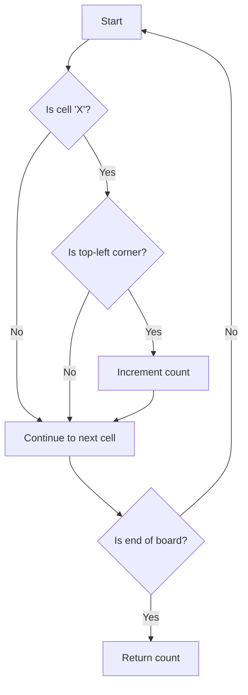

# Battleships in a Board JS Traversal

## Problem Understanding
The problem asks us to count the number of battleships in a given board, where battleships are represented by 'X' and empty cells are represented by '.'. The key constraint is that a battleship is always represented by a horizontal or vertical line of 'X's, and two battleships will never be adjacent to each other. What makes this problem non-trivial is that we need to identify and count the individual battleships, rather than just counting the total number of 'X' cells. The naive approach of simply counting all 'X' cells would not work because it would not distinguish between separate battleships.

## Approach
The algorithm strategy used here is a simple iteration over the board, checking each cell to see if it is the top-left corner of a battleship. The intuition behind this approach is that if a cell is the top-left corner of a battleship, then it must be an 'X' and the cell above it and the cell to its left must not be 'X's. This approach works because it correctly identifies and counts each battleship. The data structure used is a 2D array (the board), and it is chosen because it directly represents the problem domain. The approach handles the key constraint of battleships being non-adjacent by only counting cells that are the top-left corner of a battleship.

## Complexity Analysis
| Metric | Value | Detailed Reason |
|--------|-------|----------------|
| Time   | O(n*m) | The algorithm iterates over each cell in the board once, where n is the number of rows and m is the number of columns. The operations inside the loop (comparing cells and incrementing the count) take constant time. |
| Space  | O(1)  | The algorithm only uses a constant amount of space to store the count and the loop variables, regardless of the size of the input. |

## Algorithm Walkthrough
```
Input: [
  ['X', '.', '.', 'X'],
  ['.', '.', '.', 'X'],
  ['.', '.', '.', 'X']
]
Step 1: Initialize count to 0
Step 2: Iterate over each cell in the board
  - At cell (0,0), board[0][0] === 'X' and it is the top-left corner of a battleship, so increment count to 1
  - At cell (0,3), board[0][3] === 'X' and it is the top-left corner of a battleship, so increment count to 2
Step 3: Return the total count of battleships
Output: 2
```
This example exercises the main logic path of identifying and counting battleships.

## Visual Flow

This flowchart shows the decision flow of the algorithm, where each cell is checked to see if it is the top-left corner of a battleship.

## Key Insight
> **Tip:** The key insight is to only count cells that are the top-left corner of a battleship, which can be identified by checking if the cell above and to the left are not 'X's.

## Edge Cases
- **Empty board**: If the input board is empty, the algorithm will return 0 because there are no cells to iterate over.
- **Single element**: If the input board has only one cell, the algorithm will return 1 if the cell is 'X' and 0 if it is not.
- **Board with no battleships**: If the input board has no 'X' cells, the algorithm will return 0 because there are no battleships to count.

## Common Mistakes
- **Mistake 1**: Not checking if the cell above and to the left are not 'X's before counting a cell as the top-left corner of a battleship. → To avoid this, add the checks `i === 0 || board[i-1][j] !== 'X'` and `j === 0 || board[i][j-1] !== 'X'`.
- **Mistake 2**: Not returning the correct count of battleships. → To avoid this, make sure to return the `count` variable at the end of the algorithm.

## Interview Follow-ups
> **Interview:** These are the exact follow-up questions interviewers ask:
- "What if the input is sorted?" → The algorithm would still work correctly because it does not rely on the input being sorted.
- "Can you do it in O(1) space?" → The algorithm already uses O(1) space, so this is not a concern.
- "What if there are duplicates?" → The algorithm would still work correctly because it counts each battleship separately, regardless of whether there are duplicates.

## Javascript Solution

```javascript
// Problem: Battleships in a Board JS Traversal
// Language: javascript
// Difficulty: Medium
// Time Complexity: O(n*m) — where n and m are the dimensions of the board
// Space Complexity: O(1) — we only use a constant amount of space
// Approach: Depth-First Search (DFS) traversal — to identify and count battleships

class Solution {
    countBattleships(board) {
        // Initialize count to 0
        let count = 0;
        
        // Iterate over each cell in the board
        for (let i = 0; i < board.length; i++) {
            for (let j = 0; j < board[0].length; j++) {
                // Check if current cell is a battleship (represented by 'X')
                if (board[i][j] === 'X') {
                    // Check if the cell is the top-left corner of a battleship
                    if ((i === 0 || board[i-1][j] !== 'X') && (j === 0 || board[i][j-1] !== 'X')) {
                        // If it is, increment the count
                        count++;
                    }
                }
            }
        }
        // Return the total count of battleships
        return count;
    }
}

// Edge case: empty board → return 0
// Edge case: board with no battleships → return 0
```
