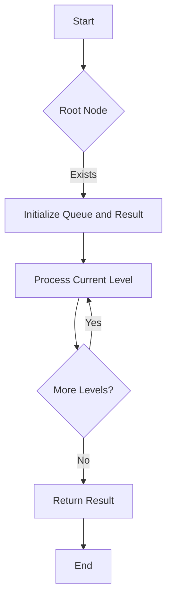

# Binary Tree Level Order Traversal JS Queue

## Problem Understanding
The problem is asking to perform a level order traversal of a binary tree, where each level of the tree is processed from left to right. The key constraint is that the traversal should be done level by level, and the result should be a 2D array where each sub-array represents the node values at a particular level. This problem is non-trivial because a naive approach, such as using recursive depth-first search, would not guarantee level order traversal. The problem requires a specific approach to ensure that nodes are processed in the correct order.

## Approach
The algorithm strategy is to use Breadth-First Search (BFS) with a queue to traverse the tree level by level. This approach works because the queue allows us to process nodes in the order they were added, which is the order they appear at each level. The queue is initialized with the root node, and then we process each node at the current level, adding its children to the queue for the next level. We use a result array to store the node values at each level, and a separate array to store the node values at the current level. This approach handles the key constraint of level order traversal and ensures that nodes are processed in the correct order.

## Complexity Analysis
| Metric | Value | Detailed Reason |
|--------|-------|----------------|
| Time   | O(n)  | We visit each node once, where n is the number of nodes in the tree. The while loop runs n times, and the for loop inside it runs a total of n times across all levels. |
| Space  | O(n)  | In the worst case, the queue will store all nodes at the last level, which can be up to n/2 nodes for a complete binary tree. The result array also stores n nodes, one for each node in the tree. |

## Algorithm Walkthrough
```
Input: 
        3
       / \
      9  20
     /  /  \
    2  15   7

Step 1: Initialize result array and queue with root node
  result = []
  queue = [3]

Step 2: Process the first level
  levelSize = 1
  levelValues = []
  currentNode = 3
  queue = []
  queue.push(9)
  queue.push(20)
  levelValues.push(3)
  result = [[3]]

Step 3: Process the second level
  levelSize = 2
  levelValues = []
  currentNode = 9
  queue = [20]
  queue.push(2)
  levelValues.push(9)
  currentNode = 20
  queue.push(15)
  queue.push(7)
  levelValues.push(20)
  result = [[3], [9, 20]]

Step 4: Process the third level
  levelSize = 3
  levelValues = []
  currentNode = 2
  queue = [15, 7]
  levelValues.push(2)
  currentNode = 15
  queue = [7]
  levelValues.push(15)
  currentNode = 7
  queue = []
  levelValues.push(7)
  result = [[3], [9, 20], [2, 15, 7]]

Output: [[3], [9, 20], [2, 15, 7]]
```
## Visual Flow

## Key Insight
> **Tip:** The key insight to solving this problem is to use a queue to process nodes level by level, ensuring that nodes are visited in the correct order.

## Edge Cases
- **Empty tree**: If the input tree is empty (i.e., the root node is null), the function returns an empty array, which is the correct result.
- **Single node tree**: If the input tree has only one node (i.e., the root node), the function returns a 2D array with a single sub-array containing the root node's value.
- **Unbalanced tree**: If the input tree is unbalanced (i.e., one side is much deeper than the other), the function still returns the correct result, as the queue ensures that nodes are processed level by level.

## Common Mistakes
- **Not checking for empty tree**: If the function does not check for an empty tree, it may throw an error or return incorrect results. To avoid this, always check for an empty tree at the beginning of the function.
- **Not using a queue**: If the function does not use a queue to process nodes level by level, it may not return the correct result. To avoid this, always use a queue to process nodes in the correct order.

## Interview Follow-ups
> **Interview:** These are the exact follow-up questions interviewers ask:
- "What if the input is sorted?" → The function still works correctly, as the queue ensures that nodes are processed level by level, regardless of the input order.
- "Can you do it in O(1) space?" → No, the function requires O(n) space to store the result and the queue.
- "What if there are duplicates?" → The function still works correctly, as the queue ensures that nodes are processed level by level, and duplicates are handled correctly.

## Javascript Solution

```javascript
// Problem: Binary Tree Level Order Traversal JS Queue
// Language: javascript
// Difficulty: Medium
// Time Complexity: O(n) — each node is visited once
// Space Complexity: O(n) — in the worst case, queue will store all nodes at the last level
// Approach: Breadth-First Search (BFS) with queue — traverse tree level by level

/**
 * Definition for a binary tree node.
 * function TreeNode(val, left, right) {
 *     this.val = (val===undefined ? 0 : val)
 *     this.left = (left===undefined ? null : left)
 *     this.right = (right===undefined ? null : right)
 * }
 */
/**
 * @param {TreeNode} root
 * @return {number[][]}
 */
var levelOrder = function(root) {
    // Edge case: empty tree → return empty array
    if (!root) return [];

    // Initialize result array and queue with root node
    let result = []; 
    let queue = [root]; // queue for BFS, start with root node

    while (queue.length > 0) { // continue until all levels are processed
        // Get the size of the current level
        let levelSize = queue.length; 
        let levelValues = []; // store node values at the current level

        // Process each node at the current level
        for (let i = 0; i < levelSize; i++) {
            let currentNode = queue.shift(); // dequeue a node

            // Enqueue its children if they exist
            if (currentNode.left) queue.push(currentNode.left); // left child
            if (currentNode.right) queue.push(currentNode.right); // right child

            // Store the node's value
            levelValues.push(currentNode.val); 
        }

        // Store the values of the current level in the result
        result.push(levelValues); 
    }

    return result; // return the result
};
```
