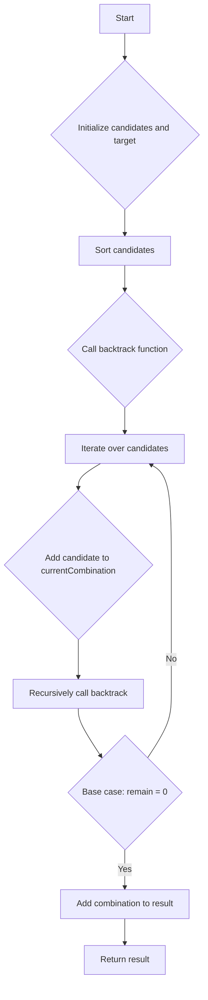

# Combination Sum JS Backtracking

## Problem Understanding
The Combination Sum problem is asking to find all unique combinations in a given array of candidates that sum up to a specified target. The key constraints are that each candidate can be used unlimited times, and the combinations should not contain duplicate subsets. What makes this problem non-trivial is the need to efficiently explore all possible combinations while avoiding duplicates and excessive computation. The naive approach would involve trying all possible combinations, but this would lead to exponential time complexity and inefficiency.

## Approach
The algorithm strategy employed here is backtracking, which involves recursively trying all possible combinations of candidates to reach the target. The intuition behind this approach is to start with an initial combination and then iteratively add or remove candidates to explore new combinations. The backtracking function uses a recursive approach to try adding each candidate to the current combination and then recursively calls itself with the updated remaining sum. The candidates are sorted in ascending order to facilitate efficient backtracking. The result is stored in a separate array, and the current combination is stored in another array to keep track of the current exploration path.

## Complexity Analysis
| Metric | Value | Detailed Reason |
|--------|-------|----------------|
| Time   | O(N^(T/M) + 1) | The time complexity is determined by the number of recursive calls made by the backtracking function. In the worst-case scenario, the function makes N^(T/M) + 1 recursive calls, where N is the number of candidates, T is the target, and M is the minimum candidate value. The additional 1 accounts for the base case when the remaining sum is 0. |
| Space  | O(T/M) | The space complexity is determined by the maximum recursion depth and the space used by the result. The maximum recursion depth is T/M, where T is the target and M is the minimum candidate value. The space used by the result is also proportional to the number of combinations found, which can be up to T/M in the worst case. |

## Algorithm Walkthrough
```
Input: candidates = [2, 3, 5], target = 8
Step 1: Sort candidates in ascending order: [2, 3, 5]
Step 2: Initialize result and currentCombination arrays: [], []
Step 3: Call backtrack function with target = 8 and start = 0
Step 4: In backtrack function:
  - remain = 8, start = 0
  - Iterate over candidates: [2, 3, 5]
  - Add 2 to currentCombination: [2]
  - Recursively call backtrack with remain = 6 and start = 0
  - ...
Step 5: Continue recursive calls until remain = 0:
  - [2, 2, 2, 2]
  - [2, 3, 3]
  - [3, 5]
Step 6: Add valid combinations to result array: [[2, 2, 2, 2], [2, 3, 3], [3, 5]]
Output: [[2, 2, 2, 2], [2, 3, 3], [3, 5]]
```
## Visual Flow

## Key Insight
> **Tip:** The key insight to solving this problem is to use a recursive backtracking approach, sorting the candidates in ascending order to facilitate efficient exploration of combinations.

## Edge Cases
- **Empty/null input**: If the input array is empty or null, the function returns an empty result array.
- **Single element**: If the input array contains a single element, the function returns a result array containing a single combination if the single element equals the target.
- **Duplicate candidates**: The function handles duplicate candidates by treating them as separate elements, ensuring that duplicate combinations are not added to the result.

## Common Mistakes
- **Mistake 1**: Not sorting the candidates in ascending order, leading to inefficient exploration of combinations.
- **Mistake 2**: Not using a recursive backtracking approach, resulting in excessive computation or failure to find all combinations.

## Interview Follow-ups
> **Interview:** These are the exact follow-up questions interviewers ask:
- "What if the input is sorted?" → The function still works correctly, but the sorting step is unnecessary.
- "Can you do it in O(1) space?" → No, the function requires at least O(T/M) space to store the recursion stack and the result.
- "What if there are duplicates in the input array?" → The function treats duplicate candidates as separate elements, ensuring that duplicate combinations are not added to the result.

## Javascript Solution

```javascript
// Problem: Combination Sum
// Language: javascript
// Difficulty: Medium
// Time Complexity: O(N^(T/M) + 1) — where N is the number of candidates, T is the target, and M is the minimum candidate value
// Space Complexity: O(T/M) — maximum recursion depth and space used by the result
// Approach: Backtracking — recursively try all possible combinations of candidates to reach the target

/**
 * @param {number[]} candidates
 * @param {number} target
 * @return {number[][]}
 */
var combinationSum = function(candidates, target) {
    // Edge case: empty input → return empty result
    if (!candidates || candidates.length === 0) return [];

    // Sort candidates in ascending order for easier backtracking
    candidates.sort((a, b) => a - b); // Ascending order for efficient backtracking

    const result = []; // Store all combinations that sum up to the target
    const currentCombination = []; // Store the current combination being explored

    // Define the recursive backtracking function
    function backtrack(remain, start) {
        // Base case: if the remaining sum is 0, it means we've found a valid combination
        if (remain === 0) {
            result.push([...currentCombination]); // Add the current combination to the result
            return;
        }

        // Iterate over the candidates starting from the current start index
        for (let i = start; i < candidates.length; i++) {
            // Edge case: if the current candidate exceeds the remaining sum, break the loop
            if (candidates[i] > remain) break; // No need to continue with larger candidates

            // Add the current candidate to the current combination
            currentCombination.push(candidates[i]); // Try adding the current candidate

            // Recursively call the backtrack function with the updated remaining sum and start index
            backtrack(remain - candidates[i], i); // Explore the next combination with the same candidate

            // Backtrack by removing the last added candidate from the current combination
            currentCombination.pop(); // Remove the last added candidate for the next iteration
        }
    }

    // Start the backtracking process with the initial remaining sum and start index
    backtrack(target, 0);

    return result; // Return all combinations that sum up to the target
};
```
