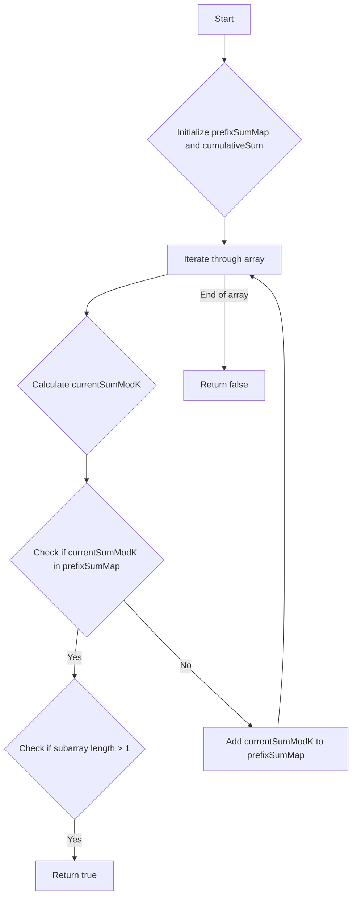

# Continuous Subarray Sum JS Map

## Problem Understanding
The problem asks to determine if there exists a continuous subarray in a given array of numbers whose sum is a multiple of a certain number `k`. The key constraint is that the subarray must be continuous, meaning its elements are adjacent in the original array. This problem is non-trivial because a naive approach, such as checking all possible subarrays, would have a high time complexity due to the number of possible subarrays being quadratic in the size of the input array.

## Approach
The algorithm strategy is to use a prefix sum and a HashMap to track cumulative sums modulo `k`. The intuition behind this approach is that if there exists a subarray whose sum is a multiple of `k`, then the prefix sums before and after this subarray will have the same remainder when divided by `k`. The HashMap is used to store the prefix sums modulo `k` and their corresponding indices. This approach works because it allows us to efficiently check if a subarray with a sum that is a multiple of `k` exists by looking for repeated prefix sums modulo `k`. The HashMap is chosen as the data structure because it provides constant-time lookups, which is crucial for achieving a linear time complexity.

## Complexity Analysis
| Metric | Value | Detailed Reason |
|--------|-------|----------------|
| Time   | O(n)  | We make a single pass through the array, and each operation (HashMap lookup, addition) takes constant time. The loop iterates `n` times, where `n` is the length of the input array. |
| Space  | O(n)  | In the worst-case scenario, every prefix sum modulo `k` is unique, and we store all of them in the HashMap. The maximum size of the HashMap is `n`, where `n` is the length of the input array. |

## Algorithm Walkthrough
```
Input: nums = [23, 2, 4, 6, 7], k = 6
Step 1: Initialize prefixSumMap with {0: -1}, cumulativeSum = 0
Step 2: i = 0, cumulativeSum = 23, currentSumModK = 23 % 6 = 5
        Since 5 is not in prefixSumMap, add {5: 0} to prefixSumMap
Step 3: i = 1, cumulativeSum = 25, currentSumModK = 25 % 6 = 1
        Since 1 is not in prefixSumMap, add {1: 1} to prefixSumMap
Step 4: i = 2, cumulativeSum = 29, currentSumModK = 29 % 6 = 5
        Since 5 is in prefixSumMap and 2 - 0 > 1, return true
Output: true
```
This example shows how the algorithm identifies a subarray `[2, 4]` whose sum is a multiple of `6`.

## Visual Flow

This flowchart illustrates the decision-making process of the algorithm.

## Key Insight
> **Tip:** The key insight is to recognize that a subarray with a sum that is a multiple of `k` will have the same remainder when divided by `k` as the prefix sums before and after this subarray, allowing for efficient detection using a HashMap.

## Edge Cases
- **Empty/null input**: If the input array is empty, the function returns `false` because there is no subarray to consider.
- **Single element**: If the input array contains only one element, the function returns `false` unless the single element is a multiple of `k`.
- **k equals 0**: If `k` equals 0, the function will throw an error when calculating `cumulativeSum % k` because division by zero is undefined.

## Common Mistakes
- **Mistake 1**: Not handling the edge case where the input array is empty or contains only one element. To avoid this, add explicit checks for these cases at the beginning of the function.
- **Mistake 2**: Not checking if the subarray has at least two elements before returning `true`. To avoid this, add a check to ensure that the difference between the current index and the index stored in the HashMap is greater than 1.

## Interview Follow-ups
> **Interview:** These are the exact follow-up questions interviewers ask:
- "What if the input is sorted?" → The algorithm's performance does not depend on the input being sorted, so the time complexity remains O(n).
- "Can you do it in O(1) space?" → No, because we need to store the prefix sums modulo `k` in a data structure like a HashMap to efficiently detect repeated sums, which requires O(n) space in the worst case.
- "What if there are duplicates?" → The algorithm handles duplicates correctly because it checks for repeated prefix sums modulo `k`, not the actual values.

## Javascript Solution

```javascript
// Problem: Continuous Subarray Sum JS Map
// Language: javascript
// Difficulty: medium
// Time Complexity: O(n) — single pass through array using prefix sum and HashMap
// Space Complexity: O(n) — HashMap stores at most n elements
// Approach: prefix sum and HashMap to track cumulative sum

/**
 * Returns true if there exists a continuous subarray whose sum is k times a certain number.
 * @param {number[]} nums - The input array of numbers.
 * @param {number} k - The certain number.
 * @return {boolean} True if a continuous subarray sum equals k times a number, false otherwise.
 */
var checkSubarraySum = function(nums, k) {
    // Edge case: empty input → return false
    if (nums.length === 0) return false;
    
    // Initialize a HashMap to store prefix sums modulo k
    let prefixSumMap = new Map();
    prefixSumMap.set(0, -1); // Base case: sum 0 at index -1
    
    let cumulativeSum = 0; // Accumulate sum of elements
    
    for (let i = 0; i < nums.length; i++) {
        // Update cumulative sum
        cumulativeSum += nums[i];
        
        // Calculate current sum modulo k
        let currentSumModK = cumulativeSum % k;
        
        // If current sum modulo k already exists in the map, 
        // it means we found a subarray whose sum is divisible by k
        if (prefixSumMap.has(currentSumModK)) {
            // If the subarray has at least two elements, return true
            if (i - prefixSumMap.get(currentSumModK) > 1) return true;
        } else {
            // Otherwise, store the current sum modulo k in the map
            prefixSumMap.set(currentSumModK, i);
        }
    }
    
    // If no such subarray is found, return false
    return false;
};
```
