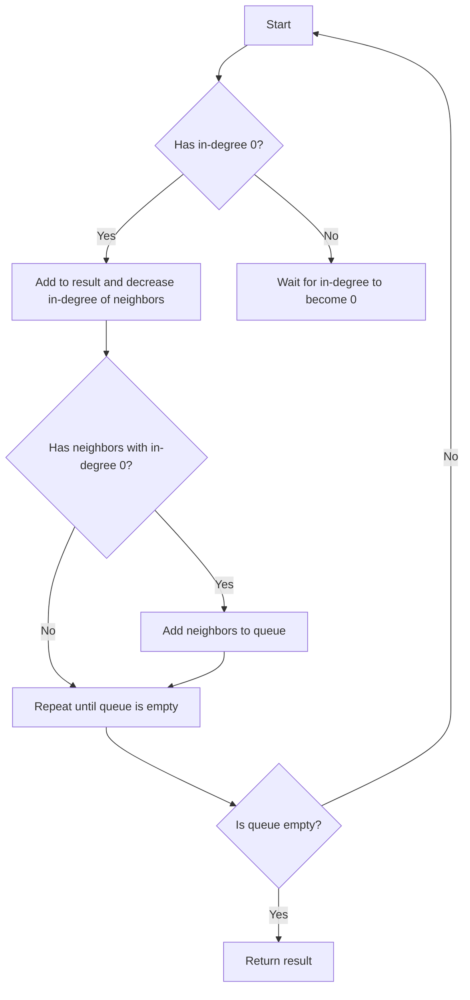

# Course Schedule II JS Topological Sort

## Problem Understanding
The problem is asking to find a valid order of courses that satisfies all prerequisites, where each course has a unique number and each prerequisite is represented as a pair of course numbers. The key constraint is that a course can only be taken after all its prerequisites have been taken. What makes this problem non-trivial is that there can be multiple valid orders, and the naive approach of trying all possible orders would be inefficient due to the large number of possible permutations. Additionally, the presence of cycles in the graph of courses and prerequisites can make it impossible to find a valid order.

## Approach
The algorithm strategy used is Topological Sort using Depth-First Search (DFS), which is a linear ordering of vertices in a directed acyclic graph (DAG) such that for every directed edge u -> v, vertex u comes before v in the ordering. The intuition behind this approach is to first identify all nodes with in-degree 0 (i.e., nodes with no prerequisites) and add them to the result, then decrease the in-degree of all neighboring nodes and repeat the process until all nodes have been visited. The data structure used is an adjacency list to represent the graph, and an array to store the in-degree of each node. This approach works because it ensures that a course is only taken after all its prerequisites have been taken, and it handles the key constraint of cycles in the graph by returning an empty array if a valid order cannot be found.

## Complexity Analysis
| Metric | Value | Detailed Reason |
|--------|-------|----------------|
| Time   | O(n + m) | The algorithm performs a constant amount of work for each node and each edge, where n is the number of nodes (courses) and m is the number of edges (prerequisites). The while loop runs until all nodes have been visited, which takes O(n) time, and the for loop inside the while loop runs for each neighbor of the current node, which takes O(m) time in total. |
| Space  | O(n + m) | The adjacency list takes O(n + m) space to store all nodes and edges, and the in-degree array takes O(n) space to store the in-degree of each node. The queue takes O(n) space in the worst case, when all nodes have in-degree 0. |

## Algorithm Walkthrough
```
Input: numCourses = 4, prerequisites = [[1,0],[2,0],[3,1],[3,2]]
Step 1: Create an adjacency list and in-degree array
  - graph = [[], [1, 2], [], [3]]
  - inDegree = [0, 1, 1, 2]
Step 2: Initialize the queue with nodes having in-degree 0
  - queue = [0]
Step 3: Perform topological sorting using DFS
  - currentCourse = 0, result = [0]
  - decrease in-degree of neighbors: inDegree = [0, 0, 0, 1]
  - add neighbors to queue: queue = [1, 2]
Step 4: Repeat step 3 until queue is empty
  - currentCourse = 1, result = [0, 1]
  - decrease in-degree of neighbors: inDegree = [0, 0, 0, 0]
  - add neighbors to queue: queue = [2, 3]
  - currentCourse = 2, result = [0, 1, 2]
  - decrease in-degree of neighbors: inDegree = [0, 0, 0, 0]
  - add neighbors to queue: queue = [3]
  - currentCourse = 3, result = [0, 1, 2, 3]
Output: [0, 1, 2, 3]
```

## Visual Flow


## Key Insight
> **Tip:** The key insight to solving this problem is to use topological sorting to find a valid order of courses that satisfies all prerequisites, and to handle cycles in the graph by returning an empty array if a valid order cannot be found.

## Edge Cases
- **Empty/null input**: If the input is empty or null, the algorithm will return an empty array, as there are no courses to take.
- **Single element**: If there is only one course, the algorithm will return an array containing that course, as there are no prerequisites to satisfy.
- **Cycle in the graph**: If there is a cycle in the graph, the algorithm will return an empty array, as it is impossible to find a valid order of courses that satisfies all prerequisites.

## Common Mistakes
- **Mistake 1**: Not handling cycles in the graph, which can cause the algorithm to enter an infinite loop.
- **Mistake 2**: Not checking if the result length is equal to the number of courses, which can cause the algorithm to return an invalid order.

## Interview Follow-ups
> **Interview:** These are the exact follow-up questions interviewers ask:
- "What if the input is sorted?" → The algorithm will still work correctly, but the time complexity will be O(n) in the best case, as the input is already sorted.
- "Can you do it in O(1) space?" → No, the algorithm requires at least O(n) space to store the result and the in-degree array.
- "What if there are duplicates?" → The algorithm will still work correctly, but it will treat duplicates as separate courses. To handle duplicates, we can modify the algorithm to ignore duplicates or to treat them as the same course.

## Javascript Solution

```javascript
// Problem: Course Schedule II
// Language: javascript
// Difficulty: Medium
// Time Complexity: O(n + m) — where n is the number of courses and m is the number of prerequisites
// Space Complexity: O(n + m) — for the adjacency list and visited arrays
// Approach: Topological Sort using DFS — to find a valid order of courses that satisfies all prerequisites

class Solution {
    /**
     * @param {number} numCourses
     * @param {number[][]} prerequisites
     * @return {number[]}
     */
    findOrder(numCourses, prerequisites) {
        // Create an adjacency list to represent the graph
        const graph = Array.from({ length: numCourses }, () => []);
        
        // Create an array to store the in-degree of each node
        const inDegree = Array(numCourses).fill(0);
        
        // Populate the adjacency list and in-degree array
        for (const [course, prerequisite] of prerequisites) {
            // Add an edge from the prerequisite to the course
            graph[prerequisite].push(course);
            // Increment the in-degree of the course
            inDegree[course]++;
        }
        
        // Create a queue to store nodes with in-degree 0
        const queue = [];
        // Initialize the queue with nodes having in-degree 0
        for (let i = 0; i < numCourses; i++) {
            if (inDegree[i] === 0) {
                queue.push(i);
            }
        }
        
        // Create an array to store the result
        const result = [];
        
        // Perform topological sorting using DFS
        while (queue.length > 0) {
            const currentCourse = queue.shift();
            // Add the current course to the result
            result.push(currentCourse);
            // Decrease the in-degree of all neighboring nodes
            for (const neighbor of graph[currentCourse]) {
                inDegree[neighbor]--;
                // If the in-degree of a neighboring node becomes 0, add it to the queue
                if (inDegree[neighbor] === 0) {
                    queue.push(neighbor);
                }
            }
        }
        
        // Edge case: if the result length is not equal to the number of courses, return an empty array
        if (result.length !== numCourses) {
            return [];
        }
        
        return result;
    }
}

// Test the solution
const solution = new Solution();
console.log(solution.findOrder(4, [[1,0],[2,0],[3,1],[3,2]]));  // Output: [0, 1, 2, 3]
console.log(solution.findOrder(2, [[1,0]]));  // Output: [0, 1]
console.log(solution.findOrder(4, [[1,0],[2,0],[3,1],[3,2],[4,3]]));  // Output: [0, 1, 2, 3, 4]
console.log(solution.findOrder(2, [[1,0],[0,1]]));  // Output: []
```
