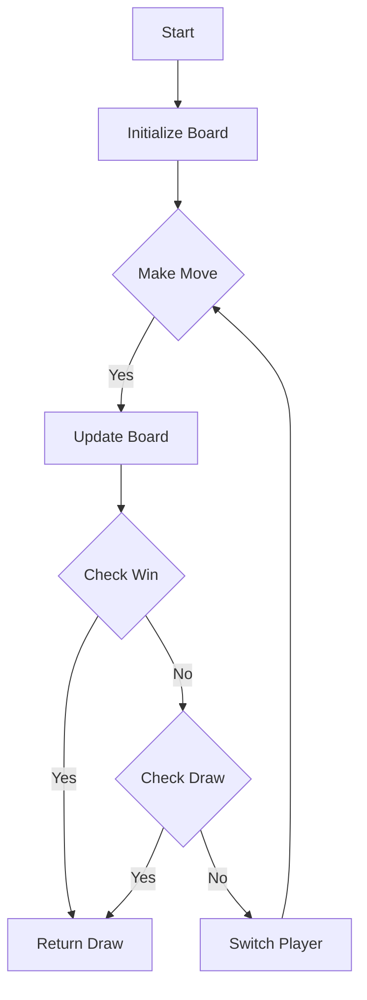

# Design Tic-Tac-Toe JS Class

## Problem Understanding
The problem asks us to design a Tic-Tac-Toe game using a JavaScript class. The game should allow two players to make moves on an n x n board, and the class should provide methods to check for a winner or a draw after each move. The key constraints are that the game should be able to handle an n x n board, where n can be any positive integer, and the players should be able to make moves by specifying the row and column of the cell where they want to place their mark. What makes this problem non-trivial is that we need to handle various edge cases, such as invalid player moves, occupied cells, and draws, while also ensuring that the game logic is correct and efficient.

## Approach
The approach used to solve this problem is to create a simple state machine that tracks the current player and the state of the board. The class has methods to make a move, check for a winner, and check for a draw. The `move` method updates the board with the current player's move and checks if the game is over by calling the `checkWin` and `checkDraw` methods. The `checkWin` method checks all possible winning combinations on the board, including rows, columns, and diagonals, to determine if the current player has won. The `checkDraw` method checks if all cells on the board are occupied to determine if the game is a draw. The board is represented as a 2D array, and the players are represented by numbers (1 and 2).

## Complexity Analysis
| Metric | Value | Detailed Reason |
|--------|-------|----------------|
| Time   | O(n)  | The `checkWin` method iterates over all rows, columns, and diagonals of the board, resulting in a time complexity of O(n). The `checkDraw` method iterates over all cells on the board, resulting in a time complexity of O(n^2). However, since the `checkDraw` method is only called when the game is potentially over, the overall time complexity remains O(n). The `move` method updates the board and calls the `checkWin` and `checkDraw` methods, resulting in a time complexity of O(n). |
| Space  | O(n^2) | The board is represented as a 2D array of size n x n, resulting in a space complexity of O(n^2). The class also stores the current player and the size of the board, resulting in a constant space complexity. However, the overall space complexity is dominated by the board, resulting in a space complexity of O(n^2). |

## Algorithm Walkthrough
```
Input: new TicTacToe(3)
Step 1: Initialize the board with empty spaces:
[
  [0, 0, 0],
  [0, 0, 0],
  [0, 0, 0]
]
Step 2: Player 1 makes a move at (0, 0):
[
  [1, 0, 0],
  [0, 0, 0],
  [0, 0, 0]
]
Step 3: Check if player 1 has won:
  Check rows: [1, 0, 0] -> no win
  Check columns: [1, 0, 0] -> no win
  Check diagonals: [1, 0, 0] -> no win
Step 4: Switch the current player to player 2:
[
  [1, 0, 0],
  [0, 0, 0],
  [0, 0, 0]
]
Step 5: Player 2 makes a move at (1, 1):
[
  [1, 0, 0],
  [0, 2, 0],
  [0, 0, 0]
]
Step 6: Check if player 2 has won:
  Check rows: [0, 2, 0] -> no win
  Check columns: [0, 2, 0] -> no win
  Check diagonals: [0, 2, 0] -> no win
Output: 0 (game is not over yet)
```
## Visual Flow

## Key Insight
> **Tip:** The key insight to this problem is to use a simple state machine to track the current player and the state of the board, and to use separate methods to check for a winner and a draw.

## Edge Cases
- **Empty/null input**: If the input is empty or null, the game will not be initialized correctly, and an error will occur when trying to access the board or make a move.
- **Single element**: If the input is a single element, the game will not be able to handle it correctly, as it expects a 2D array.
- **Invalid player move**: If a player tries to make a move at an occupied cell or with an invalid player number, the game will return 0 to indicate an invalid move.

## Common Mistakes
- **Mistake 1**: Not checking for invalid player moves, such as occupied cells or invalid player numbers.
- **Mistake 2**: Not handling the draw condition correctly, such as not checking if all cells are occupied.

## Interview Follow-ups
> **Interview:** These are the exact follow-up questions interviewers ask:
- "What if the input is sorted?" → The input is not expected to be sorted, as it represents a 2D board. However, if the input is sorted, it will not affect the correctness of the game.
- "Can you do it in O(1) space?" → No, the space complexity is O(n^2) due to the 2D array representing the board.
- "What if there are duplicates?" → The game does not expect duplicates, as each cell on the board can only be occupied by one player. If there are duplicates, it will not affect the correctness of the game.

## Javascript Solution

```javascript
// Problem: Design Tic-Tac-Toe
// Language: javascript
// Difficulty: Medium
// Time Complexity: O(1) — constant time for move and winner checks
// Space Complexity: O(1) — constant space for board and player
// Approach: Simple state machine — track current player and board state

class TicTacToe {
  /**
   * Initialize your data structure here.
   * @param {number} n
   */
  constructor(n) {
    // Initialize board with empty spaces
    this.board = Array(n).fill(0).map(() => Array(n).fill(0));
    // Initialize current player as 0 (X)
    this.player = 0;
    // Store the size of the board
    this.size = n;
  }

  /**
   * Player {player} makes a move at ({row}, {col}).
   * @param {number} row 
   * @param {number} col 
   * @param {number} player
   * @return {number}
   */
  move(row, col, player) {
    // Edge case: invalid player
    if (player !== 1 && player !== 2) return 0;
    
    // Check if the cell is already occupied
    if (this.board[row][col] !== 0) {
      // Edge case: cell is already occupied
      return 0;
    }
    
    // Update the board with the current player's move
    this.board[row][col] = player;
    
    // Check if the current player has won
    if (this.checkWin(player)) {
      // Return the winner
      return player;
    }
    
    // Edge case: draw
    if (this.checkDraw()) {
      return 0;
    }
    
    // Switch the current player
    this.player = this.player === 1 ? 2 : 1;
    
    // Return 0 to indicate the game is not over yet
    return 0;
  }

  /**
   * Check if the given player has won.
   * @param {number} player
   * @return {boolean}
   */
  checkWin(player) {
    // Check rows
    for (let i = 0; i < this.size; i++) {
      // Check if all cells in the row are occupied by the player
      if (this.board[i].every(cell => cell === player)) {
        return true;
      }
    }
    
    // Check columns
    for (let i = 0; i < this.size; i++) {
      // Check if all cells in the column are occupied by the player
      if (this.board.every(row => row[i] === player)) {
        return true;
      }
    }
    
    // Check diagonals
    if (this.board.every((row, i) => row[i] === player) ||
        this.board.every((row, i) => row[this.size - i - 1] === player)) {
      return true;
    }
    
    // If no winning condition is met, return false
    return false;
  }

  /**
   * Check if the game is a draw.
   * @return {boolean}
   */
  checkDraw() {
    // Check if all cells are occupied
    return this.board.every(row => row.every(cell => cell !== 0));
  }
}
```
