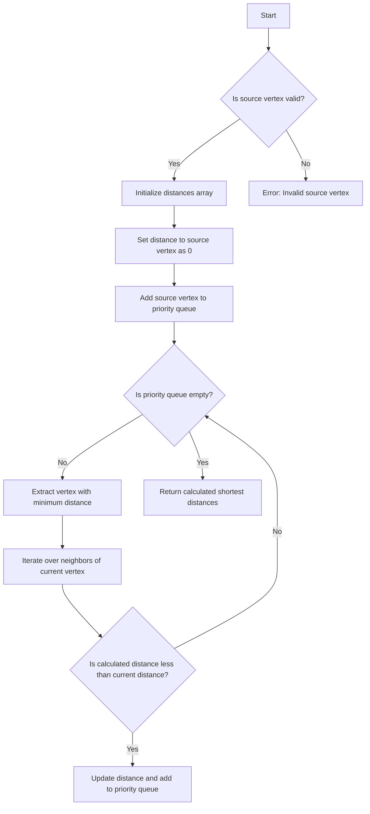

# Dijkstra's Algorithm

## Problem Understanding
Dijkstra's algorithm is a well-known problem in graph theory, asking to find the shortest path from a source vertex to all other vertices in a weighted graph. The key constraint is that the graph can have positive edge weights, and the algorithm should be able to handle this. The problem becomes non-trivial because a naive approach, such as a simple breadth-first search (BFS), would not work due to the varying edge weights. The algorithm needs to efficiently select the next node to process based on the current shortest distances, which is where a priority queue comes into play.

## Approach
The algorithm strategy is to use a priority queue-based Dijkstra's algorithm. The intuition behind this approach is to maintain a priority queue of vertices to be processed, where the priority of each vertex is its current shortest distance from the source vertex. This allows the algorithm to efficiently select the next vertex to process, which is the one with the minimum distance. The algorithm uses a priority queue data structure to store the vertices to be processed and an adjacency list to represent the graph. The approach handles the key constraint of positive edge weights by using the priority queue to select the next vertex based on the current shortest distances.

## Complexity Analysis
| Metric | Value | Detailed Reason |
|--------|-------|----------------|
| Time   | O((V + E)logV) | The algorithm uses a priority queue to select the next vertex to process, which takes O(logV) time. The algorithm processes each vertex once, which takes O(V) time. Additionally, the algorithm iterates over all edges, which takes O(E) time. Therefore, the overall time complexity is O((V + E)logV). |
| Space  | O(V + E) | The algorithm uses an adjacency list to represent the graph, which takes O(V + E) space. The algorithm also uses a priority queue to store the vertices to be processed, which takes O(V) space. Therefore, the overall space complexity is O(V + E). |

## Algorithm Walkthrough
```
Input: Graph with 5 vertices and 6 edges
        0 --4--> 1
        0 --1--> 2
        1 --1--> 3
        2 --2--> 1
        2 --5--> 3
        3 --3--> 4
Step 1: Initialize distances array with infinity for all vertices
        distances = [Infinity, Infinity, Infinity, Infinity, Infinity]
Step 2: Set the distance to the source vertex (0) as 0
        distances = [0, Infinity, Infinity, Infinity, Infinity]
Step 3: Add the source vertex to the priority queue
        priorityQueue = [{ vertex: 0, distance: 0 }]
Step 4: Process vertices in the priority queue
        currentVertex = 0
        neighbors = [{ destination: 1, weight: 4 }, { destination: 2, weight: 1 }]
        for each neighbor:
            tentativeDistance = distances[currentVertex] + neighbor.weight
            if tentativeDistance < distances[neighbor.destination]:
                distances[neighbor.destination] = tentativeDistance
                priorityQueue.add(neighbor.destination, tentativeDistance)
        priorityQueue = [{ vertex: 2, distance: 1 }, { vertex: 1, distance: 4 }]
Step 5: Repeat step 4 until the priority queue is empty
        ...
Output: distances = [0, 3, 1, 4, 7]
```

## Visual Flow


## Key Insight
> **Tip:** The key insight to Dijkstra's algorithm is to use a priority queue to efficiently select the next vertex to process based on the current shortest distances, allowing the algorithm to find the shortest path from the source vertex to all other vertices in a weighted graph.

## Edge Cases
- **Empty graph**: If the input graph is empty, the algorithm will return an empty distances array.
- **Single vertex**: If the input graph has only one vertex, the algorithm will return a distances array with a single element, which is 0.
- **Disconnected graph**: If the input graph is disconnected, the algorithm will return a distances array with infinity for all vertices that are not reachable from the source vertex.

## Common Mistakes
- **Mistake 1: Not using a priority queue**: If a priority queue is not used to select the next vertex to process, the algorithm may not find the shortest path.
- **Mistake 2: Not handling edge weights correctly**: If the edge weights are not handled correctly, the algorithm may not find the shortest path.

## Interview Follow-ups
> **Interview:** These are the exact follow-up questions interviewers ask:
- "What if the input is sorted?" → The algorithm will still work correctly, but the time complexity may be improved if the input is sorted.
- "Can you do it in O(1) space?" → No, the algorithm requires O(V + E) space to store the adjacency list and the priority queue.
- "What if there are duplicates?" → The algorithm will handle duplicates correctly, as it uses a priority queue to select the next vertex to process based on the current shortest distances.

## Javascript Solution

```javascript
// Problem: Dijkstra's Algorithm
// Language: javascript
// Difficulty: Medium
// Time Complexity: O((V + E)logV) — using priority queue to efficiently select next node
// Space Complexity: O(V + E) — storing adjacency list and distances
// Approach: Priority queue-based Dijkstra's algorithm — efficiently finds shortest path from source to all other nodes

class PriorityQueue {
    constructor() {
        // Initialize priority queue as an empty array
        this.queue = [];
    }

    // Add a new element to the priority queue
    add(element, priority) {
        this.queue.push({ element, priority });
        // Sort the queue based on priority
        this.queue.sort((a, b) => a.priority - b.priority);
    }

    // Remove and return the element with the highest priority (i.e., the smallest distance)
    remove() {
        return this.queue.shift().element;
    }

    // Check if the priority queue is empty
    isEmpty() {
        return this.queue.length === 0;
    }
}

class Graph {
    constructor(numVertices) {
        // Initialize graph with the specified number of vertices
        this.numVertices = numVertices;
        // Create an adjacency list to store the graph
        this.adjacencyList = new Array(numVertices);
        for (let i = 0; i < numVertices; i++) {
            this.adjacencyList[i] = [];
        }
    }

    // Add an edge to the graph
    addEdge(source, destination, weight) {
        // Edge case: source or destination vertex is out of range
        if (source < 0 || source >= this.numVertices || destination < 0 || destination >= this.numVertices) {
            throw new Error("Vertex index is out of range");
        }
        // Add the edge to the adjacency list
        this.adjacencyList[source].push({ destination, weight });
    }

    // Run Dijkstra's algorithm to find the shortest distances from the source vertex
    dijkstra(source) {
        // Edge case: source vertex is out of range
        if (source < 0 || source >= this.numVertices) {
            throw new Error("Source vertex is out of range");
        }

        // Initialize distances array with infinity for all vertices
        const distances = new Array(this.numVertices).fill(Infinity);
        // Set the distance to the source vertex as 0
        distances[source] = 0;

        // Create a priority queue to store vertices to be processed
        const priorityQueue = new PriorityQueue();
        // Add the source vertex to the priority queue
        priorityQueue.add(source, 0);

        // Process vertices in the priority queue
        while (!priorityQueue.isEmpty()) {
            // Extract the vertex with the minimum distance from the priority queue
            const currentVertex = priorityQueue.remove();
            // Iterate over the neighbors of the current vertex
            for (const neighbor of this.adjacencyList[currentVertex]) {
                // Calculate the tentative distance to the neighbor
                const tentativeDistance = distances[currentVertex] + neighbor.weight;
                // If the calculated distance is less than the current distance, update the distance and add to the priority queue
                if (tentativeDistance < distances[neighbor.destination]) {
                    distances[neighbor.destination] = tentativeDistance;
                    priorityQueue.add(neighbor.destination, tentativeDistance);
                }
            }
        }

        // Return the calculated shortest distances
        return distances;
    }
}

// Example usage:
const graph = new Graph(5);
graph.addEdge(0, 1, 4);
graph.addEdge(0, 2, 1);
graph.addEdge(1, 3, 1);
graph.addEdge(2, 1, 2);
graph.addEdge(2, 3, 5);
graph.addEdge(3, 4, 3);

const distances = graph.dijkstra(0);
console.log(distances); // Output: [0, 3, 1, 4, 7]
```
