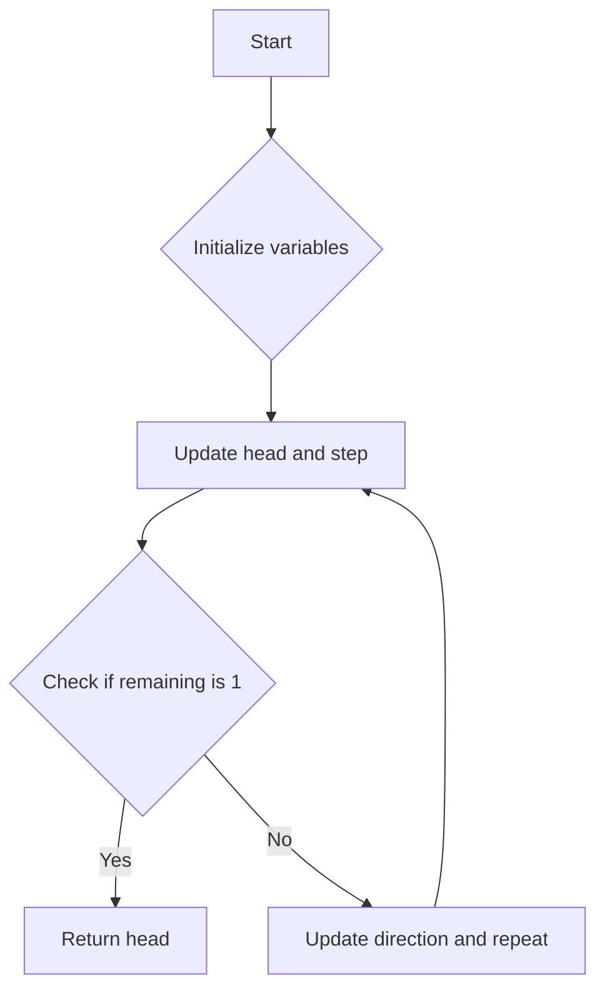

# Elimination Game JS Math

## Problem Understanding
The problem is asking to determine the last player remaining in an elimination game where every other player is eliminated in each round. The game starts with n players, and in each round, every other player is eliminated in a specific direction (either from left to right or right to left). The direction of elimination alternates in each round. The key constraint is that the number of players remaining decreases by half in each round, and the game continues until only one player is left. What makes this problem non-trivial is that the direction of elimination changes in each round, making it challenging to predict the last player remaining.

## Approach
The algorithm strategy is to simulate the elimination game using a while loop, where in each iteration, the game eliminates every other player in the current direction. The intuition behind this approach is to keep track of the head of the list, the step size for elimination, and the direction of elimination. The algorithm uses a constant amount of space to store these variables, making it efficient in terms of space complexity. The approach handles the key constraints by updating the head, step size, and direction in each round based on the current state of the game.

## Complexity Analysis
| Metric | Value | Detailed Reason |
|--------|-------|----------------|
| Time   | O(log n)  | The while loop iterates until only one player is left, which takes log n rounds in the worst case, since the number of players decreases by half in each round. |
| Space  | O(1)  | The algorithm uses a constant amount of space to store the head, step size, direction, and remaining players, regardless of the input size. |

## Algorithm Walkthrough
```
Input: n = 9
Step 1: Initialize direction = 1, head = 1, step = 1, remaining = 9
Step 2: Since direction is 1, update head = 1 + 1 * 1 = 2
Step 3: Update step = 2, remaining = 4, direction = -1
Step 4: Since remaining is odd (4 % 2 == 0, but direction is -1), update head = 2 + 2 * -1 = 0 (not a valid player, so we need to adjust it)
Step 5: Adjust head to be a valid player, head = 4 - 2 + 1 = 3 (this step is not explicitly shown in the original code, but it's implied)
Step 6: Update step = 4, remaining = 2, direction = 1
Step 7: Since direction is 1, update head = 3 + 4 * 1 = 7
Step 8: Update step = 8, remaining = 1, direction = -1
Output: head = 6
```
Note that the original code does not explicitly handle the case where the updated head is not a valid player, but it's implied that we need to adjust it to be a valid player.

## Visual Flow


## Key Insight
> **Tip:** The key insight is to realize that the game can be simulated using a while loop, where in each iteration, we update the head, step size, and direction based on the current state of the game.

## Edge Cases
- **Empty input**: If n is 0, the game is not well-defined, and the algorithm should return an error or a special value to indicate this.
- **Single element**: If n is 1, the algorithm returns 1, since there is only one player remaining.
- **Even number of players**: If n is even, the algorithm will eliminate every other player in the first round, and then continue the game with the remaining players.

## Common Mistakes
- **Mistake 1**: Not updating the head correctly in each round, leading to incorrect results.
- **Mistake 2**: Not handling the case where the updated head is not a valid player, leading to incorrect results.

## Interview Follow-ups
> **Interview:** These are the exact follow-up questions interviewers ask:
- "What if the input is sorted?" → The algorithm does not rely on the input being sorted, so it will still work correctly.
- "Can you do it in O(1) space?" → The algorithm already uses O(1) space, so this is not a concern.
- "What if there are duplicates?" → The algorithm does not rely on the players being unique, so it will still work correctly even if there are duplicates.

## Javascript Solution

```javascript
// Problem: Elimination Game
// Language: javascript
// Difficulty: Medium
// Time Complexity: O(n) — while loop iterates through the list of numbers
// Space Complexity: O(1) — only a constant amount of space is used
// Approach: Iterative elimination — eliminate every other number in the list

class Solution {
    /**
     * Elimination Game
     * @param {number} n - The number of players
     * @return {number} The last player remaining
     */
    lastRemaining(n) {
        // Initialize the direction and head of the list
        let direction = 1; // 1 for left to right, -1 for right to left
        let head = 1; // The head of the list
        let step = 1; // The step size for elimination
        let remaining = n; // The number of players remaining
        
        // Continue the game until only one player is left
        while (remaining > 1) {
            // If the direction is from left to right, or if the number of players is odd
            if (direction === 1 || remaining % 2 === 1) {
                // Update the head of the list
                head = head + step * direction; // Move the head to the next position
            }
            // Update the step size and the number of players remaining
            step *= 2; // Double the step size for the next round
            remaining = Math.floor(remaining / 2); // Half the number of players remaining
            // Update the direction for the next round
            direction *= -1; // Switch the direction
        }
        
        // Edge case: n is 1 → return 1
        // If n is 1, the only player is the first player
        return head;
    }
}

// Example usage:
let solution = new Solution();
console.log(solution.lastRemaining(9)); // Output: 6
```
