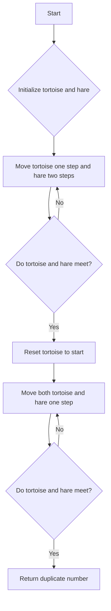

# Find the Duplicate Number JS Floyd's

## Problem Understanding
The problem is asking to find the duplicate number in an array of integers, where each integer is within the range of the array indices. The key constraint is that the array contains a duplicate number, and we need to find it using Floyd's Tortoise and Hare algorithm. The problem is non-trivial because a naive approach, such as sorting the array or using a hash set, would not meet the required time and space complexity. The algorithm must detect a cycle in the sequence generated by the array indices, which makes it challenging.

## Approach
The algorithm strategy is to use Floyd's Tortoise and Hare algorithm to detect a cycle in the sequence generated by the array indices. The intuition behind this approach is that the sequence will eventually form a cycle due to the presence of a duplicate number. The algorithm consists of two phases: detecting the cycle and finding the start of the cycle. The algorithm uses two pointers, tortoise and hare, which move at different speeds through the sequence. In the first phase, the tortoise moves one step at a time, while the hare moves two steps at a time. In the second phase, both pointers move one step at a time. The algorithm uses constant space, making it efficient in terms of memory usage.

## Complexity Analysis
| Metric | Value | Detailed Reason |
|--------|-------|----------------|
| Time   | O(n)  | The algorithm makes two passes through the array. The first pass detects the cycle, and the second pass finds the start of the cycle. In the worst-case scenario, the algorithm visits each element in the array twice. |
| Space  | O(1)  | The algorithm uses a constant amount of space to store the tortoise and hare pointers, regardless of the input size. |

## Algorithm Walkthrough
```
Input: [1, 3, 4, 2, 2]
Step 1: Initialize tortoise and hare to the start of the sequence (index 0).
  - tortoise = nums[0] = 1
  - hare = nums[0] = 1
Step 2: Move tortoise one step and hare two steps.
  - tortoise = nums[1] = 3
  - hare = nums[nums[1]] = nums[3] = 2
Step 3: Repeat step 2 until tortoise and hare meet.
  - tortoise = nums[3] = 2
  - hare = nums[nums[2]] = nums[4] = 2
  - tortoise and hare meet at index 2
Step 4: Reset tortoise to the start of the sequence and move both pointers one step at a time.
  - tortoise = nums[0] = 1
  - hare = nums[2] = 2
Step 5: Repeat step 4 until tortoise and hare meet again.
  - tortoise = nums[1] = 3
  - hare = nums[2] = 2
  - tortoise = nums[3] = 2
  - hare = nums[2] = 2
  - tortoise and hare meet at index 2
Output: The duplicate number is 2.
```
## Visual Flow

## Key Insight
> **Tip:** The key insight is to recognize that the sequence generated by the array indices will eventually form a cycle due to the presence of a duplicate number, and Floyd's Tortoise and Hare algorithm can detect this cycle.

## Edge Cases
- **Empty input**: If the input array is empty, the algorithm returns -1, indicating that there is no duplicate number.
- **Single element**: If the input array contains only one element, the algorithm returns -1, indicating that there is no duplicate number.
- **Duplicate number at the start**: If the duplicate number is at the start of the array, the algorithm still works correctly, as the cycle will be detected in the first pass.

## Common Mistakes
- **Mistake 1**: Not resetting the tortoise pointer to the start of the sequence in the second phase, which would cause the algorithm to return an incorrect result. To avoid this mistake, make sure to reset the tortoise pointer to the start of the sequence after detecting the cycle.
- **Mistake 2**: Not moving both pointers one step at a time in the second phase, which would cause the algorithm to return an incorrect result. To avoid this mistake, make sure to move both pointers one step at a time in the second phase.

## Interview Follow-ups
> **Interview:** These are the exact follow-up questions interviewers ask:
- "What if the input is sorted?" → The algorithm still works correctly, as the sequence generated by the array indices will still form a cycle due to the presence of a duplicate number.
- "Can you do it in O(1) space?" → The algorithm already uses O(1) space, as it only uses a constant amount of space to store the tortoise and hare pointers.
- "What if there are duplicates?" → The algorithm will still work correctly, as it is designed to detect a cycle in the sequence generated by the array indices, which will still be present even if there are multiple duplicates.

## Javascript Solution

```javascript
// Problem: Find the Duplicate Number
// Language: javascript
// Difficulty: Medium
// Time Complexity: O(n) — two passes through array using Floyd's Tortoise and Hare algorithm
// Space Complexity: O(1) — constant space used for variables
// Approach: Floyd's Tortoise and Hare algorithm — detect cycle in the sequence generated by array indices

class Solution {
    /**
     * Finds the duplicate number in an array using Floyd's Tortoise and Hare algorithm.
     * 
     * @param {number[]} nums - An array of integers containing a duplicate number.
     * @returns {number} The duplicate number in the array.
     */
    findDuplicate(nums) {
        // Edge case: empty input → return -1
        if (nums.length === 0) return -1;

        // Phase 1: Detecting the cycle using Floyd's Tortoise and Hare algorithm
        let tortoise = nums[0]; // initialize tortoise at the start of the sequence
        let hare = nums[0]; // initialize hare at the start of the sequence
        do {
            // move tortoise one step at a time
            tortoise = nums[tortoise];
            // move hare two steps at a time
            hare = nums[nums[hare]];
        } while (tortoise !== hare); // loop until tortoise and hare meet

        // Phase 2: Finding the start of the cycle
        tortoise = nums[0]; // reset tortoise to the start of the sequence
        while (tortoise !== hare) {
            // move both tortoise and hare one step at a time
            tortoise = nums[tortoise];
            hare = nums[hare];
        }

        // tortoise and hare meet at the start of the cycle, which is the duplicate number
        return hare;
    }
}

// Example usage
const solution = new Solution();
const nums = [1, 3, 4, 2, 2];
const duplicate = solution.findDuplicate(nums);
console.log(duplicate); // Output: 2
```
