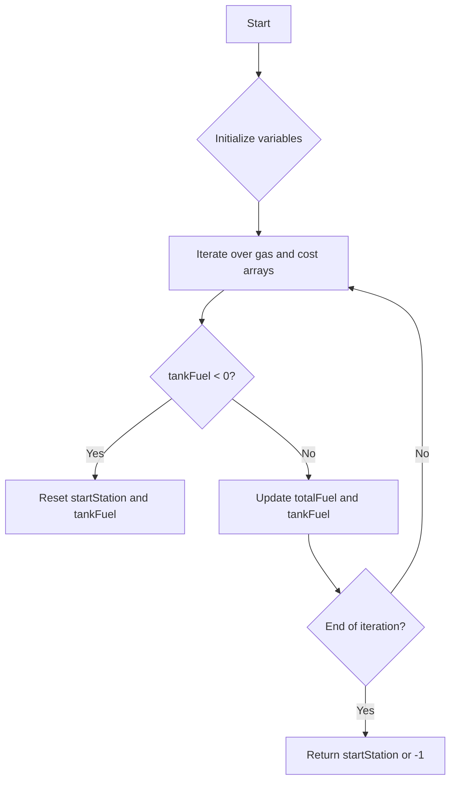

# Gas Station JS Greedy

## Problem Understanding
The problem is asking to find the starting gas station index for a circular trip given two arrays, `gas` and `cost`, representing the amount of gas available at each station and the cost to travel to the next station, respectively. The key constraint is that the total fuel available must be sufficient to complete the trip. What makes this problem non-trivial is that a naive approach of simply starting at the first station and trying to complete the trip would fail if the fuel available at the initial stations is not enough to reach a station with more fuel. The problem requires a strategy to determine the optimal starting station.

## Approach
The algorithm strategy used is a greedy approach with tank simulation, where we start at each station and track the fuel level. The intuition behind this approach is to simulate the trip and keep track of the fuel level at each station. We use two variables, `totalFuel` and `tankFuel`, to track the total fuel available and the fuel in the tank, respectively. We iterate over the `gas` and `cost` arrays, updating the `totalFuel` and `tankFuel` variables at each station. If the `tankFuel` becomes negative, we reset the starting station index.

## Complexity Analysis
| Metric | Value | Detailed Reason |
|--------|-------|----------------|
| Time   | O(n)  | We make a single pass through the `gas` and `cost` arrays, where n is the number of stations. Each iteration takes constant time, so the total time complexity is linear. |
| Space  | O(1)  | We use a constant amount of space to store the `totalFuel`, `tankFuel`, and `startStation` variables, regardless of the input size. |

## Algorithm Walkthrough
```
Input: gas = [1,2,3,4,5], cost = [3,4,5,1,2]
Step 1: i = 0, totalFuel = 1 - 3 = -2, tankFuel = -2, startStation = 0
Step 2: i = 1, totalFuel = -2 + 2 - 4 = -4, tankFuel = -4, startStation = 0
Step 3: i = 2, totalFuel = -4 + 3 - 5 = -6, tankFuel = -6, startStation = 0
Step 4: i = 3, totalFuel = -6 + 4 - 1 = -3, tankFuel = -3, startStation = 0
Step 5: i = 4, totalFuel = -3 + 5 - 2 = 0, tankFuel = 0, startStation = 3 (reset)
Output: startStation = 3
```
In this example, we simulate the trip and reset the starting station index when the tank fuel becomes negative.

## Visual Flow

This flowchart shows the decision flow of the algorithm, including the iteration over the `gas` and `cost` arrays and the reset of the starting station index when the tank fuel becomes negative.

## Key Insight
> **Tip:** The key insight is to simulate the trip and reset the starting station index when the tank fuel becomes negative, ensuring that we always start at a station with sufficient fuel to reach the next station.

## Edge Cases
- **Empty/null input**: If the input arrays are empty, the function returns -1, indicating that it is impossible to complete the trip.
- **Single element**: If there is only one station, the function returns 0 if the fuel available is sufficient to complete the trip, or -1 otherwise.
- **Not enough fuel**: If the total fuel available is not sufficient to complete the trip, the function returns -1.

## Common Mistakes
- **Mistake 1**: Not resetting the starting station index when the tank fuel becomes negative, leading to incorrect results.
- **Mistake 2**: Not checking for the edge case where the input arrays are empty, leading to incorrect results or runtime errors.

## Interview Follow-ups
> **Interview:** These are the exact follow-up questions interviewers ask:
- "What if the input is sorted?" → The algorithm still works correctly, as it only depends on the relative values of the `gas` and `cost` arrays, not their absolute values.
- "Can you do it in O(1) space?" → No, because we need to use variables to track the `totalFuel`, `tankFuel`, and `startStation`, which requires at least O(1) space.
- "What if there are duplicates?" → The algorithm still works correctly, as it only depends on the relative values of the `gas` and `cost` arrays, not their absolute values or the presence of duplicates.

## Javascript Solution

```javascript
// Problem: Gas Station
// Language: JavaScript
// Difficulty: Medium
// Time Complexity: O(n) — single pass through the gas and cost arrays
// Space Complexity: O(1) — constant space used to store variables
// Approach: Greedy algorithm with tank simulation — start at each station and track the fuel level

/**
 * Returns the starting gas station index for a circular trip, or -1 if impossible.
 * @param {number[]} gas - array of gas available at each station
 * @param {number[]} cost - array of gas cost to travel to the next station
 * @return {number} starting gas station index, or -1 if impossible
 */
var canCompleteCircuit = function(gas, cost) {
    // Edge case: empty input → return -1
    if (gas.length === 0 || cost.length === 0) return -1;

    // Initialize variables to track the total fuel and the starting station index
    let totalFuel = 0; // track the total fuel available
    let tankFuel = 0; // track the fuel in the tank
    let startStation = 0; // track the starting station index

    // Iterate over the gas and cost arrays to simulate the trip
    for (let i = 0; i < gas.length; i++) {
        // Add the gas available at the current station to the total fuel
        totalFuel += gas[i] - cost[i]; // update the total fuel available
        // Add the gas available at the current station to the tank fuel
        tankFuel += gas[i] - cost[i]; // update the fuel in the tank

        // If the tank fuel is negative, reset the starting station index
        if (tankFuel < 0) {
            startStation = i + 1; // reset the starting station index
            tankFuel = 0; // reset the fuel in the tank
        }
    }

    // If the total fuel is negative, return -1 (impossible to complete the trip)
    if (totalFuel < 0) return -1; // Edge case: not enough fuel to complete the trip

    // Return the starting station index
    return startStation; // return the starting station index
};
```
