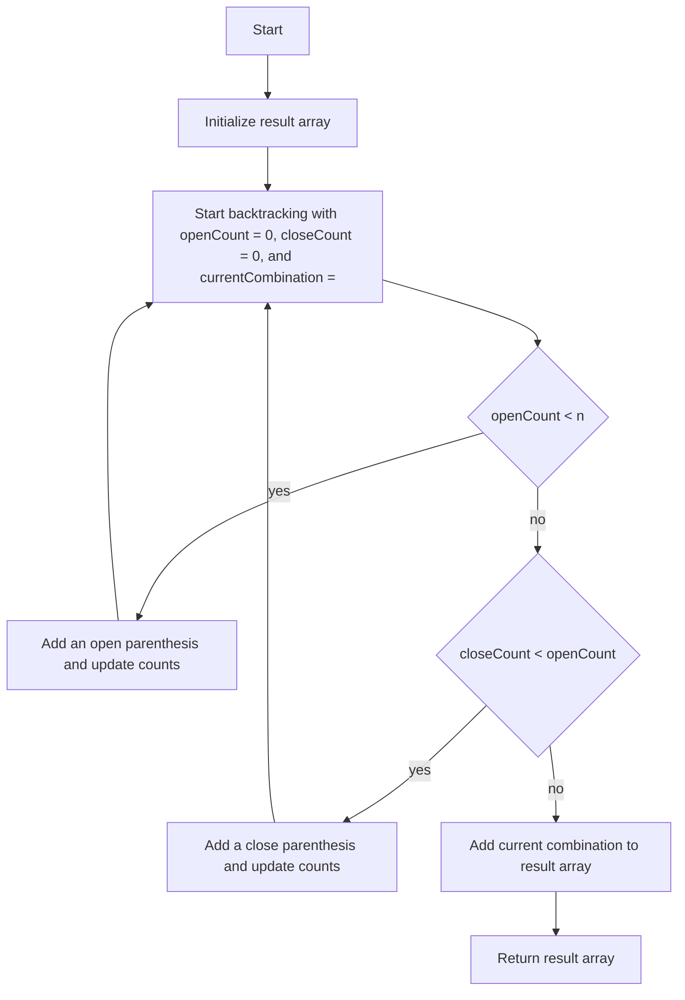

# Generate Parentheses

## Problem Understanding
The problem is asking to generate all possible combinations of well-formed parentheses, given a number `n` representing the number of pairs of parentheses. The key constraint is that the generated combinations must be well-formed, meaning that every open parenthesis must have a corresponding close parenthesis, and the pairs must be properly nested. This problem is non-trivial because a naive approach, such as generating all possible combinations of parentheses and then filtering out the invalid ones, would be inefficient due to the large number of possible combinations.

## Approach
The algorithm strategy used is backtracking with a parentheses balance check, which allows for the efficient generation of all valid combinations of well-formed parentheses. This approach works by maintaining a balance between the number of open and close parentheses, ensuring that the combination remains well-formed at each step. The algorithm uses a recursive helper function to perform the backtracking, and it utilizes an array to store the resulting combinations. The approach handles the key constraint of well-formedness by only adding a close parenthesis when the number of close parentheses is less than the number of open parentheses.

## Complexity Analysis
| Metric | Value | Detailed Reason |
|--------|-------|----------------|
| Time   | O(4^n / n^(3/2)) | The time complexity is due to the growth rate of the Catalan numbers, which represent the number of possible combinations of well-formed parentheses. The recursive backtracking approach generates all possible combinations, resulting in a time complexity proportional to the number of combinations. |
| Space  | O(4^n / n^(3/2)) | The space complexity is also proportional to the number of combinations, as the algorithm stores all possible combinations in an array. The maximum depth of the recursion tree is proportional to the number of combinations, resulting in a space complexity similar to the time complexity. |

## Algorithm Walkthrough
```
Input: n = 2
Step 1: Initialize result array and start backtracking with openCount = 0, closeCount = 0, and currentCombination = ""
Step 2: Add an open parenthesis, update counts: openCount = 1, closeCount = 0, currentCombination = "("
Step 3: Add another open parenthesis, update counts: openCount = 2, closeCount = 0, currentCombination = "(("
Step 4: Add a close parenthesis, update counts: openCount = 2, closeCount = 1, currentCombination = "(()"
Step 5: Add another close parenthesis, update counts: openCount = 2, closeCount = 2, currentCombination = "(())"
Step 6: Since the length of the current combination is equal to 2n, add it to the result array
Output: result = ["(())", "(())"]
```
This walkthrough demonstrates the recursive backtracking process, generating all possible combinations of well-formed parentheses for a given input `n`.

## Visual Flow

This visual flow represents the decision-making process and the recursive backtracking approach used in the algorithm.

## Key Insight
> **Tip:** The key insight is to maintain a balance between the number of open and close parentheses, ensuring that the combination remains well-formed at each step, by only adding a close parenthesis when the number of close parentheses is less than the number of open parentheses.

## Edge Cases
- **Empty/null input**: If the input `n` is 0, the algorithm returns an empty array, as there are no possible combinations of well-formed parentheses.
- **Single element**: If the input `n` is 1, the algorithm returns a single combination "()", representing the only possible combination of well-formed parentheses.
- **Large input**: For large inputs `n`, the algorithm may take a long time to generate all possible combinations due to the exponential growth rate of the Catalan numbers.

## Common Mistakes
- **Mistake 1**: Not checking the balance between open and close parentheses, resulting in invalid combinations. → To avoid this, always check the counts before adding a close parenthesis.
- **Mistake 2**: Not using a recursive approach, resulting in an inefficient algorithm. → To avoid this, use a recursive helper function to perform the backtracking.

## Interview Follow-ups
> **Interview:** These are the exact follow-up questions interviewers ask:
- "What if the input is very large?" → The algorithm's time and space complexity would be affected, and it may take a long time to generate all possible combinations. To improve performance, consider using a more efficient algorithm or data structure.
- "Can you optimize the algorithm to use less space?" → One possible optimization is to use an iterative approach instead of a recursive one, which would reduce the space complexity. However, this would also increase the code complexity.
- "What if there are duplicates in the input?" → The algorithm assumes that the input `n` is a unique integer. If there are duplicates, the algorithm would still generate all possible combinations, but the output would contain duplicates as well. To avoid this, consider using a set or a map to store the unique combinations.

## Javascript Solution

```javascript
// Problem: Generate Parentheses
// Language: javascript
// Difficulty: Medium
// Time Complexity: O(4^n / n^(3/2)) — due to Catalan number growth rate
// Space Complexity: O(4^n / n^(3/2)) — storing all possible combinations of parentheses
// Approach: Backtracking with parentheses balance check — generating all valid combinations

class Solution {
    /**
     * Generates all possible combinations of well-formed parentheses.
     * 
     * @param {number} n - The number of pairs of parentheses to generate.
     * @returns {string[]} An array of all possible combinations of well-formed parentheses.
     */
    generateParenthesis(n) {
        // Initialize an empty array to store the result
        let result = [];

        // Define a helper function for backtracking
        function backtrack(openCount, closeCount, currentCombination) {
            // If the length of the current combination is equal to 2n, add it to the result
            if (currentCombination.length === 2 * n) {
                result.push(currentCombination);
                return;
            }

            // Add an open parenthesis if the open count is less than n
            if (openCount < n) {
                // Recursively call the backtrack function with the updated counts and combination
                backtrack(openCount + 1, closeCount, currentCombination + "(");
            }

            // Add a close parenthesis if the close count is less than the open count
            if (closeCount < openCount) {
                // Recursively call the backtrack function with the updated counts and combination
                backtrack(openCount, closeCount + 1, currentCombination + ")");
            }
        }

        // Edge case: n is 0 → return an empty array
        if (n === 0) {
            return result;
        }

        // Start the backtracking process with initial counts and an empty combination
        backtrack(0, 0, "");

        // Return the result
        return result;
    }
}

// Example usage:
let solution = new Solution();
console.log(solution.generateParenthesis(3));
```
