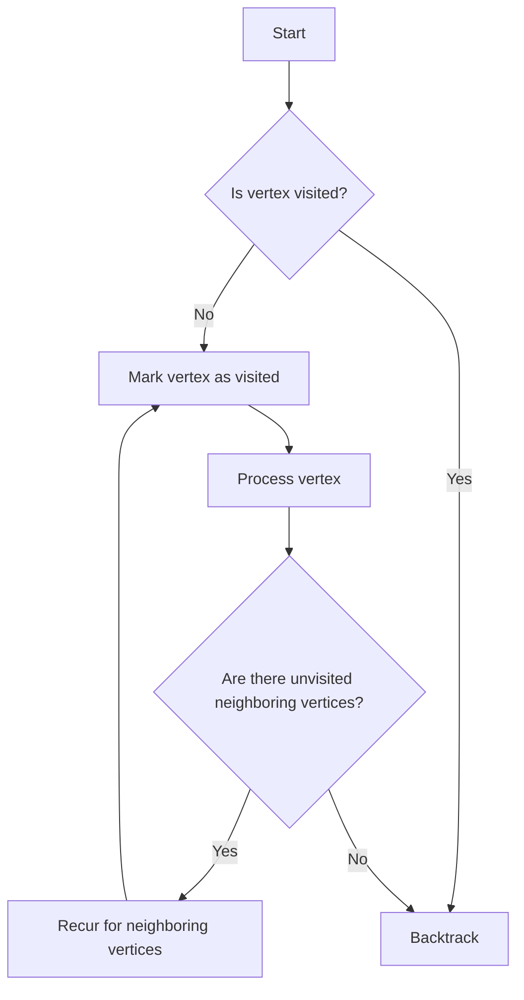

# Graph BFS and DFS

## Problem Understanding
The problem is asking to implement Breadth-First Search (BFS) and Depth-First Search (DFS) traversal algorithms on a graph. The graph is represented as an adjacency list, where each index represents a vertex and its corresponding value is an array of neighboring vertices. The key constraint is that the graph can have any number of vertices and edges, and the traversal algorithms should visit each vertex and edge once. What makes this problem non-trivial is that the graph can have cycles, and the traversal algorithms need to avoid visiting the same vertex multiple times. Additionally, the graph can have disconnected components, and the traversal algorithms need to handle this case.

## Approach
The algorithm strategy is to use a queue for BFS and recursion for DFS. The intuition behind this approach is that BFS visits all the vertices at a given depth level before moving on to the next level, whereas DFS visits as far as possible along each branch before backtracking. The adjacency list representation is used to efficiently store and retrieve the neighboring vertices of each vertex. A visited array is used to keep track of visited vertices and avoid visiting the same vertex multiple times. The approach handles the key constraints by using a queue for BFS to ensure that all vertices at a given depth level are visited before moving on to the next level, and by using recursion for DFS to efficiently explore the graph.

## Complexity Analysis
| Metric | Value | Detailed Reason |
|--------|-------|----------------|
| Time   | O(V + E) | The time complexity is O(V + E) because each vertex and edge is visited once. In the BFS algorithm, the while loop runs until all vertices are visited, and in the DFS algorithm, the recursive function calls itself for each unvisited neighboring vertex. The adjacency list representation allows for efficient retrieval of neighboring vertices, resulting in a time complexity of O(V + E). |
| Space  | O(V) | The space complexity is O(V) because in the worst case, the queue for BFS and the recursion stack for DFS can contain all vertices. Additionally, the visited array and adjacency list representation require O(V) space. |

## Algorithm Walkthrough
```
Input: Graph with 5 vertices and 4 edges: (0, 1), (0, 2), (1, 3), (1, 4)
Step 1: Initialize the visited array and queue for BFS
  - visited: [false, false, false, false, false]
  - queue: [0]
Step 2: Enqueue the start vertex (0) and mark it as visited
  - visited: [true, false, false, false, false]
  - queue: [0]
Step 3: Perform BFS traversal
  - Dequeue vertex 0 and process it
  - Enqueue all unvisited neighboring vertices: 1, 2
  - visited: [true, true, true, false, false]
  - queue: [1, 2]
Step 4: Continue BFS traversal
  - Dequeue vertex 1 and process it
  - Enqueue all unvisited neighboring vertices: 3, 4
  - visited: [true, true, true, true, true]
  - queue: [2, 3, 4]
Step 5: Complete BFS traversal
  - Dequeue vertex 2 and process it
  - visited: [true, true, true, true, true]
  - queue: [3, 4]
Step 6: Complete BFS traversal
  - Dequeue vertex 3 and process it
  - visited: [true, true, true, true, true]
  - queue: [4]
Step 7: Complete BFS traversal
  - Dequeue vertex 4 and process it
  - visited: [true, true, true, true, true]
  - queue: []
Output: BFS Traversal: 0, 1, 2, 3, 4

Input: Graph with 5 vertices and 4 edges: (0, 1), (0, 2), (1, 3), (1, 4)
Step 1: Initialize the visited array for DFS
  - visited: [false, false, false, false, false]
Step 2: Perform DFS traversal starting from vertex 0
  - Mark vertex 0 as visited
  - visited: [true, false, false, false, false]
Step 3: Recur for all unvisited neighboring vertices of 0: 1, 2
  - Mark vertex 1 as visited
  - visited: [true, true, false, false, false]
Step 4: Recur for all unvisited neighboring vertices of 1: 3, 4
  - Mark vertex 3 as visited
  - visited: [true, true, false, true, false]
Step 5: Recur for all unvisited neighboring vertices of 3: none
  - visited: [true, true, false, true, false]
Step 6: Backtrack to vertex 1 and recur for vertex 4
  - Mark vertex 4 as visited
  - visited: [true, true, false, true, true]
Step 7: Backtrack to vertex 0 and recur for vertex 2
  - Mark vertex 2 as visited
  - visited: [true, true, true, true, true]
Output: DFS Traversal: 0, 1, 3, 4, 2
```

## Visual Flow


## Key Insight
> **Tip:** The key insight is to use a visited array to keep track of visited vertices and avoid visiting the same vertex multiple times, which is crucial for both BFS and DFS traversal algorithms.

## Edge Cases
- **Empty graph**: If the graph is empty, the BFS and DFS traversal algorithms will not visit any vertices.
- **Single vertex**: If the graph has only one vertex, the BFS and DFS traversal algorithms will visit that vertex only once.
- **Disconnected graph**: If the graph is disconnected, the BFS and DFS traversal algorithms will visit all vertices in the connected component that contains the start vertex, but will not visit vertices in other connected components.

## Common Mistakes
- **Mistake 1: Not using a visited array**: Not using a visited array can result in infinite loops if the graph has cycles.
- **Mistake 2: Not handling edge cases**: Not handling edge cases, such as an empty graph or a single vertex, can result in incorrect results or runtime errors.

## Interview Follow-ups
> **Interview:** These are the exact follow-up questions interviewers ask:
- "What if the input is sorted?" → The input is not necessarily sorted, and the traversal algorithms do not rely on the input being sorted.
- "Can you do it in O(1) space?" → No, it is not possible to perform BFS or DFS traversal in O(1) space because we need to keep track of visited vertices.
- "What if there are duplicates?" → The graph does not allow duplicate edges, and the traversal algorithms do not need to handle duplicate edges.

## Javascript Solution

```javascript
// Problem: Graph BFS and DFS
// Language: javascript
// Difficulty: Medium
// Time Complexity: O(V + E) — visiting each vertex and edge once
// Space Complexity: O(V) — storing visited vertices and recursion stack
// Approach: Adjacency list representation with queue for BFS and recursion for DFS

class Graph {
    constructor(numVertices) {
        // Initialize adjacency list with empty arrays for each vertex
        this.adjacencyList = new Array(numVertices).fill(0).map(() => []);
        this.numVertices = numVertices;
    }

    // Add an edge between two vertices
    addEdge(source, destination) {
        // Edge case: source or destination vertex is out of bounds
        if (source < 0 || source >= this.numVertices || destination < 0 || destination >= this.numVertices) {
            throw new Error("Vertex index is out of bounds");
        }
        // Add edge to the adjacency list
        this.adjacencyList[source].push(destination);
    }

    // Perform BFS traversal
    bfs(startVertex) {
        // Edge case: start vertex is out of bounds
        if (startVertex < 0 || startVertex >= this.numVertices) {
            throw new Error("Start vertex index is out of bounds");
        }
        // Create a visited array to keep track of visited vertices
        const visited = new Array(this.numVertices).fill(false);
        // Create a queue for BFS
        const queue = [];
        // Enqueue the start vertex and mark it as visited
        queue.push(startVertex);
        visited[startVertex] = true;
        // Perform BFS traversal
        while (queue.length > 0) {
            const currentVertex = queue.shift();
            // Process the current vertex
            console.log(`Visited vertex: ${currentVertex}`);
            // Enqueue all unvisited neighboring vertices
            for (const neighbor of this.adjacencyList[currentVertex]) {
                if (!visited[neighbor]) {
                    queue.push(neighbor);
                    visited[neighbor] = true;
                }
            }
        }
    }

    // Perform DFS traversal
    dfs(startVertex) {
        // Edge case: start vertex is out of bounds
        if (startVertex < 0 || startVertex >= this.numVertices) {
            throw new Error("Start vertex index is out of bounds");
        }
        // Create a visited array to keep track of visited vertices
        const visited = new Array(this.numVertices).fill(false);
        // Perform DFS traversal using recursion
        this.dfsHelper(startVertex, visited);
    }

    // Recursive helper function for DFS traversal
    dfsHelper(vertex, visited) {
        // Mark the current vertex as visited
        visited[vertex] = true;
        // Process the current vertex
        console.log(`Visited vertex: ${vertex}`);
        // Recur for all unvisited neighboring vertices
        for (const neighbor of this.adjacencyList[vertex]) {
            if (!visited[neighbor]) {
                this.dfsHelper(neighbor, visited);
            }
        }
    }
}

// Example usage:
const graph = new Graph(5);
graph.addEdge(0, 1);
graph.addEdge(0, 2);
graph.addEdge(1, 3);
graph.addEdge(1, 4);

console.log("BFS Traversal:");
graph.bfs(0);

console.log("DFS Traversal:");
graph.dfs(0);
```
