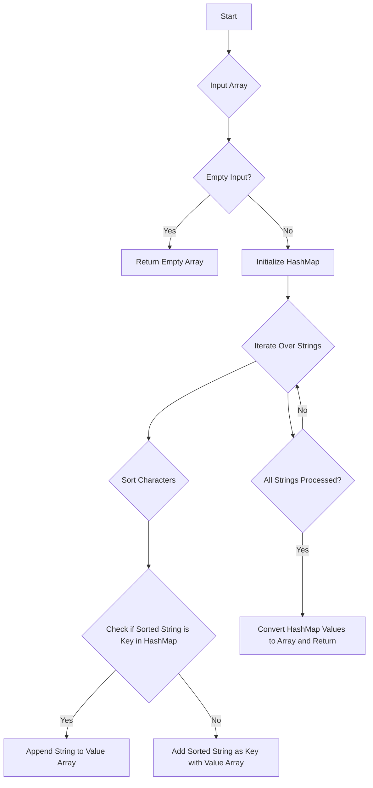

# Group Anagrams JS Hash Map

## Problem Understanding
The problem is asking to group a list of strings into anagrams, where anagrams are strings that contain the same characters, but in a different order. The key constraint is that the input is an array of strings, and the output should be an array of arrays, where each inner array contains strings that are anagrams of each other. This problem is non-trivial because it requires finding a way to efficiently identify and group the anagrams, and a naive approach such as comparing each string to every other string would be inefficient. The problem also requires handling edge cases such as empty input, single element input, and input with duplicate strings.

## Approach
The algorithm strategy is to use a HashMap to store the anagrams, where the key is a sorted version of the string and the value is an array of strings that are anagrams of each other. The intuition behind this approach is that if two strings are anagrams, their sorted versions will be the same, so we can use the sorted version as a key to group the anagrams. This approach works because it allows us to efficiently identify and group the anagrams in O(n*m) time complexity, where n is the number of strings and m is the maximum length of a string. The HashMap data structure is used because it allows us to efficiently store and retrieve the anagrams, and the sorted string is used as the key because it provides a unique identifier for each group of anagrams.

## Complexity Analysis
| Metric | Value | Detailed Reason |
|--------|-------|----------------|
| Time   | O(n*m log m)  | The time complexity is O(n*m log m) because we are iterating over each string in the input array (O(n)), and for each string, we are sorting its characters (O(m log m)). The HashMap operations (insert, retrieve) take constant time on average, so they do not affect the overall time complexity. |
| Space  | O(n*m)  | The space complexity is O(n*m) because we are storing all the characters of the input strings in the HashMap. In the worst case, if all strings are anagrams of each other, the HashMap will store n*m characters. |

## Algorithm Walkthrough
```
Input: ["eat", "tea", "tan", "ate", "nat", "bat"]
Step 1: Initialize HashMap anagramMap
Step 2: Iterate over each string in input array
  - For "eat", sort characters to get "aet", and add to anagramMap with value ["eat"]
  - For "tea", sort characters to get "aet", and add to anagramMap with value ["eat", "tea"]
  - For "tan", sort characters to get "ant", and add to anagramMap with value ["tan"]
  - For "ate", sort characters to get "aet", and add to anagramMap with value ["eat", "tea", "ate"]
  - For "nat", sort characters to get "ant", and add to anagramMap with value ["tan", "nat"]
  - For "bat", sort characters to get "abt", and add to anagramMap with value ["bat"]
Step 3: Convert HashMap values to array and return
Output: [["eat", "tea", "ate"], ["tan", "nat"], ["bat"]]
```

## Visual Flow


## Key Insight
> **Tip:** The key insight is to use the sorted version of each string as a key in the HashMap, which allows us to efficiently group the anagrams together.

## Edge Cases
- **Empty/null input**: If the input is empty or null, the function will return an empty array, because there are no strings to group.
- **Single element**: If the input contains only one string, the function will return an array containing an array with the single string, because there are no other strings to group with it.
- **Duplicate strings**: If the input contains duplicate strings, the function will group them together, because they are considered anagrams of each other.

## Common Mistakes
- **Mistake 1**: Not handling the edge case of empty input, which can cause the function to throw an error. To avoid this, we should check for empty input and return an empty array.
- **Mistake 2**: Not using a HashMap to store the anagrams, which can lead to inefficient grouping of anagrams. To avoid this, we should use a HashMap to store the anagrams, where the key is the sorted version of the string and the value is an array of strings that are anagrams of each other.

## Interview Follow-ups
> **Interview:** These are the exact follow-up questions interviewers ask:
- "What if the input is sorted?" → The function will still work correctly, because it sorts each string to create a key for the HashMap, regardless of the order of the input strings.
- "Can you do it in O(1) space?" → No, it is not possible to solve this problem in O(1) space, because we need to store the anagrams in a data structure, and the space complexity of the HashMap is O(n*m), where n is the number of strings and m is the maximum length of a string.
- "What if there are duplicates?" → The function will group duplicate strings together, because they are considered anagrams of each other.

## Javascript Solution

```javascript
// Problem: Group Anagrams
// Language: javascript
// Difficulty: Medium
// Time Complexity: O(n*m) — where n is the number of strings and m is the maximum length of a string
// Space Complexity: O(n*m) — HashMap stores at most n*m characters
// Approach: HashMap with sorted string as key — for each string, sort its characters and use as key in HashMap

class Solution {
    /**
     * @param {string[]} strs
     * @return {string[][]}
     */
    groupAnagrams(strs) {
        // Edge case: empty input → return empty array
        if (!strs || strs.length === 0) return [];

        // Initialize HashMap to store anagrams
        const anagramMap = new Map();

        // Iterate over each string in input array
        for (const str of strs) {
            // Sort characters in current string to create a key for anagrams
            const sortedStr = str.split('').sort().join('');

            // Check if sorted string is already a key in HashMap
            if (anagramMap.has(sortedStr)) {
                // If key exists, append current string to its value array
                anagramMap.get(sortedStr).push(str);
            } else {
                // If key does not exist, add it to HashMap with current string as its value
                anagramMap.set(sortedStr, [str]);
            }
        }

        // Convert HashMap values to array and return
        return Array.from(anagramMap.values());
    }
}

// Example usage:
const solution = new Solution();
const strs = ["eat", "tea", "tan", "ate", "nat", "bat"];
const result = solution.groupAnagrams(strs);
console.log(result); // Output: [["eat", "tea", "ate"], ["tan", "nat"], ["bat"]]
```
