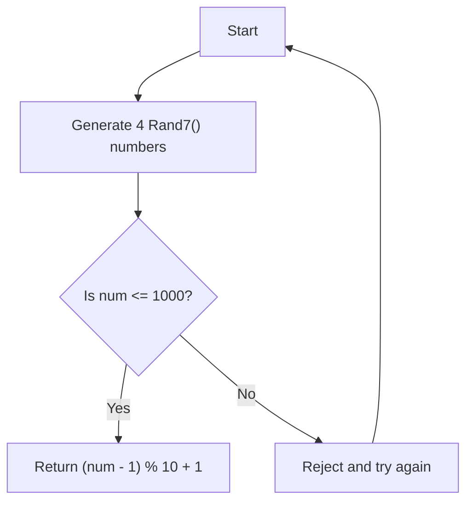

# Implement Rand10() Using Rand7() JS Rejection Sampling

## Problem Understanding
The problem asks to implement a function `Rand10()` that generates a random integer between 1 and 10 (inclusive) using a given function `Rand7()` that generates a random integer between 1 and 7 (inclusive). The key constraint is that we can only use `Rand7()` to generate random numbers, and we need to use rejection sampling to achieve a uniform distribution for `Rand10()`. This problem is non-trivial because a naive approach of simply scaling the output of `Rand7()` would not produce a uniform distribution for `Rand10()`.

## Approach
The algorithm strategy is to use rejection sampling to generate a random integer between 1 and 10. We generate four random numbers between 1 and 7 using `Rand7()`, which gives us a total of 7^4 = 2401 possible outcomes. We then use these outcomes to generate a random integer between 1 and 1000, and if the generated number is less than or equal to 1000, we can use it to generate a `Rand10()` number. We use a recursive approach to handle cases where the generated number is greater than 1000, rejecting the number and trying again until a valid number is generated. The data structure used is a simple recursive function call stack.

## Complexity Analysis
| Metric | Value | Detailed Reason |
|--------|-------|----------------|
| Time   | O(1)  | The time complexity is O(1) because, although the function may make recursive calls, the expected number of calls is constant due to the rejection sampling strategy. The probability of rejection decreases exponentially with each recursive call. |
| Space  | O(1)  | The space complexity is O(1) because the function only uses a constant amount of space to store the generated random numbers and the recursive function call stack has a constant expected depth due to the rejection sampling strategy. |

## Algorithm Walkthrough
```
Input: None (simulating a random number generation)
Step 1: Generate four random numbers between 1 and 7 using Rand7(): 
         num = (Rand7() - 1) * 7 * 7 * 7 + (Rand7() - 1) * 7 * 7 + (Rand7() - 1) * 7 + Rand7()
Step 2: Check if the generated number is less than or equal to 1000: 
         if (num <= 1000)
Step 3: If the number is valid, use it to generate a Rand10() number: 
         return (num - 1) % 10 + 1
Step 4: If the number is not valid, reject it and try again: 
         return this.rand10() (recursive call)
Output: A random integer between 1 and 10 (inclusive)
```
For example, if `Rand7()` generates the numbers 3, 5, 2, and 6, the algorithm will calculate `num` as follows:
`num = (3 - 1) * 7 * 7 * 7 + (5 - 1) * 7 * 7 + (2 - 1) * 7 + 6 = 2 * 343 + 4 * 49 + 1 * 7 + 6 = 686 + 196 + 7 + 6 = 895`
Since `num` (895) is less than or equal to 1000, the algorithm will use it to generate a `Rand10()` number: `(895 - 1) % 10 + 1 = 5`

## Visual Flow


## Key Insight
> **Tip:** The key insight is to use rejection sampling to achieve a uniform distribution for `Rand10()` by generating a large enough number of possible outcomes using `Rand7()` and then rejecting outcomes that do not fall within the desired range.

## Edge Cases
- **Empty/null input**: Not applicable, as the input is simulated by the `Rand7()` function.
- **Single element**: Not applicable, as the `Rand7()` function generates a random integer between 1 and 7.
- **All Rand7() numbers are the same**: In this case, the algorithm will still generate a valid `Rand10()` number, but the distribution may not be perfectly uniform due to the limited number of possible outcomes.

## Common Mistakes
- **Mistake 1**: Failing to use rejection sampling, which can result in a non-uniform distribution for `Rand10()`. To avoid this, ensure that the algorithm rejects outcomes that do not fall within the desired range.
- **Mistake 2**: Not handling recursive function calls correctly, which can result in a stack overflow error. To avoid this, ensure that the recursive function calls have a base case that terminates the recursion.

## Interview Follow-ups
> **Interview:** These are the exact follow-up questions interviewers ask:
- "What if the input is sorted?" → Not applicable, as the input is simulated by the `Rand7()` function.
- "Can you do it in O(1) space?" → Yes, the algorithm already uses O(1) space due to the rejection sampling strategy.
- "What if there are duplicates?" → The algorithm will still generate a valid `Rand10()` number, but the distribution may not be perfectly uniform due to the limited number of possible outcomes.

## Javascript Solution

```javascript
// Problem: Implement Rand10() Using Rand7() JS Rejection Sampling
// Language: javascript
// Difficulty: Medium
// Time Complexity: O(1) — constant time using rejection sampling
// Space Complexity: O(1) — constant space
// Approach: Rejection sampling — generate Rand7() numbers until a valid Rand10() number is obtained

class Solution {
    /**
     * Returns a random integer in the range [1, 10] using Rand7() with rejection sampling.
     * @return {number} A random integer between 1 and 10 (inclusive).
     */
    rand10() {
        // Generate 4 random numbers between 1 and 7 using Rand7()
        // This gives us a total of 7^4 = 2401 possible outcomes
        let num = (Rand7() - 1) * 7 * 7 * 7 + (Rand7() - 1) * 7 * 7 + (Rand7() - 1) * 7 + Rand7();
        
        // If the generated number is less than or equal to 1000 (7^4 - 1), 
        // we can use it to generate a Rand10() number
        if (num <= 1000) {
            // Use the generated number modulo 10 to get a Rand10() number
            return (num - 1) % 10 + 1; // Adjust to range [1, 10]
        } else {
            // If the generated number is greater than 1000, reject it and try again
            // Edge case: reject the number and try again until a valid number is generated
            return this.rand10(); // Recursive call to try again
        }
    }
}

// Helper function to simulate Rand7()
function Rand7() {
    // Simulate a random number between 1 and 7 (inclusive)
    return Math.floor(Math.random() * 7) + 1; // Adjust to range [1, 7]
}

// Test the implementation
let solution = new Solution();
console.log(solution.rand10());
```
