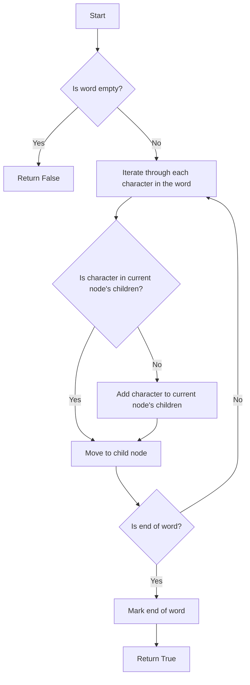

# Implement Trie

## Problem Understanding
The problem asks us to implement a Trie data structure, which is a tree-like data structure in which each node stores a string. The key constraints of this problem are that we need to support three main operations: insert, search, and startsWith. The insert operation adds a word to the Trie, the search operation checks if a word is in the Trie, and the startsWith operation checks if there is any word in the Trie that starts with a given prefix. What makes this problem non-trivial is that we need to handle the case where words share common prefixes, which means we need to efficiently store and retrieve words in the Trie.

## Approach
The algorithm strategy we will use is to utilize a hash map and nested objects to efficiently store and retrieve words in the Trie. We will create a TrieNode class to represent each node in the Trie, and a Trie class to manage the Trie as a whole. The TrieNode class will have a hash map to store characters and their corresponding child nodes, and a boolean flag to mark the end of a word. The Trie class will have methods to insert words, search for words, and check if a prefix exists in the Trie. This approach works because it allows us to efficiently store and retrieve words in the Trie by using a hash map to quickly look up child nodes.

## Complexity Analysis
| Metric | Value | Detailed Reason |
|--------|-------|----------------|
| Time   | O(m)  | The time complexity is O(m) because in the worst-case scenario, we need to iterate through each character in the word being inserted or searched. This is because the insert, search, and startsWith operations all involve iterating through the characters in the word or prefix. |
| Space  | O(n*m) | The space complexity is O(n*m) because we need to store all the words in the Trie, where n is the number of words and m is the average length of each word. This is because each node in the Trie stores a hash map of its child nodes, and each word in the Trie corresponds to a path from the root node to a leaf node. |

## Algorithm Walkthrough
```
Input: trie.insert("apple")
Step 1: Start at the root node
Step 2: Iterate through each character in the word "apple"
  - 'a' is not in the current node's children, add it
  - Move to the child node corresponding to 'a'
  - 'p' is not in the current node's children, add it
  - Move to the child node corresponding to 'p'
  - 'p' is not in the current node's children, add it
  - Move to the child node corresponding to 'p'
  - 'l' is not in the current node's children, add it
  - Move to the child node corresponding to 'l'
  - 'e' is not in the current node's children, add it
  - Move to the child node corresponding to 'e'
Step 3: Mark the end of the word
Output: The word "apple" is now in the Trie

Input: trie.search("apple")
Step 1: Start at the root node
Step 2: Iterate through each character in the word "apple"
  - 'a' is in the current node's children, move to the child node corresponding to 'a'
  - 'p' is in the current node's children, move to the child node corresponding to 'p'
  - 'p' is in the current node's children, move to the child node corresponding to 'p'
  - 'l' is in the current node's children, move to the child node corresponding to 'l'
  - 'e' is in the current node's children, move to the child node corresponding to 'e'
Step 3: Return whether the current node marks the end of a word
Output: True
```

## Visual Flow


## Key Insight
> **Tip:** The key insight to implementing a Trie is to use a hash map to efficiently store and retrieve child nodes, allowing for fast lookup and insertion of words.

## Edge Cases
- **Empty/null input**: When the input is empty, the search and startsWith operations will return False and True respectively, because an empty string is considered to be a prefix of every string.
- **Single element**: When the input is a single character, the insert, search, and startsWith operations will work as expected, because a single character is a valid word.
- **Duplicate words**: When the input contains duplicate words, the insert operation will overwrite the existing word, but the search operation will still return True, because the word is still in the Trie.

## Common Mistakes
- **Mistake 1**: Not checking if a character is in the current node's children before moving to the child node, which can cause a null pointer exception. → To avoid this, always check if a character is in the current node's children before moving to the child node.
- **Mistake 2**: Not marking the end of a word when inserting a word, which can cause the search operation to return False for words that are in the Trie. → To avoid this, always mark the end of a word when inserting a word.

## Interview Follow-ups
> **Interview:** These are the exact follow-up questions interviewers ask:
- "What if the input is sorted?" → The Trie data structure does not rely on the input being sorted, so the insert, search, and startsWith operations will work regardless of the order of the input words.
- "Can you do it in O(1) space?" → No, it is not possible to implement a Trie in O(1) space, because we need to store all the words in the Trie, which requires O(n*m) space.
- "What if there are duplicates?" → The Trie data structure can handle duplicates, but the insert operation will overwrite the existing word. The search operation will still return True for duplicate words.

## Javascript Solution

```javascript
// Problem: Implement Trie
// Language: javascript
// Difficulty: Medium
// Time Complexity: O(m) — where m is the length of the word being inserted or searched
// Space Complexity: O(n*m) — where n is the number of words and m is the average length of each word
// Approach: Hash map and nested objects — to efficiently store and retrieve words in the Trie

class TrieNode {
    constructor() {
        // Initialize a hash map to store characters and their corresponding child nodes
        this.children = {};
        // Initialize a boolean flag to mark the end of a word
        this.isEndOfWord = false;
    }
}

class Trie {
    constructor() {
        // Initialize the root node of the Trie
        this.root = new TrieNode();
    }

    insert(word) {
        // Start at the root node
        let currentNode = this.root;
        // Iterate through each character in the word
        for (let char of word) {
            // If the character is not in the current node's children, add it
            if (!currentNode.children[char]) {
                currentNode.children[char] = new TrieNode();
            }
            // Move to the child node corresponding to the current character
            currentNode = currentNode.children[char];
        }
        // Mark the end of the word
        currentNode.isEndOfWord = true;
    }

    search(word) {
        // Start at the root node
        let currentNode = this.root;
        // Iterate through each character in the word
        for (let char of word) {
            // If the character is not in the current node's children, return false
            if (!currentNode.children[char]) {
                return false;
            }
            // Move to the child node corresponding to the current character
            currentNode = currentNode.children[char];
        }
        // Return whether the current node marks the end of a word
        return currentNode.isEndOfWord;
    }

    startsWith(prefix) {
        // Start at the root node
        let currentNode = this.root;
        // Iterate through each character in the prefix
        for (let char of prefix) {
            // If the character is not in the current node's children, return false
            if (!currentNode.children[char]) {
                return false;
            }
            // Move to the child node corresponding to the current character
            currentNode = currentNode.children[char];
        }
        // If we reach this point, the prefix exists in the Trie
        return true;
    }
}

// Example usage:
let trie = new Trie();
trie.insert("apple");
trie.insert("app");
console.log(trie.search("apple"));   // Returns True
console.log(trie.search("app"));     // Returns True
console.log(trie.search("ap"));      // Returns False
console.log(trie.startsWith("app")); // Returns True
console.log(trie.startsWith("ap")); // Returns True
console.log(trie.startsWith("b"));   // Returns False

// Edge case: empty input
console.log(trie.search(""));  // Returns False
console.log(trie.startsWith(""));  // Returns True
```
