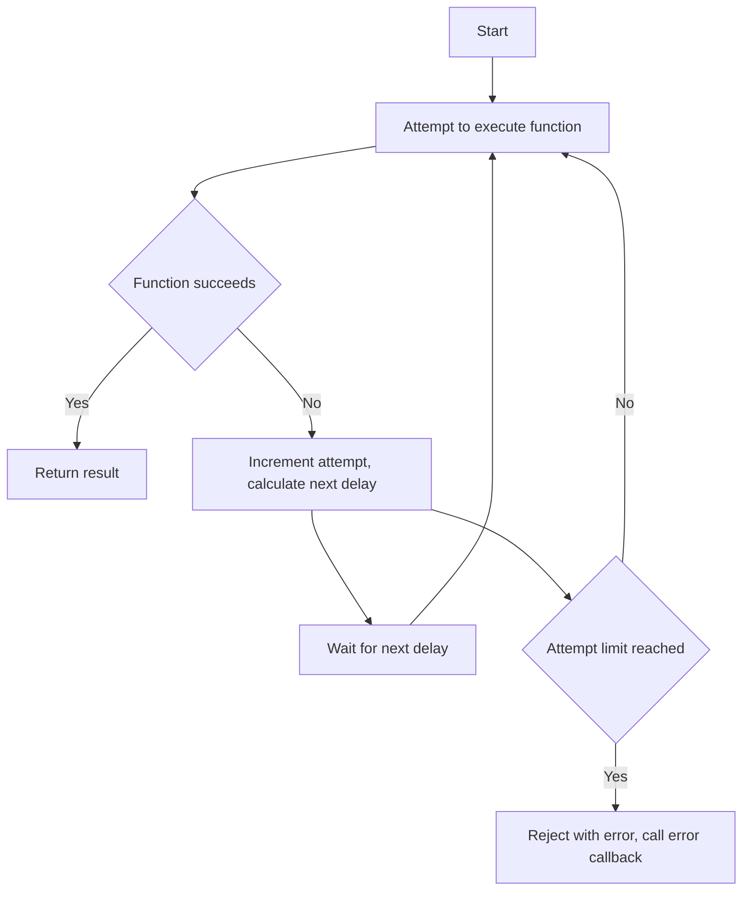

# Implementing a Retry with Exponential Backoff

## Problem Understanding
The problem is asking to implement a retry mechanism with exponential backoff in JavaScript. This means that if a function fails, it should be retried after a certain delay, and this delay should increase exponentially with each subsequent attempt. The key constraints are the maximum number of attempts, the initial delay, and the maximum delay. What makes this problem non-trivial is that it requires handling errors, calculating the next delay, and implementing a recursive function to retry the original function.

## Approach
The algorithm strategy is to use a recursive function to retry the original function with increasing delay between attempts. The intuition behind this approach is to give the system a chance to recover from temporary failures by waiting for a longer period of time before retrying. This approach works because it allows the system to adapt to changing conditions and reduces the likelihood of overwhelming the system with repeated attempts. The data structure used is a simple promise chain to handle the asynchronous nature of the function. The approach handles the key constraints by keeping track of the attempt counter and the current delay, and using these values to determine whether to retry or give up.

## Complexity Analysis
| Metric | Value | Detailed Reason |
|--------|-------|----------------|
| Time   | O(2^n) | The time complexity is exponential because the delay between attempts doubles with each subsequent attempt, leading to a geometric progression. The number of attempts (n) determines the number of recursive calls, hence the time complexity is O(2^n). |
| Space  | O(1)  | The space complexity is constant because the recursive function only uses a fixed amount of memory to store the attempt counter and the current delay, regardless of the number of attempts. |

## Algorithm Walkthrough
```
Input: exampleFunction, 3, 100, 1000, onError
Step 1: Initialize attempt = 0, currentDelay = 100
Step 2: Attempt to execute exampleFunction, which throws an error
Step 3: Increment attempt to 1, calculate next delay as 200 (min(100 * 2, 1000))
Step 4: Wait for 200ms before retrying
Step 5: Attempt to execute exampleFunction again, which throws an error again
Step 6: Increment attempt to 2, calculate next delay as 400 (min(200 * 2, 1000))
Step 7: Wait for 400ms before retrying
Step 8: Attempt to execute exampleFunction again, which throws an error again
Step 9: Increment attempt to 3, which exceeds the maximum attempts
Step 10: Reject with the error and call the error callback
Output: Error: Example error
```
This walkthrough demonstrates the recursive retry process with exponential backoff.

## Visual Flow

This flowchart illustrates the decision flow and retry process.

## Key Insight
> **Tip:** The key to implementing a robust retry mechanism with exponential backoff is to carefully manage the attempt counter and the current delay, and to use a recursive function to handle the retry logic.

## Edge Cases
- **Empty/null input**: If the input function is null or undefined, the retry mechanism will throw an error immediately. To handle this, we can add a simple null check at the beginning of the function.
- **Single element**: If the input function is a single element, the retry mechanism will work as expected. However, if the single element is an error, the retry mechanism will still retry the function.
- **Maximum attempts reached**: If the maximum attempts are reached, the retry mechanism will reject with the error and call the error callback. This is the expected behavior, but we should ensure that the error callback is properly handled.

## Common Mistakes
- **Mistake 1**: Not handling the error callback properly. To avoid this, we should ensure that the error callback is called with the correct error object.
- **Mistake 2**: Not implementing the recursive function correctly. To avoid this, we should carefully manage the attempt counter and the current delay, and use a recursive function to handle the retry logic.

## Interview Follow-ups
> **Interview:** These are the exact follow-up questions interviewers ask:
- "What if the input is sorted?" → This is not relevant to the retry mechanism with exponential backoff, as the input is a function, not a sorted array.
- "Can you do it in O(1) space?" → The current implementation already uses O(1) space, as it only uses a fixed amount of memory to store the attempt counter and the current delay.
- "What if there are duplicates?" → This is not relevant to the retry mechanism with exponential backoff, as the input is a function, not a collection of elements.

## Javascript Solution

```javascript
// Problem: Implementing a Retry with Exponential Backoff
// Language: javascript
// Difficulty: Medium
// Time Complexity: O(2^n) — due to exponential backoff
// Space Complexity: O(1) — constant space usage
// Approach: Recursive function with exponential backoff — retries a function with increasing delay between attempts

/**
 * Implementing a Retry with Exponential Backoff
 * @param {function} func - The function to be retried
 * @param {number} maxAttempts - The maximum number of attempts
 * @param {number} initialDelay - The initial delay in milliseconds
 * @param {number} maxDelay - The maximum delay in milliseconds
 * @param {function} onError - The callback function for error handling
 * @returns {Promise} A promise that resolves with the result of the function or rejects with the error
 */
async function retryWithExponentialBackoff(func, maxAttempts = 5, initialDelay = 100, maxDelay = 30000, onError) {
  // Initialize the attempt counter and the current delay
  let attempt = 0;
  let currentDelay = initialDelay;

  // Define the recursive function for retrying
  const retry = async () => {
    try {
      // Attempt to execute the function
      return await func();
    } catch (error) {
      // Edge case: maximum attempts reached
      if (attempt >= maxAttempts) {
        // Reject with the error and call the error callback
        onError(error);
        throw error;
      }

      // Increment the attempt counter
      attempt++;

      // Calculate the next delay using exponential backoff
      currentDelay = Math.min(currentDelay * 2, maxDelay);

      // Wait for the current delay before retrying
      await new Promise(resolve => setTimeout(resolve, currentDelay));

      // Recursively call the retry function
      return retry();
    }
  };

  // Start the retry process
  return retry();
}

// Example usage
async function exampleFunction() {
  // Simulate a failing function
  throw new Error('Example error');
}

retryWithExponentialBackoff(exampleFunction, 3, 100, 1000, (error) => {
  console.error('Error:', error);
}).catch((error) => {
  console.error('Caught error:', error);
});
```
