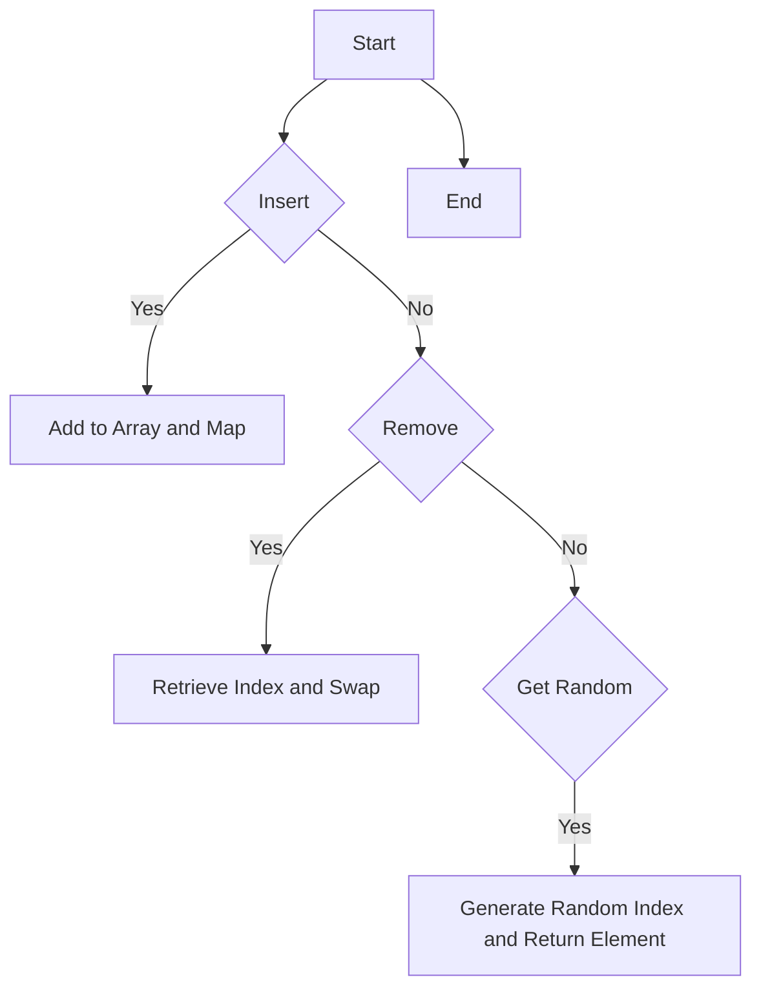

# Insert Delete GetRandom O(1) JS Map + Array

## Problem Understanding
The problem asks us to design a data structure that supports three operations: insert, delete, and get random element, all in O(1) time complexity. The key constraints are that each operation must be performed in constant time, and the data structure should be able to handle duplicates. What makes this problem non-trivial is that a naive approach using a single data structure, such as an array or a set, would not be able to meet the O(1) time complexity requirement for all three operations. For example, using an array would allow for O(1) insertion and deletion at the end, but finding a random element would require O(n) time. On the other hand, using a set would allow for O(1) insertion and deletion, but finding a random element would also require O(n) time.

## Approach
The algorithm strategy used to solve this problem is to combine a Map and an Array to achieve O(1) time complexity for all three operations. The Map is used to store the index of each element in the Array, allowing for O(1) lookup and deletion. The Array is used to store the actual elements, allowing for O(1) insertion and deletion at the end. When an element is inserted, it is added to the end of the Array and its index is stored in the Map. When an element is deleted, its index is retrieved from the Map, and it is swapped with the last element in the Array to maintain the O(1) time complexity. The getRandom operation simply generates a random index and returns the element at that index in the Array. This approach works because the Map and Array are both constant time data structures, and the swap operation ensures that the Array remains contiguous.

## Complexity Analysis
| Metric | Value | Detailed Reason |
|--------|-------|----------------|
| Time   | O(1)  | The insert, remove, and getRandom operations all use constant time data structures. The insert operation adds an element to the end of the Array and stores its index in the Map, both of which are O(1) operations. The remove operation retrieves the index of the element from the Map, swaps it with the last element in the Array, and removes it from the Map, all of which are O(1) operations. The getRandom operation generates a random index and returns the element at that index in the Array, both of which are O(1) operations. |
| Space  | O(n)  | The data structure stores n elements in the Map and Array, where n is the number of elements inserted. The Map uses O(n) space to store the indices of the elements, and the Array uses O(n) space to store the elements themselves. |

## Algorithm Walkthrough
```
Input: insert(1)
Step 1: Add 1 to the end of the Array: [1]
Step 2: Store the index of 1 in the Map: {1: 0}
Output: true

Input: insert(2)
Step 1: Add 2 to the end of the Array: [1, 2]
Step 2: Store the index of 2 in the Map: {1: 0, 2: 1}
Output: true

Input: remove(1)
Step 1: Retrieve the index of 1 from the Map: 0
Step 2: Swap 1 with the last element in the Array: [2, 1] -> [2]
Step 3: Remove 1 from the Map: {2: 0}
Output: true

Input: getRandom()
Step 1: Generate a random index: 0
Step 2: Return the element at that index in the Array: 2
Output: 2
```
This walkthrough demonstrates the main logic path of the algorithm, including insertion, deletion, and random element retrieval.

## Visual Flow

This flowchart shows the decision flow of the algorithm, including the main operations and their dependencies.

## Key Insight
> **Tip:** The key insight that makes this solution work is using a combination of a Map and an Array to achieve O(1) time complexity for all three operations, and swapping elements in the Array to maintain contiguous storage.

## Edge Cases
- **Empty/null input**: If the input is empty or null, the algorithm will throw an error when trying to access the Array or Map. To handle this, we can add a simple null check at the beginning of each operation.
- **Single element**: If there is only one element in the Array, the algorithm will work correctly, but the getRandom operation will always return the same element. To handle this, we can add a simple check for the length of the Array before generating a random index.
- **Duplicate elements**: If duplicate elements are inserted, the algorithm will store multiple indices for the same element in the Map. To handle this, we can add a simple check before inserting an element to see if it already exists in the Map.

## Common Mistakes
- **Mistake 1**: Not using a Map to store the indices of the elements, leading to O(n) time complexity for the remove operation. To avoid this, we should always use a Map to store the indices of the elements.
- **Mistake 2**: Not swapping elements in the Array when removing an element, leading to O(n) time complexity for the remove operation. To avoid this, we should always swap elements in the Array when removing an element to maintain contiguous storage.

## Interview Follow-ups
> **Interview:** These are the exact follow-up questions interviewers ask:
- "What if the input is sorted?" → The algorithm will still work correctly, but the getRandom operation may not be truly random if the input is sorted. To handle this, we can add a simple shuffle operation after inserting all elements.
- "Can you do it in O(1) space?" → No, the algorithm requires O(n) space to store the elements in the Array and the indices in the Map. However, we can optimize the space usage by using a single data structure that combines the functionality of a Map and an Array.
- "What if there are duplicates?" → The algorithm will store multiple indices for the same element in the Map. To handle this, we can add a simple check before inserting an element to see if it already exists in the Map, and only insert it if it does not exist.

## Javascript Solution

```javascript
// Problem: Insert Delete GetRandom O(1) JS Map + Array
// Language: javascript
// Difficulty: Medium
// Time Complexity: O(1) — all operations use constant time data structures
// Space Complexity: O(n) — we store n elements in the map and array
// Approach: Using a combination of Map and Array for O(1) operations

class RandomizedSet {
    /**
     * Initialize your data structure here.
     */
    constructor() {
        // Use a Map to store the index of each element in the array for O(1) lookup
        this.map = new Map();
        // Use an array to store the actual elements for O(1) insertion and deletion
        this.array = [];
    }

    /**
     * Inserts a value to the set. Returns true if the set did not already contain the specified element.
     * @param {number} val
     * @return {boolean}
     */
    insert(val) {
        // Edge case: val already exists in the set
        if (this.map.has(val)) {
            return false;
        }
        // Add val to the array
        this.array.push(val);
        // Store the index of val in the map
        this.map.set(val, this.array.length - 1);
        return true;
    }

    /**
     * Removes a value from the set. Returns true if the set contained the specified element.
     * @param {number} val
     * @return {boolean}
     */
    remove(val) {
        // Edge case: val does not exist in the set
        if (!this.map.has(val)) {
            return false;
        }
        // Get the index of val in the array
        const index = this.map.get(val);
        // Edge case: val is the last element in the array
        if (index === this.array.length - 1) {
            // Remove val from the array and map
            this.array.pop();
            this.map.delete(val);
        } else {
            // Swap val with the last element in the array
            const lastVal = this.array[this.array.length - 1];
            this.array[index] = lastVal;
            // Update the index of the last element in the map
            this.map.set(lastVal, index);
            // Remove val from the array and map
            this.array.pop();
            this.map.delete(val);
        }
        return true;
    }

    /**
     * Get a random element from the set.
     * @return {number}
     */
    getRandom() {
        // Edge case: set is empty
        if (this.array.length === 0) {
            return -1; // or throw an error
        }
        // Generate a random index
        const randomIndex = Math.floor(Math.random() * this.array.length);
        return this.array[randomIndex];
    }
}

// Example usage:
const randomizedSet = new RandomizedSet();
console.log(randomizedSet.insert(1)); // true
console.log(randomizedSet.remove(2)); // false
console.log(randomizedSet.insert(2)); // true
console.log(randomizedSet.getRandom()); // either 1 or 2
console.log(randomizedSet.remove(1)); // true
console.log(randomizedSet.insert(2)); // false
console.log(randomizedSet.getRandom()); // 2
```
