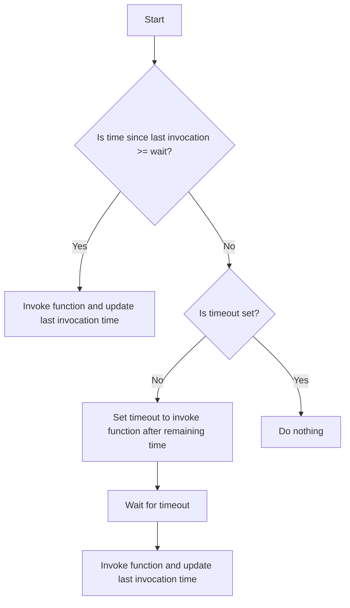

# JS Concept: Throttle with Trailing Edge

## Problem Understanding
The problem is asking to implement a function that throttles another function with a trailing edge, meaning the throttled function is called after a certain delay since the last invocation. The key constraint is that the throttled function should only be called when the time since the last invocation is greater than or equal to the specified wait time. This problem is non-trivial because a naive approach would involve constantly checking the time since the last invocation, which would be inefficient and might lead to multiple invocations within the wait time. The throttling with trailing edge concept ensures that the function is called after a certain delay, making it useful for scenarios like debouncing user input or optimizing function calls.

## Approach
The algorithm strategy used here is to keep track of the last invocation time and the current timeout. When the throttled function is called, it calculates the time since the last invocation and checks if it is greater than or equal to the wait time. If it is, the function is invoked immediately, and the last invocation time is updated. If not, a timeout is set to invoke the function after the remaining time. The mathematical reasoning behind this approach is to ensure that the function is called only after the specified wait time has passed since the last invocation. The data structures used are simple variables to keep track of the last invocation time and the current timeout. This approach handles the key constraints by constantly checking the time since the last invocation and adjusting the timeout accordingly.

## Complexity Analysis
| Metric | Value | Detailed Reason |
|--------|-------|----------------|
| Time   | O(1)  | The time complexity is constant because the function only involves a fixed number of operations, such as calculating the time since the last invocation and checking the timeout. The number of operations does not grow with the size of the input. |
| Space  | O(1)  | The space complexity is constant because the function only uses a fixed amount of space to store variables like the last invocation time and the current timeout. The space used does not grow with the size of the input. |

## Algorithm Walkthrough
```
Input: throttleWithTrailingEdge(console.log, 1000)
Step 1: Initialize variables - timeout = null, lastInvocationTime = 0
Step 2: Call the throttled function - throttledConsoleLog("Invocation 0")
  - currentTime = 1643723400, timeSinceLastInvocation = 1643723400 - 0 = 1643723400
  - Since timeSinceLastInvocation >= wait, invoke console.log("Invocation 0") and update lastInvocationTime = 1643723400
Step 3: Call the throttled function - throttledConsoleLog("Invocation 1")
  - currentTime = 1643723401, timeSinceLastInvocation = 1643723401 - 1643723400 = 1
  - Since timeSinceLastInvocation < wait, set a timeout to invoke console.log("Invocation 1") after 999ms
Step 4: After 999ms, the timeout invokes console.log("Invocation 1") and updates lastInvocationTime = 1643723400 + 1000 = 1643724400
Output: The throttled function is called after the specified wait time, with the last invocation time updated accordingly.
```

## Visual Flow


## Key Insight
> **Tip:** The key insight here is to use a timeout to invoke the function after the specified wait time, ensuring that the function is called only once during the wait period, even if the throttled function is called multiple times.

## Edge Cases
- **Empty/null input**: If the input function is null or undefined, the throttled function will throw an error when trying to invoke it. To handle this, you can add a null check at the beginning of the throttled function.
- **Single element**: If the input function is called only once, it will be invoked immediately, and the last invocation time will be updated accordingly.
- **Zero wait time**: If the wait time is set to 0, the throttled function will be invoked immediately every time it is called, effectively disabling the throttling.

## Common Mistakes
- **Mistake 1**: Not clearing the existing timeout before setting a new one, which can lead to multiple invocations of the function within the wait time. To avoid this, always clear the existing timeout before setting a new one.
- **Mistake 2**: Not updating the last invocation time when the function is invoked, which can lead to incorrect throttling. To avoid this, always update the last invocation time when the function is invoked.

## Interview Follow-ups
> **Interview:** These are the exact follow-up questions interviewers ask:
- "What if the input is sorted?" → The sorting of the input does not affect the throttling function, as it only depends on the time since the last invocation.
- "Can you do it in O(1) space?" → Yes, the current implementation already uses O(1) space, as it only uses a fixed amount of space to store variables.
- "What if there are duplicates?" → The throttling function will invoke the input function only once during the wait period, even if the throttled function is called multiple times with the same arguments.

## Javascript Solution

```javascript
// Problem: JS Concept: Throttle with Trailing Edge
// Language: javascript
// Difficulty: medium
// Time Complexity: O(1) — constant time complexity because we're only dealing with a fixed number of variables
// Space Complexity: O(1) — constant space complexity because we're only using a fixed amount of space to store variables
// Approach: Throttling with trailing edge — ensures the function is called after a certain delay since the last invocation

/**
 * Throttles a function with a trailing edge, meaning the function is called after a certain delay since the last invocation.
 * 
 * @param {function} func - The function to throttle.
 * @param {number} wait - The delay between invocations.
 * @returns {function} - The throttled function.
 */
function throttleWithTrailingEdge(func, wait) {
    // Initialize variables to keep track of the timeout and the last invocation time
    let timeout = null;
    let lastInvocationTime = 0;

    // Return the throttled function
    return function(...args) {
        // Get the current time
        const currentTime = Date.now();

        // Calculate the time since the last invocation
        const timeSinceLastInvocation = currentTime - lastInvocationTime;

        // If the time since the last invocation is greater than the wait time, reset the timeout and invoke the function
        if (timeSinceLastInvocation >= wait) {
            // Reset the last invocation time
            lastInvocationTime = currentTime;

            // Clear any existing timeout
            if (timeout !== null) {
                globalThis.clearTimeout(timeout);
                timeout = null;
            }

            // Invoke the function
            func(...args);
        } else {
            // If the time since the last invocation is less than the wait time, set a timeout to invoke the function after the wait time
            if (timeout === null) {
                // Calculate the time remaining until the wait time is reached
                const timeRemaining = wait - timeSinceLastInvocation;

                // Set a timeout to invoke the function after the time remaining
                timeout = globalThis.setTimeout(() => {
                    // Reset the timeout and last invocation time
                    timeout = null;
                    lastInvocationTime = Date.now();

                    // Invoke the function
                    func(...args);
                }, timeRemaining);
            }
        }
    };
}

// Example usage
const throttledConsoleLog = throttleWithTrailingEdge((...args) => globalThis.console.log(...args), 1000);

// Test the throttled function
for (let i = 0; i < 10; i++) {
    throttledConsoleLog(`Invocation ${i}`);
}
```
