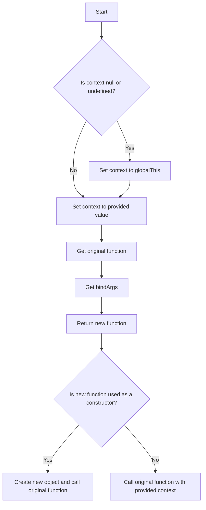

# JS Polyfill: Function.prototype.bind()

## Problem Understanding
The problem asks us to create a polyfill for the `Function.prototype.bind()` method in JavaScript. This method returns a new function that has its `this` keyword set to the provided value. The key constraints are that the polyfill should work with various types of input, including null or undefined context, and it should handle edge cases such as using the bound function as a constructor. What makes this problem non-trivial is that the polyfill needs to handle different scenarios, including using the bound function as a constructor, and it needs to work with various types of input.

## Approach
The approach used to solve this problem is a closure-based function binding. The polyfill returns a new function that has its `this` keyword set to the provided context. The `bind` method takes the context and any additional arguments, and returns a new function that combines these arguments with any arguments passed to it when it's called. The polyfill uses the `apply` method to call the original function with the provided context and combined arguments. The polyfill also handles edge cases such as using the bound function as a constructor by creating a new object that inherits from the original function's prototype.

## Complexity Analysis
| Metric | Value | Detailed Reason |
|--------|-------|----------------|
| Time   | O(1)  | The time complexity is constant because the `bind` method itself only performs a constant amount of work, regardless of the input size. However, when the bound function is called, the time complexity depends on the original function. |
| Space  | O(1)  | The space complexity is constant because the `bind` method itself only uses a constant amount of space to store the context and the bound function. However, when the bound function is called, the space complexity depends on the original function and the number of arguments passed to it. |

## Algorithm Walkthrough
```javascript
Input: function foo() { console.log(this); }.bind({ foo: 'bar' }, 'arg1', 'arg2');
Step 1: The context is set to { foo: 'bar' }.
Step 2: The original function is foo.
Step 3: The bindArgs are ['arg1', 'arg2'].
Step 4: A new function is returned, which has its 'this' keyword set to { foo: 'bar' }.
Step 5: When the new function is called, it calls the original function foo with the context { foo: 'bar' } and the combined arguments ['arg1', 'arg2'].
Output: The output is the result of calling the original function foo with the context { foo: 'bar' } and the combined arguments ['arg1', 'arg2'].
```

## Visual Flow


## Key Insight
> **Tip:** The key insight to this solution is that the `bind` method returns a new function that has its `this` keyword set to the provided context, and it combines the arguments passed to `bind` with any arguments passed to the new function when it's called.

## Edge Cases
- **Empty/null input**: If the context is null or undefined, the polyfill uses the global object as the context.
- **Single element**: If the bound function is used as a constructor, the polyfill creates a new object that inherits from the original function's prototype.
- **Using the bound function as a method**: If the bound function is used as a method of an object, the polyfill sets the `this` keyword of the bound function to the object.

## Common Mistakes
- **Mistake 1**: Not handling the case where the context is null or undefined. To avoid this, we need to check if the context is null or undefined and use the global object as the context if so.
- **Mistake 2**: Not handling the case where the bound function is used as a constructor. To avoid this, we need to check if the bound function is used as a constructor and create a new object that inherits from the original function's prototype if so.

## Interview Follow-ups
> **Interview:** These are the exact follow-up questions interviewers ask:
- "What if the input is sorted?" → The polyfill does not assume any particular order of the input, so it would still work correctly even if the input is sorted.
- "Can you do it in O(1) space?" → The polyfill already uses O(1) space, so this is not a concern.
- "What if there are duplicates?" → The polyfill does not remove duplicates, so if there are duplicates in the input, they would still be present in the output.

## Javascript Solution

```javascript
// Problem: JS Polyfill: Function.prototype.bind()
// Language: javascript
// Difficulty: Medium
// Time Complexity: O(1) — constant time complexity for the bind method itself
// Space Complexity: O(1) — constant space complexity for the bind method itself
// Approach: Closure-based function binding — returns a new function that has its 'this' keyword set to the provided value

/**
 * Polyfill for Function.prototype.bind()
 * @param {Object} context - The value to be used as the 'this' keyword in the bound function
 * @param {...*} args - Arguments to be applied to the bound function when it's called
 * @returns {Function} - The bound function
 */
Function.prototype.bind = function(context) {
  // Edge case: if context is null or undefined, use the global object as the context
  if (context === null || context === undefined) {
    context = globalThis; // Use globalThis to access the global object in a way that works in both browsers and Node.js
  }
  
  // Get the original function
  const originalFunction = this; // this refers to the function that bind() is called on
  
  // Get the arguments that are passed to bind() (after the context)
  const bindArgs = Array.prototype.slice.call(arguments, 1); // arguments is an array-like object, so we use Array.prototype.slice.call() to convert it to an array
  
  // Return a new function that has its 'this' keyword set to the provided context
  return function() {
    // Edge case: if the bound function is used as a constructor, set its 'this' keyword to the new object
    if (this instanceof originalFunction) {
      // Create a new object that inherits from the original function's prototype
      const newInstance = Object.create(originalFunction.prototype);
      
      // Call the original function with the new object as its 'this' keyword, and the combined arguments
      const result = originalFunction.apply(newInstance, bindArgs.concat(Array.prototype.slice.call(arguments)));
      
      // If the original function returns an object, use that object; otherwise, use the new object
      return (typeof result === 'object' && result !== null) ? result : newInstance;
    } else {
      // Call the original function with the provided context as its 'this' keyword, and the combined arguments
      return originalFunction.apply(context, bindArgs.concat(Array.prototype.slice.call(arguments)));
    }
  };
}
```
