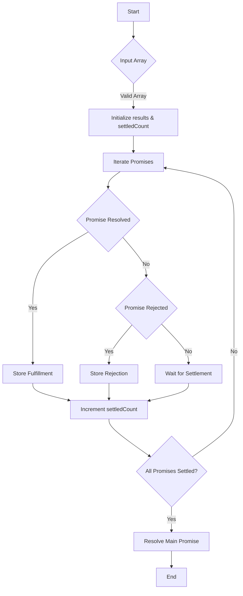

# JS Polyfill: Promise.allSettled()

## Problem Understanding
The problem requires implementing a polyfill for the `Promise.allSettled()` method in JavaScript. This method takes an array of promises as input and returns a promise that resolves when all the input promises have either been fulfilled or rejected. The key constraint is that the method should handle both resolved and rejected states of the promises. What makes this problem non-trivial is the need to track the settlement of each promise and resolve the main promise only when all promises are settled, regardless of their outcome.

## Approach
The algorithm strategy involves iterating through the array of promises and handling the resolution or rejection of each promise individually. This approach works by using `then` and `catch` to handle the fulfillment and rejection of each promise, and `finally` to increment a counter that tracks the number of settled promises. The `results` array is used to store the outcome of each promise, and the main promise is resolved with this array when all promises are settled. The `settledCount` variable is crucial in determining when all promises have been settled.

## Complexity Analysis
| Metric | Value | Detailed Reason |
|--------|-------|----------------|
| Time   | O(n)  | The algorithm iterates through each promise in the input array once. The `then`, `catch`, and `finally` methods are called for each promise, but these operations are constant time. Therefore, the overall time complexity is linear with respect to the number of promises. |
| Space  | O(n)  | The algorithm uses an array of size `n` to store the results of the promises, where `n` is the number of promises in the input array. This is the primary space usage, making the space complexity linear. |

## Algorithm Walkthrough
```
Input: [Promise.resolve('Resolved 1'), Promise.reject('Rejected 2'), Promise.resolve('Resolved 3')]
Step 1: Initialize results = [], settledCount = 0
Step 2: Iterate through each promise:
  - For Promise.resolve('Resolved 1'), call then() to store { status: 'fulfilled', value: 'Resolved 1' } in results[0]
  - For Promise.reject('Rejected 2'), call catch() to store { status: 'rejected', reason: 'Rejected 2' } in results[1]
  - For Promise.resolve('Resolved 3'), call then() to store { status: 'fulfilled', value: 'Resolved 3' } in results[2]
Step 3: After each promise is settled, increment settledCount and check if all promises are settled
Step 4: When settledCount equals the number of promises, resolve the main promise with the results array
Output: [{ status: 'fulfilled', value: 'Resolved 1' }, { status: 'rejected', reason: 'Rejected 2' }, { status: 'fulfilled', value: 'Resolved 3' }]
```

## Visual Flow


## Key Insight
> **Tip:** The key insight is to use a counter (`settledCount`) to track the number of settled promises and only resolve the main promise when this counter equals the total number of promises, ensuring that all promises are accounted for regardless of their outcome.

## Edge Cases
- **Empty/null input**: If the input array is empty or null, the function should either return an immediately resolved promise with an empty array or throw an error, depending on the desired behavior. In the provided polyfill, an error is thrown if the input is not an array.
- **Single element**: If the input array contains a single promise, the function should behave as expected, resolving the main promise with an array containing the outcome of the single promise after it settles.
- **Duplicate promises**: If the input array contains duplicate promises, the function should still work correctly, as each promise is handled individually based on its index in the array.

## Common Mistakes
- **Mistake 1**: Forgetting to handle the rejection of promises. To avoid this, always use `catch` after `then` to handle any errors that may occur.
- **Mistake 2**: Not checking if the input is an array. To avoid this, validate the input type at the beginning of the function and throw an error if it's not an array.

## Interview Follow-ups
> **Interview:** These are the exact follow-up questions interviewers ask:
- "What if the input is sorted?" → The sorting of the input array does not affect the functionality of the `allSettled` polyfill, as it processes each promise based on its index in the array.
- "Can you do it in O(1) space?" → Achieving O(1) space complexity is not possible with the current approach, as we need to store the results of each promise. However, optimizations could potentially reduce the space usage, but not to a constant level.
- "What if there are duplicates?" → The presence of duplicate promises in the input array does not affect the correctness of the polyfill, as each promise is handled individually. However, the settlement of duplicate promises will result in duplicate outcomes in the results array.

## Javascript Solution

```javascript
// Problem: JS Polyfill: Promise.allSettled()
// Language: javascript
// Difficulty: Medium
// Time Complexity: O(n) — where n is the number of promises
// Space Complexity: O(n) — where n is the number of promises
// Approach: Iterate through promises and handle resolved or rejected states

/**
 * Polyfill for Promise.allSettled()
 * @param {Promise[]} promises - array of promises to settle
 * @returns {Promise[]} - array of settled promises
 */
function allSettled(promises) {
  // Check if input is an array
  if (!Array.isArray(promises)) {
    // Edge case: input is not an array → throw error
    throw new TypeError('Input must be an array of promises');
  }

  // Initialize an empty array to store results
  const results = new Array(promises.length);

  // Initialize a counter to track the number of settled promises
  let settledCount = 0;

  // Return a new promise that resolves when all promises are settled
  return new Promise((resolve) => {
    // Iterate through each promise
    promises.forEach((promise, index) => {
      // Handle promise resolution
      promise.then((value) => {
        // Store the result as an object with status 'fulfilled'
        results[index] = { status: 'fulfilled', value };
      })
      // Handle promise rejection
      .catch((reason) => {
        // Store the result as an object with status 'rejected'
        results[index] = { status: 'rejected', reason };
      })
      // Increment the settled count when a promise is settled
      .finally(() => {
        settledCount++;
        // Check if all promises are settled
        if (settledCount === promises.length) {
          // Resolve the main promise with the results
          resolve(results);
        }
      });
    });
  });
}

// Example usage:
const promises = [
  Promise.resolve('Resolved 1'),
  Promise.reject('Rejected 2'),
  Promise.resolve('Resolved 3'),
];

allSettled(promises)
  .then((results) => {
    // Use console.log if it exists
    if (typeof globalThis.console !== 'undefined') {
      globalThis.console.log(results);
    }
  })
  .catch((error) => {
    // Use console.error if it exists
    if (typeof globalThis.console !== 'undefined') {
      globalThis.console.error(error);
    }
  });
```
