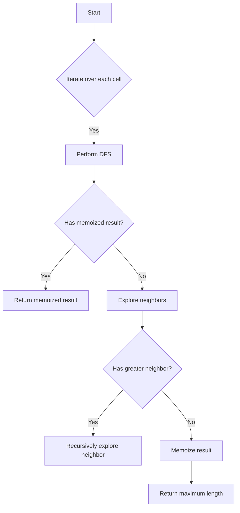

# Longest Increasing Path in a Matrix JS DFS + Memo

## Problem Understanding
The problem is asking to find the longest increasing path in a matrix, where each cell can have a value and each path can only be formed by moving to a neighboring cell with a greater value. The key constraints are that we can only move in four directions (up, down, left, right) and each cell can only be visited once in a path. What makes this problem non-trivial is that a naive approach of exploring all possible paths from each cell would result in exponential time complexity due to the overlapping subproblems. The problem requires an efficient algorithm to avoid redundant computations and find the longest increasing path.

## Approach
The approach used here is Depth-First Search (DFS) with memoization. The intuition behind this approach is to explore all possible paths from each cell while avoiding redundant computations by storing the longest increasing path lengths in a memoization map. The algorithm works by iterating over each cell in the matrix, performing DFS from each cell, and updating the maximum length found. The DFS function explores neighboring cells with greater values, recursively updates the maximum length, and memoizes the result for each cell. The use of memoization allows the algorithm to avoid redundant computations and achieve a time complexity of O(m*n), where m and n are the dimensions of the matrix.

## Complexity Analysis
| Metric | Value | Detailed Reason |
|--------|-------|----------------|
| Time   | O(m*n) | The algorithm visits each cell once and performs a constant amount of work for each cell. The use of memoization avoids redundant computations, resulting in a linear time complexity. |
| Space  | O(m*n) | The algorithm uses a memoization map to store the longest increasing path lengths for each cell, resulting in a space complexity of O(m*n). The recursion stack also uses O(m*n) space in the worst case. |

## Algorithm Walkthrough
```
Input: matrix = [
  [9, 9, 4],
  [6, 6, 8],
  [2, 1, 1]
]
Step 1: Initialize memoization map and maximum length
  memo = {}
  maxLength = 0
Step 2: Iterate over each cell in the matrix
  For cell (0, 0) with value 9:
    Perform DFS and update maximum length
    maxLength = max(maxLength, dfs(matrix, 0, 0, memo, directions))
    ...
  For cell (0, 1) with value 9:
    Perform DFS and update maximum length
    maxLength = max(maxLength, dfs(matrix, 0, 1, memo, directions))
    ...
  ...
Step 3: Perform DFS from cell (0, 0)
  Create key for memoization map: "0,0"
  Check if result is already memoized: no
  Initialize maximum length for current cell: 1
  Explore neighbors:
    For neighbor (0, 1) with value 9:
      Not greater, skip
    For neighbor (1, 0) with value 6:
      Greater, recursively explore and update maximum length
      maxLength = max(maxLength, 1 + dfs(matrix, 1, 0, memo, directions))
      ...
  Memoize result for current cell: memo.set("0,0", maxLength)
  Return the maximum length found for current cell
Output: maxLength = 4
```

## Visual Flow


## Key Insight
> **Tip:** The key insight is to use memoization to avoid redundant computations and store the longest increasing path lengths for each cell, allowing the algorithm to achieve a time complexity of O(m*n).

## Edge Cases
- **Empty/null input**: If the input matrix is empty or null, the algorithm returns 0, as there are no cells to explore.
- **Single element**: If the input matrix has only one element, the algorithm returns 1, as the longest increasing path is the single cell itself.
- **Matrix with all equal elements**: If the input matrix has all elements equal, the algorithm returns 1, as there are no increasing paths.

## Common Mistakes
- **Mistake 1**: Not using memoization, resulting in exponential time complexity due to redundant computations.
- **Mistake 2**: Not checking for out-of-bounds neighbors, resulting in incorrect results or runtime errors.

## Interview Follow-ups
> **Interview:** These are the exact follow-up questions interviewers ask:
- "What if the input is sorted?" → The algorithm still works correctly, as it explores all possible paths from each cell and returns the longest increasing path.
- "Can you do it in O(1) space?" → No, the algorithm requires O(m*n) space for the memoization map and recursion stack.
- "What if there are duplicates?" → The algorithm still works correctly, as it uses the greater-than operator to determine if a neighbor is part of an increasing path.

## Javascript Solution

```javascript
// Problem: Longest Increasing Path in a Matrix
// Language: javascript
// Difficulty: medium
// Time Complexity: O(m*n) — visiting each cell once with memoization
// Space Complexity: O(m*n) — memoization and recursion stack
// Approach: Depth-First Search with memoization — exploring all possible paths from each cell

/**
 * @param {number[][]} matrix
 * @return {number}
 */
var longestIncreasingPath = function(matrix) {
    // Edge case: empty matrix → return 0
    if (!matrix.length || !matrix[0].length) return 0;

    // Define directions for DFS exploration
    const directions = [[0, 1], [0, -1], [1, 0], [-1, 0]];
    
    // Initialize memoization map to store longest increasing path lengths
    const memo = new Map();
    
    // Initialize maximum length
    let maxLength = 0;
    
    // Iterate over each cell in the matrix
    for (let i = 0; i < matrix.length; i++) {
        for (let j = 0; j < matrix[0].length; j++) {
            // Perform DFS from current cell and update maximum length
            maxLength = Math.max(maxLength, dfs(matrix, i, j, memo, directions));
        }
    }
    
    // Return the maximum length found
    return maxLength;
};

/**
 * @param {number[][]} matrix
 * @param {number} i
 * @param {number} j
 * @param {Map<string, number>} memo
 * @param {number[][]} directions
 * @return {number}
 */
function dfs(matrix, i, j, memo, directions) {
    // Create key for memoization map
    const key = `${i},${j}`;
    
    // Check if result is already memoized
    if (memo.has(key)) return memo.get(key); // Return memoized result
    
    // Initialize maximum length for current cell
    let maxLength = 1;
    
    // Explore neighbors
    for (const [di, dj] of directions) {
        const ni = i + di;
        const nj = j + dj;
        
        // Check if neighbor is within bounds and has a greater value
        if (ni >= 0 && ni < matrix.length && nj >= 0 && nj < matrix[0].length && matrix[ni][nj] > matrix[i][j]) {
            // Recursively explore neighbor and update maximum length
            maxLength = Math.max(maxLength, 1 + dfs(matrix, ni, nj, memo, directions));
        }
    }
    
    // Memoize result for current cell
    memo.set(key, maxLength);
    
    // Return the maximum length found for current cell
    return maxLength;
}
```
