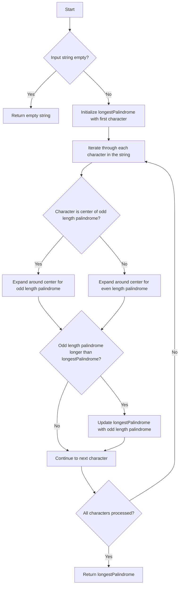

# Longest Palindromic Substring JS Expand Around Center

## Problem Understanding
The problem asks to find the longest palindromic substring within a given string. A palindromic substring is a sequence of characters that reads the same backward as forward. The key constraint is that the input string can be of any length, and the solution must handle edge cases such as empty strings or single-character strings. The problem is non-trivial because a naive approach, such as checking all possible substrings, would have a time complexity of O(n^3), which is inefficient for large inputs. The Expand Around Center approach is used to solve this problem efficiently.

## Approach
The algorithm strategy is to treat each character in the string as the center of a potential palindrome and expand outwards to find the longest palindromic substring. This approach works by iterating through each character in the string and considering two types of palindromes: odd-length palindromes (e.g., "aba") and even-length palindromes (e.g., "abba"). The `expandAroundCenter` function is used to expand around the center of each potential palindrome, and the longest palindromic substring found is updated accordingly. The algorithm uses a simple iterative approach and does not require any additional data structures beyond the input string and output substring.

## Complexity Analysis
| Metric | Value | Detailed Reason |
|--------|-------|----------------|
| Time   | O(n^2) | The algorithm iterates through each character in the string (O(n)), and for each character, it potentially expands outwards to find the longest palindromic substring (O(n)). Therefore, the overall time complexity is O(n^2). |
| Space  | O(1) | The algorithm only uses a constant amount of space to store the input string, output substring, and indices, regardless of the input size. Therefore, the space complexity is O(1). |

## Algorithm Walkthrough
```
Input: "babad"
Step 1: Initialize longestPalindrome with the first character "b"
Step 2: Iterate through each character in the string:
  - For character "b" (index 0):
    - Odd length palindrome: expandAroundCenter("babad", 0, 0) returns "b"
    - Even length palindrome: expandAroundCenter("babad", 0, 1) returns "ba"
  - For character "a" (index 1):
    - Odd length palindrome: expandAroundCenter("babad", 1, 1) returns "a"
    - Even length palindrome: expandAroundCenter("babad", 1, 2) returns "aba"
  - For character "b" (index 2):
    - Odd length palindrome: expandAroundCenter("babad", 2, 2) returns "b"
    - Even length palindrome: expandAroundCenter("babad", 2, 3) returns "bab"
  - For character "a" (index 3):
    - Odd length palindrome: expandAroundCenter("babad", 3, 3) returns "a"
    - Even length palindrome: expandAroundCenter("babad", 3, 4) returns "aba"
  - For character "d" (index 4):
    - Odd length palindrome: expandAroundCenter("babad", 4, 4) returns "d"
    - Even length palindrome: expandAroundCenter("babad", 4, 5) returns "" (out of bounds)
Step 3: Update longestPalindrome with the longest palindromic substring found: "aba" or "bab"
Output: "aba" or "bab"
```

## Visual Flow


## Key Insight
> **Tip:** The key to solving this problem efficiently is to realize that a palindrome is symmetric around its center, and by expanding around the center, we can find the longest palindromic substring in O(n^2) time complexity.

## Edge Cases
- **Empty/null input**: If the input string is empty or null, the algorithm returns an empty string.
- **Single element**: If the input string has only one character, the algorithm returns that character as the longest palindromic substring.
- **Palindrome with even length**: If the longest palindromic substring has an even length, the algorithm correctly identifies it by expanding around the center of the palindrome.

## Common Mistakes
- **Mistake 1**: Not handling the edge case where the input string is empty or null. To avoid this, always check for empty or null input and return an empty string in such cases.
- **Mistake 2**: Not considering both odd and even length palindromes. To avoid this, always expand around the center for both odd and even length palindromes.

## Interview Follow-ups
> **Interview:** These are the exact follow-up questions interviewers ask:
- "What if the input is sorted?" → The algorithm still works correctly, but the time complexity remains O(n^2) because we need to expand around each character to find the longest palindromic substring.
- "Can you do it in O(1) space?" → No, we cannot achieve O(1) space complexity because we need to store the input string and output substring, which requires at least O(n) space.
- "What if there are duplicates?" → The algorithm correctly handles duplicates by expanding around the center of each character and considering both odd and even length palindromes.

## Javascript Solution

```javascript
// Problem: Longest Palindromic Substring
// Language: javascript
// Difficulty: Medium
// Time Complexity: O(n^2) — for each character, potentially expand outwards
// Space Complexity: O(1) — no extra space needed beyond input and output
// Approach: Expand Around Center — treat each character as the center of a potential palindrome

class Solution {
    /**
     * Returns the longest palindromic substring in the given string.
     * @param {string} s - The input string.
     * @returns {string} The longest palindromic substring.
     */
    longestPalindromicSubstring(s) {
        // Edge case: empty input → return empty string
        if (!s || s.length === 0) return "";

        let longestPalindrome = s.substring(0, 1); // Initialize with first character as palindrome
        for (let i = 0; i < s.length; i++) {
            // Odd length palindrome
            let oddLengthPalindrome = this.expandAroundCenter(s, i, i);
            // Even length palindrome
            let evenLengthPalindrome = this.expandAroundCenter(s, i, i + 1);

            // Update longest palindrome if necessary
            if (oddLengthPalindrome.length > longestPalindrome.length) {
                longestPalindrome = oddLengthPalindrome;
            }
            if (evenLengthPalindrome.length > longestPalindrome.length) {
                longestPalindrome = evenLengthPalindrome;
            }
        }
        return longestPalindrome;
    }

    /**
     * Expands around the center to find the longest palindromic substring.
     * @param {string} s - The input string.
     * @param {number} left - The left index of the center.
     * @param {number} right - The right index of the center.
     * @returns {string} The longest palindromic substring.
     */
    expandAroundCenter(s, left, right) {
        while (left >= 0 && right < s.length && s[left] === s[right]) {
            // As long as characters match, continue expanding outwards
            left--;
            right++;
        }
        // Return the palindromic substring (excluding the last non-matching characters)
        return s.substring(left + 1, right);
    }
}

// Example usage:
let solution = new Solution();
console.log(solution.longestPalindromicSubstring("babad")); // Output: "bab" or "aba"
console.log(solution.longestPalindromicSubstring("cbbd")); // Output: "bb"
```
