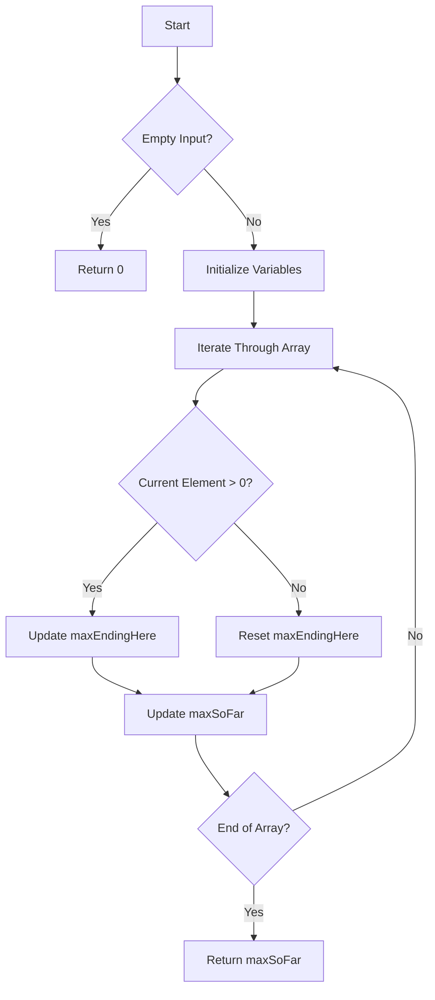

# Maximum Subarray JS Kadane's

## Problem Understanding
The problem asks to find the maximum contiguous subarray of an array of integers, which is the subarray with the largest sum. The key constraint is that the subarray must be contiguous, meaning that the elements must be adjacent in the original array. This problem is non-trivial because a naive approach, such as checking all possible subarrays, would have a time complexity of O(n^2), which is inefficient for large arrays. The problem requires a more efficient algorithm that can find the maximum subarray in linear time.

## Approach
The algorithm strategy used here is Kadane's algorithm, which is an iterative approach that tracks the maximum sum of subarray ending at each position. The intuition behind this approach is that the maximum sum of subarray ending at a position is the maximum of the current element and the sum of the current element and the maximum sum of subarray ending at the previous position. This approach works because it ensures that the maximum sum of subarray ending at each position is considered, and it avoids the need to check all possible subarrays. The data structures used are simple variables to store the maximum sum of subarray seen so far and the maximum sum of subarray ending at the current position.

## Complexity Analysis
| Metric | Value | Detailed Reason |
|--------|-------|----------------|
| Time   | O(n)  | The algorithm iterates through the array only once, where n is the number of elements in the array. The operations inside the loop are constant time, so the overall time complexity is linear. |
| Space  | O(1)  | The algorithm uses only a few variables to store the maximum sum of subarray seen so far and the maximum sum of subarray ending at the current position, so the space complexity is constant. |

## Algorithm Walkthrough
```
Input: [-2, 1, -3, 4, -1, 2, 1, -5, 4]
Step 1: maxSoFar = -2, maxEndingHere = -2
Step 2: maxEndingHere = max(-2 + 1, 1) = 1, maxSoFar = max(-2, 1) = 1
Step 3: maxEndingHere = max(1 - 3, -3) = -2, maxSoFar = max(1, -2) = 1
Step 4: maxEndingHere = max(-2 + 4, 4) = 4, maxSoFar = max(1, 4) = 4
Step 5: maxEndingHere = max(4 - 1, -1) = 3, maxSoFar = max(4, 3) = 4
Step 6: maxEndingHere = max(3 + 2, 2) = 5, maxSoFar = max(4, 5) = 5
Step 7: maxEndingHere = max(5 + 1, 1) = 6, maxSoFar = max(5, 6) = 6
Step 8: maxEndingHere = max(6 - 5, -5) = 1, maxSoFar = max(6, 1) = 6
Step 9: maxEndingHere = max(1 + 4, 4) = 5, maxSoFar = max(6, 5) = 6
Output: 6
```
This walkthrough demonstrates how the algorithm iterates through the array and updates the maximum sum of subarray ending at each position and the maximum sum of subarray seen so far.

## Visual Flow

This flowchart illustrates the decision flow of the algorithm, including the handling of empty input, initialization of variables, iteration through the array, and updates to the maximum sum of subarray ending at each position and the maximum sum of subarray seen so far.

## Key Insight
> **Tip:** The key insight is to realize that the maximum sum of subarray ending at a position is the maximum of the current element and the sum of the current element and the maximum sum of subarray ending at the previous position, which allows the algorithm to avoid checking all possible subarrays.

## Edge Cases
- **Empty input**: If the input array is empty, the algorithm returns 0, as there is no subarray to consider.
- **Single element**: If the input array has only one element, the algorithm returns that element, as it is the only possible subarray.
- **All negative elements**: If the input array contains only negative elements, the algorithm returns the largest negative element, as it is the maximum sum of subarray that can be obtained.

## Common Mistakes
- **Mistake 1**: Not handling the case where the input array is empty, which can cause the algorithm to throw an error or return an incorrect result. To avoid this, add a check at the beginning of the algorithm to return 0 if the input array is empty.
- **Mistake 2**: Not resetting the `maxEndingHere` variable when the current element is negative, which can cause the algorithm to return an incorrect result. To avoid this, reset `maxEndingHere` to the current element when it is negative.

## Interview Follow-ups
> **Interview:** These are the exact follow-up questions interviewers ask:
- "What if the input is sorted?" → The algorithm still works correctly, as it only depends on the relative order of the elements, not their absolute values.
- "Can you do it in O(1) space?" → The algorithm already uses O(1) space, as it only uses a few variables to store the maximum sum of subarray seen so far and the maximum sum of subarray ending at the current position.
- "What if there are duplicates?" → The algorithm still works correctly, as it treats duplicate elements as separate elements and considers all possible subarrays.

## Javascript Solution

```javascript
// Problem: Maximum Subarray
// Language: javascript
// Difficulty: Medium
// Time Complexity: O(n) — single pass through array
// Space Complexity: O(1) — only a few variables are used
// Approach: Kadane's algorithm — track maximum sum of subarray ending at each position

class Solution {
    maxSubArray(nums) {
        // Edge case: empty input → return 0
        if (nums.length === 0) return 0;

        // Initialize variables to store maximum sum and current sum
        let maxSoFar = nums[0]; // maximum sum of subarray seen so far
        let maxEndingHere = nums[0]; // maximum sum of subarray ending at current position

        // Iterate through the array starting from the second element
        for (let i = 1; i < nums.length; i++) {
            // Update maximum sum of subarray ending at current position
            // by choosing the maximum between current element and sum of current element and previous maximum sum
            maxEndingHere = Math.max(nums[i], maxEndingHere + nums[i]);
            
            // Update maximum sum of subarray seen so far
            maxSoFar = Math.max(maxSoFar, maxEndingHere);
        }

        // Return the maximum sum of subarray
        return maxSoFar;
    }
}

// Example usage:
let solution = new Solution();
console.log(solution.maxSubArray([-2, 1, -3, 4, -1, 2, 1, -5, 4])); // Output: 6
```
