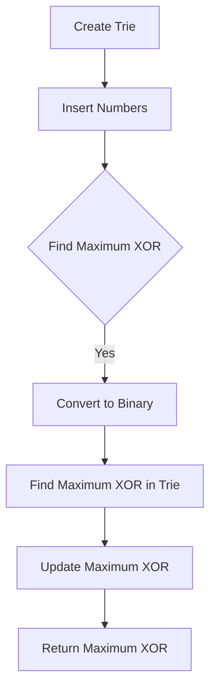

# Maximum XOR of Two Numbers in an Array JS Trie

## Problem Understanding
The problem is asking to find the maximum XOR of two numbers in an array. The XOR operation is a binary operation that takes two bits and returns 1 if the bits are different and 0 if they are the same. The key constraint is that we need to find the maximum XOR of two numbers in the array, which means we need to consider all possible pairs of numbers. The problem is non-trivial because a naive approach would involve comparing each pair of numbers, resulting in a time complexity of O(n^2), which is inefficient for large arrays. The use of a Trie data structure can help reduce the time complexity by allowing us to efficiently find the maximum XOR of two numbers.

## Approach
The algorithm strategy is to use a Trie data structure to store the binary representation of each number in the array. The intuition behind this approach is that the Trie allows us to efficiently find the maximum XOR of two numbers by matching prefixes in the Trie. We insert each number into the Trie and then for each number, we find the maximum XOR by matching prefixes in the Trie. The Trie is used to store the binary representation of each number, and we use a recursive approach to insert each number into the Trie. The approach handles the key constraint of finding the maximum XOR of two numbers by considering all possible pairs of numbers.

## Complexity Analysis
| Metric | Value | Detailed Reason |
|--------|-------|----------------|
| Time   | O(n * 32) | Each number is processed 32 times (for each bit) when inserting it into the Trie and when finding the maximum XOR. The insertion and search operations in the Trie take O(32) time, and we perform these operations for each of the n numbers. |
| Space  | O(n) | The Trie stores at most n elements, where each element is a binary representation of a number. The Trie has a maximum depth of 32, which is the number of bits in the binary representation of a number. |

## Algorithm Walkthrough
```
Input: [3, 10, 5, 25, 2, 8]
Step 1: Create the Trie and insert the first number (3) into the Trie
    - Convert 3 to binary: 0000000000000000000000000000011
    - Insert the binary into the Trie
Step 2: Insert the second number (10) into the Trie
    - Convert 10 to binary: 00000000000000000000000000001010
    - Insert the binary into the Trie
Step 3: Find the maximum XOR for the first number (3)
    - Convert 3 to binary: 0000000000000000000000000000011
    - Find the maximum XOR by matching prefixes in the Trie: 0000000000000000000000000000011 ^ 00000000000000000000000000001010 = 00000000000000000000000000001101
Step 4: Find the maximum XOR for the second number (10)
    - Convert 10 to binary: 00000000000000000000000000001010
    - Find the maximum XOR by matching prefixes in the Trie: 00000000000000000000000000001010 ^ 0000000000000000000000000000011 = 00000000000000000000000000001101
...
Output: 28
```
## Visual Flow

## Key Insight
> **Tip:** The key insight is to use a Trie data structure to efficiently find the maximum XOR of two numbers by matching prefixes in the Trie.

## Edge Cases
- **Empty input**: If the input array is empty, the function returns 0 because there are no numbers to find the maximum XOR.
- **Single element**: If the input array has only one element, the function returns 0 because there is no other number to find the XOR with.
- **Duplicate elements**: If the input array has duplicate elements, the function still works correctly because the Trie stores the binary representation of each number, and duplicate numbers will have the same binary representation.

## Common Mistakes
- **Mistake 1**: Not padding the binary representation of each number with zeros to 32 bits, which can cause incorrect results.
- **Mistake 2**: Not updating the maximum XOR correctly, which can cause the function to return an incorrect result.

## Interview Follow-ups
> **Interview:** These are the exact follow-up questions interviewers ask:
- "What if the input is sorted?" → The function still works correctly because the Trie stores the binary representation of each number, and the sorting of the input array does not affect the correctness of the function.
- "Can you do it in O(1) space?" → No, it is not possible to find the maximum XOR of two numbers in an array in O(1) space because we need to store the binary representation of each number in the Trie.
- "What if there are duplicates?" → The function still works correctly because the Trie stores the binary representation of each number, and duplicate numbers will have the same binary representation.

## Javascript Solution

```javascript
// Problem: Maximum XOR of Two Numbers in an Array JS Trie
// Language: javascript
// Difficulty: Medium
// Time Complexity: O(n * 32) — each number is processed 32 times (for each bit) 
// Space Complexity: O(n) — Trie stores at most n elements
// Approach: Trie prefix matching — for each number, find the maximum XOR by matching prefixes in the Trie

class TrieNode {
    constructor() {
        // Initialize the children nodes and the endOfWord flag
        this.children = {};
        this.endOfWord = false;
    }
}

class Solution {
    findMaximumXOR(nums) {
        // Edge case: empty input → return 0
        if (nums.length === 0) return 0;
        
        // Create the Trie and insert all numbers
        let root = new TrieNode();
        for (let num of nums) {
            // Convert the number to binary and insert it into the Trie
            this.insert(root, num);
        }
        
        // Initialize the maximum XOR
        let max = 0;
        
        // For each number, find the maximum XOR by matching prefixes in the Trie
        for (let num of nums) {
            // Convert the number to binary
            let binary = this.convertToBinary(num);
            
            // Find the maximum XOR by matching prefixes in the Trie
            let xor = this.findMaximumXOR(root, binary);
            
            // Update the maximum XOR
            max = Math.max(max, xor);
        }
        
        return max;
    }

    insert(root, num) {
        // Convert the number to binary
        let binary = this.convertToBinary(num);
        
        // Insert the binary into the Trie
        let node = root;
        for (let bit of binary) {
            // If the bit is not in the children, add it
            if (!(bit in node.children)) {
                node.children[bit] = new TrieNode();
            }
            // Move to the child node
            node = node.children[bit];
        }
        
        // Mark the end of the word
        node.endOfWord = true;
    }

    findMaximumXOR(root, binary) {
        // Initialize the current node and the XOR
        let node = root;
        let xor = '';
        
        // For each bit in the binary
        for (let bit of binary) {
            // Find the opposite bit in the children
            let oppositeBit = bit === '0' ? '1' : '0';
            
            // If the opposite bit is in the children, move to it
            if (oppositeBit in node.children) {
                xor += '1';
                node = node.children[oppositeBit];
            } else {
                // Otherwise, move to the same bit
                xor += '0';
                node = node.children[bit];
            }
        }
        
        // Convert the XOR binary to decimal
        return parseInt(xor, 2);
    }

    convertToBinary(num) {
        // Convert the number to binary and pad it with zeros to 32 bits
        return num.toString(2).padStart(32, '0');
    }
}

// Test the solution
let solution = new Solution();
console.log(solution.findMaximumXOR([3, 10, 5, 25, 2, 8]));
```
