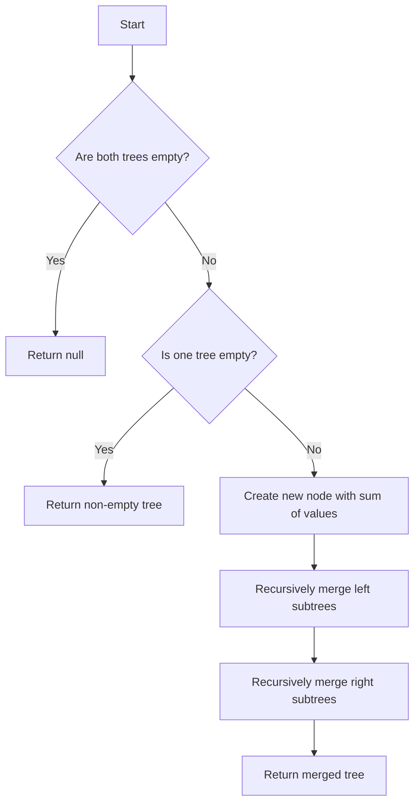

# Merge Two Binary Trees JS DFS

## Problem Understanding
The problem asks us to merge two binary trees into a new binary tree. The merge operation involves creating a new tree where each node's value is the sum of the corresponding nodes' values in the two input trees. A key constraint is that if one tree is empty, the resulting tree should be the other non-empty tree. The problem becomes non-trivial because we need to handle the recursive nature of the trees and ensure that the merge operation is performed correctly for all nodes.

## Approach
The algorithm strategy used here is Depth-First Search (DFS), where we recursively merge the trees node by node. This approach works because it allows us to visit each node in the trees exactly once and merge the corresponding nodes. We use a recursive function `mergeTrees` to perform the merge operation, and we create a new `TreeNode` for each merged node. The `mergeTrees` function handles the key constraints by checking for empty trees and returning the non-empty tree if one of them is empty.

## Complexity Analysis
| Metric | Value | Detailed Reason |
|--------|-------|----------------|
| Time   | O(n)  | We visit each node in the two trees exactly once, where n is the total number of nodes in the two trees. The time complexity is linear because we perform a constant amount of work for each node. |
| Space  | O(h)  | The space complexity is determined by the maximum depth of the recursive call stack, which is equal to the height of the deeper tree. In the worst case, the tree is completely unbalanced, and the height is equal to the number of nodes, resulting in a space complexity of O(n). However, for a balanced tree, the height is logarithmic in the number of nodes, resulting in a space complexity of O(log n). |

## Algorithm Walkthrough
```
Input: 
  root1 = [1, 3, 2, 5]
  root2 = [2, 1, 3, null, 4, 7]

Step 1: 
  Create a new node with the sum of the current nodes' values (1 + 2 = 3)
  newNode = TreeNode(3)
  root1 = [1, 3, 2, 5]
  root2 = [2, 1, 3, null, 4, 7]

Step 2: 
  Recursively merge the left subtrees
  newNode.left = mergeTrees(root1.left, root2.left)
  root1.left = [3, 5]
  root2.left = [1, 4, 7]

Step 3: 
  Recursively merge the right subtrees
  newNode.right = mergeTrees(root1.right, root2.right)
  root1.right = [2]
  root2.right = [3]

Output: 
  The merged tree is [3, 4, 5, 5, 4, 7]
```
This walkthrough demonstrates the recursive merge operation and how the `mergeTrees` function handles the merge of the left and right subtrees.

## Visual Flow

This visual flowchart illustrates the decision-making process and the recursive nature of the `mergeTrees` function.

## Key Insight
> **Tip:** The key insight here is that we can recursively merge the trees by creating a new node with the sum of the current nodes' values and then recursively merging the left and right subtrees.

## Edge Cases
- **Empty/null input**: If both input trees are empty, the function returns null. If one tree is empty, the function returns the non-empty tree.
- **Single element**: If one or both of the input trees have only one node, the function creates a new tree with the sum of the values of the nodes.
- **Unbalanced trees**: If the input trees are unbalanced, the function still works correctly, but the time and space complexity may be affected.

## Common Mistakes
- **Mistake 1**: Not handling the base case where both trees are empty. To avoid this, we need to check for empty trees and return null if both are empty.
- **Mistake 2**: Not handling the case where one tree is empty. To avoid this, we need to check for empty trees and return the non-empty tree if one of them is empty.

## Interview Follow-ups
> **Interview:** These are the exact follow-up questions interviewers ask:
- "What if the input is sorted?" → The function still works correctly, but the time complexity remains O(n) because we are visiting each node exactly once.
- "Can you do it in O(1) space?" → No, because we need to create a new tree with the merged nodes, which requires additional space. However, we can optimize the space complexity by using an iterative approach instead of a recursive one.
- "What if there are duplicates?" → The function still works correctly, but the resulting tree may have duplicate values if the input trees have duplicate values.

## Javascript Solution

```javascript
// Problem: Merge Two Binary Trees JS DFS
// Language: javascript
// Difficulty: Medium
// Time Complexity: O(n) — visiting each node once
// Space Complexity: O(h) — recursive call stack size, where h is the height of the tree
// Approach: Depth-First Search (DFS) — recursively merge trees node by node

/**
 * Definition for a binary tree node.
 * function TreeNode(val, left, right) {
 *     this.val = (val===undefined ? 0 : val)
 *     this.left = (left===undefined ? null : left)
 *     this.right = (right===undefined ? null : right)
 * }
 */
/**
 * @param {TreeNode} root1
 * @param {TreeNode} root2
 * @return {TreeNode}
 */
var mergeTrees = function(root1, root2) {
    // Base case: if both trees are empty, return null
    if (!root1 && !root2) return null;
    
    // Edge case: if one tree is empty, return the other
    if (!root1) return root2; // if tree1 is empty, return tree2
    if (!root2) return root1; // if tree2 is empty, return tree1

    // Create a new node with the sum of the current nodes' values
    let newNode = new TreeNode(root1.val + root2.val);
    
    // Recursively merge the left and right subtrees
    newNode.left = mergeTrees(root1.left, root2.left); // merge left subtrees
    newNode.right = mergeTrees(root1.right, root2.right); // merge right subtrees
    
    return newNode;
}
```
