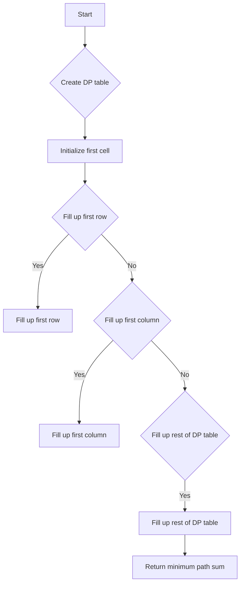

# Minimum Path Sum JS DP

## Problem Understanding
The Minimum Path Sum problem is asking to find the minimum sum of the numbers in a path from the top-left cell to the bottom-right cell in a given grid, where each step can only be either down or right. The key constraint is that we can only move either down or right, which means we cannot move up or left. This constraint implies that we need to consider the minimum path sum to reach each cell from the top-left cell. The problem is non-trivial because the naive approach of trying all possible paths would result in an exponential time complexity, making it inefficient for large grids.

## Approach
The algorithm strategy used to solve this problem is Dynamic Programming (DP), which involves filling up a DP table in a bottom-up manner. The intuition behind this approach is to break down the problem into smaller sub-problems, where each sub-problem represents the minimum path sum to reach a particular cell. The DP table is used to store the minimum path sum to reach each cell, and it is filled up row by row from the top-left cell to the bottom-right cell. The approach works by considering the minimum path sum to reach each cell as the minimum of the path sum to reach the cell above it and the cell to its left, plus the value of the current cell. The DP table is used to store the minimum path sum to reach each cell, and it is filled up using two nested loops.

## Complexity Analysis
| Metric | Value | Detailed Reason |
|--------|-------|----------------|
| Time   | O(m*n) | The time complexity is O(m*n) because we need to fill up the DP table, which has m rows and n columns. The filling up process involves two nested loops, each of which iterates m and n times, respectively. |
| Space  | O(m*n) | The space complexity is O(m*n) because we need to store the DP table, which has m rows and n columns. The DP table is used to store the minimum path sum to reach each cell, and it is filled up row by row from the top-left cell to the bottom-right cell. |

## Algorithm Walkthrough
```javascript
Input: [[1,3,1],[1,5,1],[4,2,1]]
Step 1: Create a DP table with the same dimensions as the grid
  dp = [[0,0,0],[0,0,0],[0,0,0]]
Step 2: Initialize the first cell of the DP table
  dp[0][0] = 1
Step 3: Fill up the first row of the DP table
  dp[0][1] = dp[0][0] + grid[0][1] = 1 + 3 = 4
  dp[0][2] = dp[0][1] + grid[0][2] = 4 + 1 = 5
Step 4: Fill up the first column of the DP table
  dp[1][0] = dp[0][0] + grid[1][0] = 1 + 1 = 2
  dp[2][0] = dp[1][0] + grid[2][0] = 2 + 4 = 6
Step 5: Fill up the rest of the DP table
  dp[1][1] = Math.min(dp[0][1], dp[1][0]) + grid[1][1] = Math.min(4, 2) + 5 = 7
  dp[1][2] = Math.min(dp[0][2], dp[1][1]) + grid[1][2] = Math.min(5, 7) + 1 = 6
  dp[2][1] = Math.min(dp[1][1], dp[2][0]) + grid[2][1] = Math.min(7, 6) + 2 = 8
  dp[2][2] = Math.min(dp[1][2], dp[2][1]) + grid[2][2] = Math.min(6, 8) + 1 = 7
Output: 7
```

## Visual Flow


## Key Insight
> **Tip:** The key insight to solving this problem is to use Dynamic Programming to break down the problem into smaller sub-problems, where each sub-problem represents the minimum path sum to reach a particular cell.

## Edge Cases
- **Empty/null input**: If the input grid is empty or null, the function returns 0, as there are no cells to traverse.
- **Single element**: If the input grid has only one cell, the function returns the value of that cell, as there is only one possible path.
- **Single row**: If the input grid has only one row, the function returns the sum of all cells in that row, as there is only one possible path.

## Common Mistakes
- **Mistake 1**: Not initializing the first cell of the DP table correctly, which can lead to incorrect results.
- **Mistake 2**: Not considering the minimum path sum to reach each cell as the minimum of the path sum to reach the cell above it and the cell to its left, plus the value of the current cell.

## Interview Follow-ups
> **Interview:** These are the exact follow-up questions interviewers ask:
- "What if the input is sorted?" → The solution does not rely on the input being sorted, so it would not affect the time complexity.
- "Can you do it in O(1) space?" → No, it is not possible to solve this problem in O(1) space, as we need to store the DP table to store the minimum path sum to reach each cell.
- "What if there are duplicates?" → The solution does not rely on the uniqueness of the cells, so duplicates would not affect the time complexity.

## Javascript Solution

```javascript
// Problem: Minimum Path Sum
// Language: javascript
// Difficulty: Medium
// Time Complexity: O(m*n) — filling up the dp table in a bottom-up manner
// Space Complexity: O(m*n) — storing the dp table
// Approach: Dynamic Programming — filling up the dp table in a bottom-up manner

class Solution {
    /**
     * @param {number[][]} grid
     * @return {number}
     */
    minPathSum(grid) {
        // Edge case: empty grid → return 0
        if (!grid.length || !grid[0].length) return 0;
        
        const rows = grid.length; // number of rows in the grid
        const cols = grid[0].length; // number of columns in the grid
        
        // Create a dp table with the same dimensions as the grid
        const dp = Array(rows).fill().map(() => Array(cols).fill(0));
        
        // Initialize the first cell of the dp table
        dp[0][0] = grid[0][0]; // the minimum path sum to reach the first cell is the value of the first cell itself
        
        // Fill up the first row of the dp table
        for (let col = 1; col < cols; col++) {
            // the minimum path sum to reach a cell in the first row is the sum of the current cell and the previous cell
            dp[0][col] = dp[0][col-1] + grid[0][col];
        }
        
        // Fill up the first column of the dp table
        for (let row = 1; row < rows; row++) {
            // the minimum path sum to reach a cell in the first column is the sum of the current cell and the cell above it
            dp[row][0] = dp[row-1][0] + grid[row][0];
        }
        
        // Fill up the rest of the dp table
        for (let row = 1; row < rows; row++) {
            for (let col = 1; col < cols; col++) {
                // the minimum path sum to reach a cell is the minimum of the path sum to reach the cell above it and the cell to its left, plus the value of the current cell
                dp[row][col] = Math.min(dp[row-1][col], dp[row][col-1]) + grid[row][col];
            }
        }
        
        // the minimum path sum to reach the bottom-right cell is the minimum path sum of the entire grid
        return dp[rows-1][cols-1];
    }
}

// Test the solution
const solution = new Solution();
const grid = [[1,3,1],[1,5,1],[4,2,1]];
console.log(solution.minPathSum(grid)); // Output: 7
```
