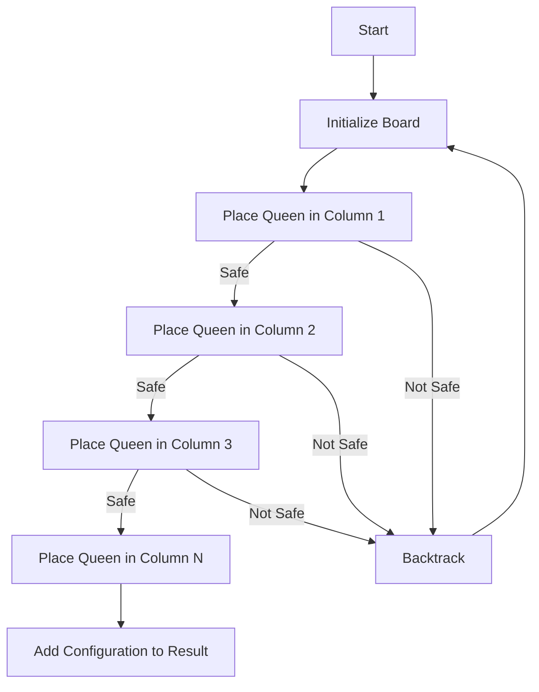

# N-Queens Backtracking

## Problem Understanding
The N-Queens problem is a classic backtracking problem that involves placing N queens on an NxN chessboard such that no two queens attack each other. The key constraints are that no two queens can be in the same row, column, or diagonal. The problem is non-trivial because the number of possible configurations grows exponentially with the size of the board, and a naive approach would require checking all possible configurations, resulting in an inefficient solution.

## Approach
The approach used to solve this problem is backtracking with constraint satisfaction. The algorithm tries to place queens in each column and backtracks if a constraint is violated. The algorithm uses a recursive helper function to place the queens and another helper function to check if a position is safe. The board is represented as a 2D array, and the result is stored in an array of strings, where each string represents a configuration of the board. The algorithm handles the key constraints by checking if a position is safe before placing a queen.

## Complexity Analysis
| Metric | Value | Detailed Reason |
|--------|-------|----------------|
| Time   | O(N!)  | The algorithm tries to place N queens in N columns, resulting in N! possible configurations. The recursive nature of the backtracking algorithm also contributes to the time complexity. |
| Space  | O(N)  | The maximum depth of the recursion tree is N, which is the number of queens. The board is also represented as a 2D array of size NxN, but the space complexity is dominated by the recursion stack. |

## Algorithm Walkthrough
```
Input: n = 4
Step 1: Initialize the board as an empty array of arrays
  [
    [ '.', '.', '.', '.' ],
    [ '.', '.', '.', '.' ],
    [ '.', '.', '.', '.' ],
    [ '.', '.', '.', '.' ]
  ]
Step 2: Try placing a queen in the first column
  [
    [ 'Q', '.', '.', '.' ],
    [ '.', '.', '.', '.' ],
    [ '.', '.', '.', '.' ],
    [ '.', '.', '.', '.' ]
  ]
Step 3: Recursively place the next queen
  [
    [ 'Q', '.', '.', '.' ],
    [ '.', 'Q', '.', '.' ],
    [ '.', '.', '.', '.' ],
    [ '.', '.', '.', '.' ]
  ]
Step 4: Recursively place the next queen
  [
    [ 'Q', '.', '.', '.' ],
    [ '.', 'Q', '.', '.' ],
    [ '.', '.', 'Q', '.' ],
    [ '.', '.', '.', '.' ]
  ]
Step 5: Recursively place the next queen
  [
    [ 'Q', '.', '.', '.' ],
    [ '.', 'Q', '.', '.' ],
    [ '.', '.', 'Q', '.' ],
    [ '.', '.', '.', 'Q' ]
  ]
Output: [
  [ 'Q', '.', '.', '.' ],
  [ '.', 'Q', '.', '.' ],
  [ '.', '.', 'Q', '.' ],
  [ '.', '.', '.', 'Q' ]
]
```
This walkthrough shows how the algorithm tries to place queens in each column and backtracks if a constraint is violated.

## Visual Flow

This flowchart shows the decision flow of the algorithm, where the algorithm tries to place a queen in each column and backtracks if a constraint is violated.

## Key Insight
> **Tip:** The key insight to solving this problem is to use a recursive backtracking approach with constraint satisfaction, where the algorithm tries to place queens in each column and backtracks if a constraint is violated.

## Edge Cases
- **Empty/null input**: If the input is empty or null, the algorithm should return an empty array, as there are no queens to place.
- **Single element**: If the input is 1, the algorithm should return a single configuration, where the queen is placed in the only available position.
- **Invalid input**: If the input is not a positive integer, the algorithm should throw an error or return an empty array, as the input is invalid.

## Common Mistakes
- **Mistake 1**: Not checking if a position is safe before placing a queen, resulting in an incorrect configuration.
- **Mistake 2**: Not backtracking correctly, resulting in an incomplete or incorrect solution.

## Interview Follow-ups
> **Interview:** These are the exact follow-up questions interviewers ask:
- "What if the input is sorted?" → The algorithm does not assume any specific order of the input, so it should still work correctly even if the input is sorted.
- "Can you do it in O(1) space?" → No, the algorithm requires at least O(N) space to store the board and the recursion stack.
- "What if there are duplicates?" → The algorithm does not assume any specific properties of the input, so it should still work correctly even if there are duplicates. However, the algorithm may produce duplicate configurations if the input has duplicates.

## Javascript Solution

```javascript
// Problem: N-Queens Backtracking
// Language: javascript
// Difficulty: Medium
// Time Complexity: O(N!) — due to the recursive nature of backtracking
// Space Complexity: O(N) — maximum depth of recursion tree
// Approach: Backtracking with constraint satisfaction — try placing queens in each column and backtrack if a constraint is violated

class Solution {
    /**
     * Solves the N-Queens problem using backtracking.
     * @param {number} n - The number of queens to place on the board.
     * @returns {string[][]} - All possible configurations of the board with n queens.
     */
    solveNQueens(n) {
        // Edge case: n is less than 1 → return an empty array
        if (n < 1) return [];

        // Initialize the result array
        const result = [];

        // Initialize the board as an empty array of arrays
        const board = Array(n).fill('.').map(() => Array(n).fill('.'));

        // Define a helper function to check if a position is safe
        const isSafe = (row, col) => {
            // Check the column
            for (let i = 0; i < row; i++) {
                if (board[i][col] === 'Q') return false;
            }

            // Check the main diagonal
            for (let i = row - 1, j = col - 1; i >= 0 && j >= 0; i--, j--) {
                if (board[i][j] === 'Q') return false;
            }

            // Check the other diagonal
            for (let i = row - 1, j = col + 1; i >= 0 && j < n; i--, j++) {
                if (board[i][j] === 'Q') return false;
            }

            // If no queen is found, the position is safe
            return true;
        };

        // Define a helper function to place the queens using backtracking
        const placeQueens = (row) => {
            // If all queens are placed, add the configuration to the result
            if (row === n) {
                const config = board.map(row => row.join(''));
                result.push(config);
                return;
            }

            // Try placing a queen in each column
            for (let col = 0; col < n; col++) {
                // Check if the position is safe
                if (isSafe(row, col)) {
                    // Place the queen
                    board[row][col] = 'Q';

                    // Recursively place the next queen
                    placeQueens(row + 1);

                    // Backtrack by removing the queen
                    board[row][col] = '.';
                }
            }
        };

        // Start placing the queens
        placeQueens(0);

        // Return the result
        return result;
    }
}

// Example usage:
const solution = new Solution();
const result = solution.solveNQueens(4);
console.log(result);
```
