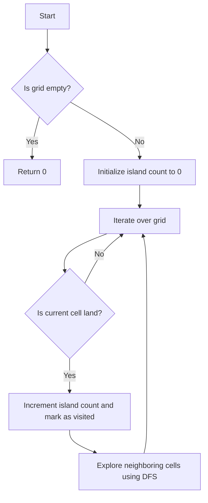

# Number of Islands

## Problem Understanding
The problem is asking to find the number of islands in a given 2D grid, where an island is defined as a group of connected land cells ('1') surrounded by water cells ('0'). The key constraint is that we need to iterate over the entire grid to count all the islands. What makes this problem non-trivial is that we need to explore each island and mark its cells as visited to avoid counting the same island multiple times. The problem also requires handling edge cases such as an empty grid, a grid with a single cell, or a grid with duplicate islands.

## Approach
The algorithm strategy used here is Depth-First Search (DFS), where we explore each island and count them. The intuition behind this approach is to iterate over the grid, and whenever we find a land cell, we increment the island count and mark all connected land cells as visited using DFS. We use a recursive DFS function to explore all neighboring cells of a given cell. The approach handles the key constraints by iterating over the entire grid and marking visited cells to avoid counting the same island multiple times.

## Complexity Analysis
| Metric | Value | Detailed Reason |
|--------|-------|----------------|
| Time   | O(m * n) | We iterate over the grid once, and for each cell, we perform a DFS operation. In the worst case, we might need to visit every cell in the grid, resulting in a time complexity of O(m * n), where m is the number of rows and n is the number of columns. |
| Space  | O(m * n) | In the worst case, the recursive call stack for DFS can go up to the size of the grid, resulting in a space complexity of O(m * n). |

## Algorithm Walkthrough
```
Input: [
  ['1', '1', '1', '1', '0'],
  ['1', '1', '0', '1', '0'],
  ['1', '1', '0', '0', '0'],
  ['0', '0', '0', '0', '0']
]
Step 1: Initialize island count to 0
Step 2: Iterate over the grid and find the first land cell at (0, 0)
Step 3: Increment island count to 1 and mark all connected land cells as visited using DFS
  - Mark (0, 0) as visited
  - Recursively explore (0, 1), (1, 0), (-1, 0), (0, -1)
  - Mark (0, 1), (1, 0) as visited
  - Recursively explore (0, 2), (1, 1), (2, 0), (-1, 1), (0, 0), (1, -1)
  - ...
Step 4: Continue iterating over the grid and find the next land cell at (1, 3)
Step 5: Increment island count to 2 and mark all connected land cells as visited using DFS
  - Mark (1, 3) as visited
  - Recursively explore (1, 4), (2, 3), (0, 3), (1, 2)
Output: 1 (number of islands)
```

## Visual Flow


## Key Insight
> **Tip:** The key insight to solving this problem is to use DFS to explore each island and mark its cells as visited to avoid counting the same island multiple times.

## Edge Cases
- **Empty/null input**: If the input grid is empty or null, the function returns 0, as there are no islands to count.
- **Single element**: If the input grid contains a single cell, the function returns 1 if the cell is land and 0 if the cell is water.
- **Grid with duplicate islands**: If the input grid contains duplicate islands (i.e., islands that are not connected), the function correctly counts each island separately.

## Common Mistakes
- **Mistake 1**: Not marking visited cells as water, leading to incorrect island counts. → To avoid this, mark each visited cell as water ('0') to prevent revisiting it.
- **Mistake 2**: Not handling edge cases correctly, such as an empty grid or a grid with a single cell. → To avoid this, add explicit checks for these edge cases and handle them accordingly.

## Interview Follow-ups
> **Interview:** These are the exact follow-up questions interviewers ask:
- "What if the input is sorted?" → The algorithm still works correctly, as it only relies on the connectivity of the land cells, not the order of the cells.
- "Can you do it in O(1) space?" → No, as we need to use a recursive call stack or a queue to store the cells to visit, which requires O(m * n) space in the worst case.
- "What if there are duplicates?" → The algorithm correctly counts each island separately, even if there are duplicate islands.

## Javascript Solution

```javascript
// Problem: Number of Islands
// Language: javascript
// Difficulty: Medium
// Time Complexity: O(m * n) — iterating over the grid once
// Space Complexity: O(m * n) — in the worst case, the queue will store all cells
// Approach: Depth-First Search (DFS) — exploring each island and counting them

class Solution {
    numIslands(grid) {
        // Edge case: empty grid → return 0
        if (!grid || grid.length === 0) return 0;

        let count = 0; // initialize island count
        for (let i = 0; i < grid.length; i++) { // iterate over each row
            for (let j = 0; j < grid[0].length; j++) { // iterate over each column
                // if the current cell is land and not visited yet
                if (grid[i][j] === '1') {
                    // increment island count and mark all connected land cells as visited
                    count++;
                    this.dfs(grid, i, j); // explore the current island
                }
            }
        }
        return count; // return the total island count
    }

    dfs(grid, i, j) {
        // Edge case: out of bounds or water → return immediately
        if (i < 0 || j < 0 || i >= grid.length || j >= grid[0].length || grid[i][j] !== '1') return;

        // mark the current cell as visited by setting it to water
        grid[i][j] = '0'; 

        // recursively explore all neighboring cells
        this.dfs(grid, i - 1, j); // up
        this.dfs(grid, i + 1, j); // down
        this.dfs(grid, i, j - 1); // left
        this.dfs(grid, i, j + 1); // right
    }
}
```
