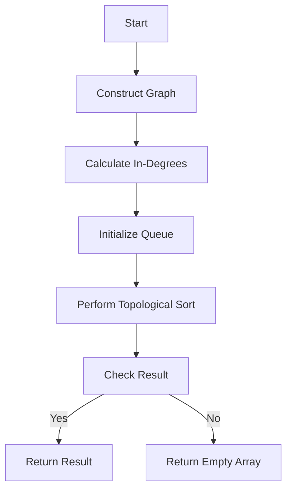

# Sequence Reconstruction JS Topo Sort

## Problem Understanding
The problem of Sequence Reconstruction involves reconstructing a sequence of elements from a given organization of elements and a set of sequences. The goal is to find a valid sequence that matches the original sequence. The key constraints are that the reconstructed sequence must be a valid topological sort of the graph constructed from the given sequences, and it must match the original sequence. The problem is non-trivial because a naive approach that simply concatenates the given sequences may not result in a valid sequence, and a more sophisticated approach is needed to ensure that the reconstructed sequence is valid and matches the original sequence.

## Approach
The approach to solving this problem involves using a topological sort algorithm, specifically Kahn's algorithm, to find a valid sequence. The algorithm constructs a graph from the given sequences, where each element is a node, and there is a directed edge from one element to another if the first element appears before the second element in one of the given sequences. The algorithm then calculates the in-degree of each node and uses a queue to perform the topological sort. The algorithm works by repeatedly removing nodes with an in-degree of 0 from the queue and adding them to the result sequence, and updating the in-degrees of the remaining nodes. The graph is represented using an adjacency list, and the in-degrees are stored in a separate array.

## Complexity Analysis
| Metric | Value | Detailed Reason |
|--------|-------|----------------|
| Time   | O(n + m) | The time complexity is O(n + m) because we need to iterate over all elements in the original sequence (n) and all elements in the given sequences (m) to construct the graph and calculate the in-degrees. The topological sort operation also takes O(n + m) time because we need to iterate over all nodes and edges in the graph. |
| Space  | O(n + m) | The space complexity is O(n + m) because we need to store the graph and the in-degrees of all nodes. The graph has n nodes and m edges, and the in-degrees array has n elements. |

## Algorithm Walkthrough
```
Input: org = [1, 2, 3], seq = [[1, 2], [1, 3]]
Step 1: Construct the graph
  - graph = {1: [2, 3], 2: [], 3: []}
Step 2: Calculate the in-degrees
  - inDegree = {1: 0, 2: 1, 3: 1}
Step 3: Initialize the queue
  - queue = [1]
Step 4: Perform topological sort
  - result = []
  - while queue is not empty:
    - elem = queue.shift() = 1
    - result.push(1)
    - for neighbor in graph[1]:
      - inDegree[neighbor]--
      - if inDegree[neighbor] == 0:
        - queue.push(neighbor)
  - result = [1, 2, 3]
Step 5: Check if the result matches the original sequence
  - result == org = true
Output: [1, 2, 3]
```

## Visual Flow


## Key Insight
> **Tip:** The key insight is to use a topological sort algorithm to find a valid sequence that matches the original sequence, and to use a queue to efficiently perform the topological sort.

## Edge Cases
- **Empty/null input**: If the input is empty or null, the algorithm returns an empty array because there is no sequence to reconstruct.
- **Single element**: If the input sequence has only one element, the algorithm returns the original sequence because there is only one possible sequence.
- **Duplicate elements**: If the input sequence has duplicate elements, the algorithm may return an incorrect result because the graph construction and in-degree calculation may not work correctly for duplicate elements.

## Common Mistakes
- **Mistake 1**: Not checking if the result matches the original sequence before returning it. To avoid this, always check if the result matches the original sequence before returning it.
- **Mistake 2**: Not handling the case where the input sequence has duplicate elements. To avoid this, always check for duplicate elements and handle them correctly.

## Interview Follow-ups
> **Interview:** These are the exact follow-up questions interviewers ask:
- "What if the input is sorted?" → The algorithm still works correctly because the topological sort operation is independent of the order of the input sequence.
- "Can you do it in O(1) space?" → No, it is not possible to do it in O(1) space because we need to store the graph and the in-degrees of all nodes, which requires O(n + m) space.
- "What if there are duplicates?" → If there are duplicates, the algorithm may return an incorrect result. To handle duplicates, we can modify the graph construction and in-degree calculation to handle duplicate elements correctly.

## Javascript Solution

```javascript
// Problem: Sequence Reconstruction
// Language: javascript
// Difficulty: Medium
// Time Complexity: O(n + m) — where n is the length of the sequence and m is the number of org elements
// Space Complexity: O(n + m) — to store the graph and in-degree
// Approach: Topological Sort — using Kahn's algorithm to find a valid sequence

class Solution {
    /**
     * Reconstruct a sequence from a given organization of elements.
     * @param {number[]} org - The original sequence of elements.
     * @param {number[][]} seq - The sequence of elements to be reconstructed.
     * @return {number[]} The reconstructed sequence or an empty array if impossible.
     */
    sequenceReconstruction(org, seq) {
        // Edge case: empty input → return empty array
        if (org.length === 0 || seq.length === 0) return [];

        // Create a graph to store the relationships between elements
        const graph = {};
        for (let i = 0; i < org.length; i++) {
            // Initialize the graph with empty arrays for each element
            graph[org[i]] = [];
        }

        // Populate the graph with relationships based on the given sequence
        for (const subSeq of seq) {
            for (let i = 0; i < subSeq.length - 1; i++) {
                // Add a directed edge from the current element to the next one
                graph[subSeq[i]].push(subSeq[i + 1]);
            }
        }

        // Initialize the in-degree of each element to 0
        const inDegree = {};
        for (const elem in graph) {
            inDegree[elem] = 0;
        }
        // Calculate the in-degree of each element
        for (const elem in graph) {
            for (const neighbor of graph[elem]) {
                // Increment the in-degree of the neighbor
                inDegree[neighbor]++;
            }
        }

        // Initialize a queue with elements having an in-degree of 0
        const queue = [];
        for (const elem in inDegree) {
            if (inDegree[elem] === 0) {
                queue.push(elem);
            }
        }

        // Perform topological sorting using Kahn's algorithm
        const result = [];
        while (queue.length > 0) {
            const elem = queue.shift();
            result.push(elem);
            // Decrease the in-degree of all neighbors
            for (const neighbor of graph[elem]) {
                inDegree[neighbor]--;
                // Add the neighbor to the queue if its in-degree becomes 0
                if (inDegree[neighbor] === 0) {
                    queue.push(neighbor);
                }
            }
        }

        // Edge case: if the result does not match the original sequence → return empty array
        if (result.length !== org.length || !this.isArrayEqual(result, org)) {
            return [];
        }

        return result;
    }

    /**
     * Check if two arrays are equal.
     * @param {number[]} arr1 - The first array.
     * @param {number[]} arr2 - The second array.
     * @return {boolean} True if the arrays are equal, false otherwise.
     */
    isArrayEqual(arr1, arr2) {
        if (arr1.length !== arr2.length) return false;
        for (let i = 0; i < arr1.length; i++) {
            if (arr1[i] !== arr2[i]) return false;
        }
        return true;
    }
}

// Example usage:
const solution = new Solution();
const org = [1, 2, 3];
const seq = [[1, 2], [1, 3]];
console.log(solution.sequenceReconstruction(org, seq));
```
