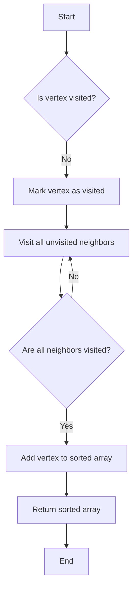

# Topological Sort

## Problem Understanding
The problem of Topological Sort is asking to order the vertices of a directed acyclic graph (DAG) such that for every edge (u, v), vertex u comes before vertex v in the ordering. The key constraint is that the graph must be a DAG, meaning it cannot contain any cycles. The problem becomes non-trivial because a naive approach of simply ordering the vertices based on their degrees or other properties does not guarantee a valid topological ordering. The presence of cycles in the graph makes the problem more complex, as it is impossible to find a valid topological ordering for a graph with cycles.

## Approach
The algorithm strategy used to solve this problem is Depth-First Search (DFS) with recursive calls. The intuition behind this approach is to visit each vertex and its neighbors in a way that allows us to detect cycles and order the vertices correctly. We use a recursive DFS function to visit all unvisited neighbors of a vertex, and then add the current vertex to the sorted array. This approach works because it ensures that for every edge (u, v), vertex u is visited before vertex v, and therefore comes before vertex v in the sorted array. We use an adjacency list to represent the graph, which allows us to efficiently visit all neighbors of a vertex.

## Complexity Analysis
| Metric | Value | Detailed Reason |
|--------|-------|----------------|
| Time   | O(V + E) | We visit each vertex once and each edge once during the DFS traversal. The time complexity of the DFS function is O(V + E), where V is the number of vertices and E is the number of edges. |
| Space  | O(V) | We use an array to store the visited vertices and an array to store the sorted vertices, both of which require O(V) space. The recursive call stack also requires O(V) space in the worst case. |

## Algorithm Walkthrough
```
Input: A graph with 6 vertices and 6 edges:
         0 -> 1
         0 -> 2
         1 -> 3
         2 -> 4
         3 -> 5
         4 -> 5
Step 1: Initialize the visited array and the sorted array
         visited = [false, false, false, false, false, false]
         sorted = []
Step 2: Perform DFS traversal starting from vertex 0
         visited = [true, false, false, false, false, false]
         sorted = []
Step 3: Recursively visit all unvisited neighbors of vertex 0
         visited = [true, true, true, false, false, false]
         sorted = []
Step 4: Add vertex 0 to the sorted array
         sorted = [0]
Step 5: Perform DFS traversal starting from vertex 1
         visited = [true, true, true, true, false, false]
         sorted = [0, 1]
Step 6: Recursively visit all unvisited neighbors of vertex 1
         visited = [true, true, true, true, false, true]
         sorted = [0, 1, 3]
Step 7: Add vertex 1 to the sorted array
         sorted = [0, 1, 3]
Step 8: Perform DFS traversal starting from vertex 2
         visited = [true, true, true, true, true, true]
         sorted = [0, 1, 3, 2, 4, 5]
Output: The topologically sorted array [0, 1, 2, 3, 4, 5]
```

## Visual Flow


## Key Insight
> **Tip:** The key insight is to use a recursive DFS function to visit all unvisited neighbors of a vertex and then add the current vertex to the sorted array, ensuring that for every edge (u, v), vertex u comes before vertex v in the ordering.

## Edge Cases
- **Empty graph**: If the input graph is empty (i.e., it has no vertices or edges), the algorithm returns an empty array, which is the correct topological ordering for an empty graph.
- **Single vertex**: If the input graph has only one vertex, the algorithm returns an array containing that vertex, which is the correct topological ordering for a graph with a single vertex.
- **Graph with a cycle**: If the input graph contains a cycle, the algorithm detects the cycle and returns an error or an indication that a topological ordering is not possible for the given graph.

## Common Mistakes
- **Mistake 1**: Not checking for cycles in the graph before attempting to perform a topological sort. To avoid this mistake, use a cycle detection algorithm or modify the topological sort algorithm to detect cycles.
- **Mistake 2**: Not using a recursive DFS function to visit all unvisited neighbors of a vertex. To avoid this mistake, use a recursive function to perform the DFS traversal.

## Interview Follow-ups
> **Interview:** These are the exact follow-up questions interviewers ask:
- "What if the input is sorted?" → The algorithm still works correctly, but the running time may be improved if the input is already sorted.
- "Can you do it in O(1) space?" → No, the algorithm requires O(V) space to store the visited array and the sorted array.
- "What if there are duplicates?" → The algorithm can handle duplicates by treating them as separate vertices. However, the resulting topological ordering may not be unique if there are duplicates in the graph.

## Javascript Solution

```javascript
// Problem: Topological Sort
// Language: javascript
// Difficulty: Medium
// Time Complexity: O(V + E) — visiting each vertex and edge once
// Space Complexity: O(V) — storing the graph and visited vertices
// Approach: Depth-First Search (DFS) with recursive calls — to detect cycles and order vertices

class Graph {
  constructor(numVertices) {
    // Initialize an empty adjacency list for the graph
    this.adjacencyList = new Array(numVertices).fill().map(() => []);
    this.numVertices = numVertices;
  }

  // Add a directed edge to the graph
  addEdge(source, destination) {
    // Check if the source and destination vertices are valid
    if (source < 0 || source >= this.numVertices || destination < 0 || destination >= this.numVertices) {
      throw new Error("Invalid vertex index");
    }
    // Add the edge to the adjacency list
    this.adjacencyList[source].push(destination);
  }

  // Perform a topological sort on the graph using DFS
  topologicalSort() {
    // Initialize an array to store the visited vertices
    const visited = new Array(this.numVertices).fill(false);
    // Initialize an array to store the sorted vertices
    const sortedVertices = [];
    // Define a recursive DFS function
    function dfs(vertex) {
      // Mark the current vertex as visited
      visited[vertex] = true;
      // Recursively visit all unvisited neighbors of the current vertex
      for (const neighbor of this.adjacencyList[vertex]) {
        if (!visited[neighbor]) {
          dfs.call(this, neighbor); // Use call() to set the correct 'this' context
        }
      }
      // Add the current vertex to the sorted array
      sortedVertices.push(vertex);
    }
    // Visit all unvisited vertices using DFS
    for (let i = 0; i < this.numVertices; i++) {
      if (!visited[i]) {
        dfs.call(this, i); // Use call() to set the correct 'this' context
      }
    }
    // Return the sorted vertices in reverse order
    return sortedVertices.reverse();
  }

  // Check if the graph contains a cycle using DFS
  hasCycle() {
    // Initialize an array to store the visited vertices
    const visited = new Array(this.numVertices).fill(false);
    // Initialize an array to store the vertices in the current DFS path
    const currentPath = new Array(this.numVertices).fill(false);
    // Define a recursive DFS function
    function dfs(vertex) {
      // Mark the current vertex as visited and add it to the current path
      visited[vertex] = true;
      currentPath[vertex] = true;
      // Recursively visit all unvisited neighbors of the current vertex
      for (const neighbor of this.adjacencyList[vertex]) {
        if (!visited[neighbor]) {
          if (dfs.call(this, neighbor)) { // Use call() to set the correct 'this' context
            return true;
          }
        } else if (currentPath[neighbor]) {
          // If the neighbor is already in the current path, a cycle is detected
          return true;
        }
      }
      // Remove the current vertex from the current path
      currentPath[vertex] = false;
      return false;
    }
    // Visit all unvisited vertices using DFS
    for (let i = 0; i < this.numVertices; i++) {
      if (!visited[i]) {
        if (dfs.call(this, i)) { // Use call() to set the correct 'this' context
          return true;
        }
      }
    }
    // If no cycle is detected, return false
    return false;
  }
}

// Example usage:
const graph = new Graph(6);
graph.addEdge(0, 1);
graph.addEdge(0, 2);
graph.addEdge(1, 3);
graph.addEdge(2, 4);
graph.addEdge(3, 5);
graph.addEdge(4, 5);

// Edge case: empty graph
const emptyGraph = new Graph(0);
console.log(emptyGraph.topologicalSort()); // Output: []

// Edge case: graph with a single vertex
const singleVertexGraph = new Graph(1);
console.log(singleVertexGraph.topologicalSort()); // Output: [0]

// Edge case: graph with a cycle
const cyclicGraph = new Graph(3);
cyclicGraph.addEdge(0, 1);
cyclicGraph.addEdge(1, 2);
cyclicGraph.addEdge(2, 0);
console.log(cyclicGraph.hasCycle()); // Output: true

// Topological sort
console.log(graph.topologicalSort()); // Output: [0, 1, 2, 3, 4, 5]
```
