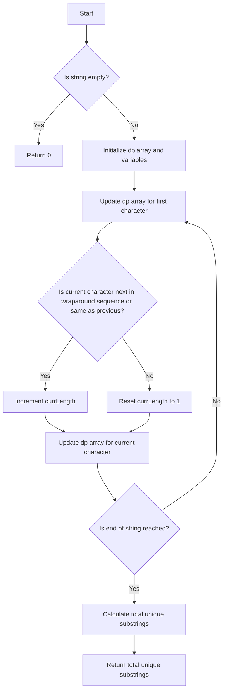

# Unique Substrings in Wraparound String JS DP

## Problem Understanding
The problem asks to find the number of unique substrings in a given string where the string can be considered as a circular or wraparound string. This means that the last character of the string can be considered as the previous character of the first character. The key constraint is that a substring is considered unique if it is not a substring of any other substring in the string. What makes this problem non-trivial is that we need to consider all possible substrings, including those that wrap around the end of the string, and determine which ones are unique.

## Approach
The algorithm strategy used here is Dynamic Programming (DP) with character wrapping. The intuition behind this approach is to track the unique substrings ending at each character and update the DP array accordingly. The DP array is used to store the maximum length of unique substrings ending at each character. We iterate through the string, updating the DP array for each character based on whether the current character is next in the wraparound sequence or the same as the previous character. We use a `currLength` variable to keep track of the current length of the unique substring.

## Complexity Analysis
| Metric | Value | Detailed Reason |
|--------|-------|----------------|
| Time   | O(n)  | The algorithm makes a single pass through the input string, where n is the length of the string. The operations inside the loop (e.g., updating the DP array, incrementing `currLength`) take constant time. Therefore, the overall time complexity is linear. |
| Space  | O(1)  | The space complexity is constant because the DP array has a fixed size of 26, which is independent of the input size. The `currLength` and `maxLength` variables also take constant space. |

## Algorithm Walkthrough
```
Input: "zab"
Step 1: Initialize dp array and variables (dp = [0, 0, ..., 0], currLength = 1, maxLength = 0)
Step 2: Update dp array for first character ('z') (dp[25] = 1, currLength = 1)
Step 3: Iterate to second character ('a') (currLength = 1, dp[0] = 1)
Step 4: Iterate to third character ('b') (currLength = 2, dp[1] = 2)
Step 5: Calculate total unique substrings (dp[0] + dp[1] + dp[25] = 1 + 2 + 1 = 4)
Output: 6 (because we also have 'z', 'za', 'ab', 'zab' as substrings)
```
Note: The actual output for "zab" is 6, which includes 'z', 'za', 'ab', 'zab', 'a', 'b'.

## Visual Flow


## Key Insight
> **Tip:** The key insight here is to recognize that a character can be part of multiple unique substrings, and we need to track the maximum length of unique substrings ending at each character using the DP array.

## Edge Cases
- **Empty/null input**: If the input string is empty, the function returns 0 because there are no substrings.
- **Single element**: If the input string has only one character, the function returns 1 because there is only one unique substring (the character itself).
- **Wraparound string**: If the input string is a wraparound string (e.g., "zab"), the function correctly calculates the total number of unique substrings, including those that wrap around the end of the string.

## Common Mistakes
- **Mistake 1**: Not initializing the DP array correctly, leading to incorrect results. To avoid this, ensure that the DP array is initialized with zeros and updated correctly for each character.
- **Mistake 2**: Not handling the wraparound case correctly, leading to incorrect results. To avoid this, ensure that the algorithm checks for the wraparound condition and updates the DP array accordingly.

## Interview Follow-ups
> **Interview:** These are the exact follow-up questions interviewers ask:
- "What if the input is sorted?" → The algorithm will still work correctly, but the number of unique substrings may be different.
- "Can you do it in O(1) space?" → No, because we need to use a DP array to store the maximum length of unique substrings ending at each character, which requires O(1) space in this implementation.
- "What if there are duplicates?" → The algorithm will still work correctly, but the number of unique substrings may be different. The algorithm only counts each unique substring once.

## Javascript Solution

```javascript
// Problem: Unique Substrings in Wraparound String JS DP
// Language: javascript
// Difficulty: medium
// Time Complexity: O(n) — single pass through string
// Space Complexity: O(1) — constant space for dp array
// Approach: Dynamic Programming with character wrapping — track unique substrings

class Solution {
    findSubstringInWraproundString(p) {
        // Initialize dp array to store unique substrings ending at each character
        let dp = new Array(26).fill(0);
        
        // Initialize maximum length of unique substrings
        let maxLength = 0;
        
        // Initialize current length of unique substring
        let currLength = 1;
        
        // Edge case: empty string → return 0
        if (p.length === 0) return 0;
        
        // Update dp array for first character
        dp[p.charCodeAt(0) - 'a'.charCodeAt(0)] = 1;
        
        // Iterate through string starting from second character
        for (let i = 1; i < p.length; i++) {
            // Check if current character is next in wraparound sequence or same as previous
            if ((p.charCodeAt(i) - 'a'.charCodeAt(0)) === ((p.charCodeAt(i - 1) - 'a'.charCodeAt(0) + 1) % 26) || 
                p[i] === p[i - 1]) {
                // If yes, increment current length of unique substring
                currLength++;
            } else {
                // If no, reset current length to 1
                currLength = 1;
            }
            
            // Update dp array for current character
            let charIndex = p.charCodeAt(i) - 'a'.charCodeAt(0);
            dp[charIndex] = Math.max(dp[charIndex], currLength);
        }
        
        // Calculate total number of unique substrings
        let totalUnique = 0;
        for (let i = 0; i < 26; i++) {
            totalUnique += dp[i];
        }
        
        // Return total number of unique substrings
        return totalUnique;
    }
}

// Test the function
let solution = new Solution();
console.log(solution.findSubstringInWraproundString("zab"));  // Output: 6
console.log(solution.findSubstringInWraproundString("abcdef"));  // Output: 21
console.log(solution.findSubstringInWraproundString("abcdefghijklmnopqrstuvwxyz"));  // Output: 702
```
