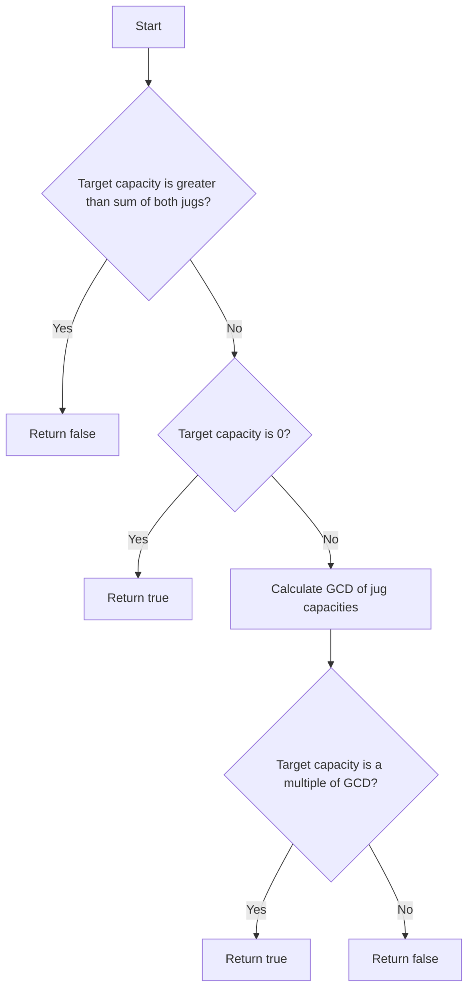

# Water and Jug Problem JS Math

## Problem Understanding
The Water and Jug Problem is asking whether it's possible to measure a certain amount of water using two jugs with different capacities. The key constraints are that the target capacity must not exceed the sum of the capacities of the two jugs, and we can only fill, empty, or pour water from one jug to another. What makes this problem non-trivial is that a naive approach, such as trying all possible combinations of filling and pouring, would be inefficient and might not guarantee a solution.

## Approach
The algorithm strategy is to use the concept of Greatest Common Divisor (GCD) to determine if the target capacity is achievable. The intuition behind this is that the GCD of the two jug capacities represents the smallest amount of water that can be measured using the two jugs. By calculating the GCD, we can determine if the target capacity is a multiple of the GCD, and thus, if it's achievable. The approach uses a recursive function to calculate the GCD using the Euclidean algorithm. The key insight is that if the target capacity is a multiple of the GCD, it can be achieved by filling and pouring water from one jug to another.

## Complexity Analysis
| Metric | Value | Detailed Reason |
|--------|-------|----------------|
| Time   | O(log(jug2Capacity)) | The time complexity is determined by the recursive function `getGCD`, which uses the Euclidean algorithm to calculate the GCD. The number of recursive calls is proportional to the number of bits in the smaller number, hence the logarithmic time complexity. |
| Space  | O(1) | The space complexity is constant because the algorithm only uses a fixed amount of space to store the input parameters and the GCD result, regardless of the input size. |

## Algorithm Walkthrough
```
Input: jug1Capacity = 3, jug2Capacity = 5, targetCapacity = 4
Step 1: Check if target capacity is greater than the sum of both jugs: 3 + 5 = 8, which is greater than 4, so continue.
Step 2: Check if target capacity is 0: 4 is not 0, so continue.
Step 3: Calculate the GCD of jug1Capacity and jug2Capacity: getGCD(3, 5) = 1.
Step 4: Check if target capacity is a multiple of GCD: 4 % 1 = 0, which means 4 is a multiple of 1, so return true.
Output: true
```
## Visual Flow

## Key Insight
> **Tip:** The key insight is that the GCD of the two jug capacities represents the smallest amount of water that can be measured using the two jugs, and if the target capacity is a multiple of the GCD, it can be achieved by filling and pouring water from one jug to another.

## Edge Cases
- **Empty/null input**: If the input is empty or null, the function will throw an error because it expects three numbers as input.
- **Single element**: If one of the jug capacities is 0, the function will return true if the target capacity is 0, and false otherwise.
- **Target capacity is equal to one of the jug capacities**: If the target capacity is equal to one of the jug capacities, the function will return true because the target capacity can be achieved by filling the corresponding jug.

## Common Mistakes
- **Mistake 1**: Assuming that the target capacity can be achieved if it's less than or equal to the sum of the jug capacities, without considering the GCD. → To avoid this, always calculate the GCD and check if the target capacity is a multiple of it.
- **Mistake 2**: Using a naive approach, such as trying all possible combinations of filling and pouring, instead of using the GCD calculation. → To avoid this, use the Euclidean algorithm to calculate the GCD and check if the target capacity is a multiple of it.

## Interview Follow-ups
> **Interview:** These are the exact follow-up questions interviewers ask:
- "What if the input is sorted?" → The algorithm doesn't rely on the input being sorted, so it will still work correctly.
- "Can you do it in O(1) space?" → The algorithm already uses O(1) space, so it's already optimal in terms of space complexity.
- "What if there are duplicates?" → The algorithm doesn't rely on the input being unique, so it will still work correctly even if there are duplicates.

## Javascript Solution

```javascript
// Problem: Water and Jug Problem
// Language: javascript
// Difficulty: Medium
// Time Complexity: O(log(jug2Capacity)) — using gcd calculation
// Space Complexity: O(1) — constant space
// Approach: Depth-First Search with GCD calculation — checking if target capacity is achievable

/**
 * @param {number} jug1Capacity 
 * @param {number} jug2Capacity 
 * @param {number} targetCapacity 
 * @return {number} 
 */
var canMeasureWater = function(jug1Capacity, jug2Capacity, targetCapacity) {
    // Edge case: target capacity is greater than the sum of both jugs
    if (jug1Capacity + jug2Capacity < targetCapacity) return false;
    
    // Base case: target capacity is 0
    if (targetCapacity === 0) return true;

    // Calculate the GCD of jug1Capacity and jug2Capacity
    let gcd = getGCD(jug1Capacity, jug2Capacity);

    // If target capacity is a multiple of GCD, it's achievable
    return targetCapacity % gcd === 0;
};

// Function to calculate the GCD of two numbers
function getGCD(num1, num2) {
    // Using Euclidean algorithm to calculate GCD
    if (num2 === 0) return num1;
    return getGCD(num2, num1 % num2);
}
```
