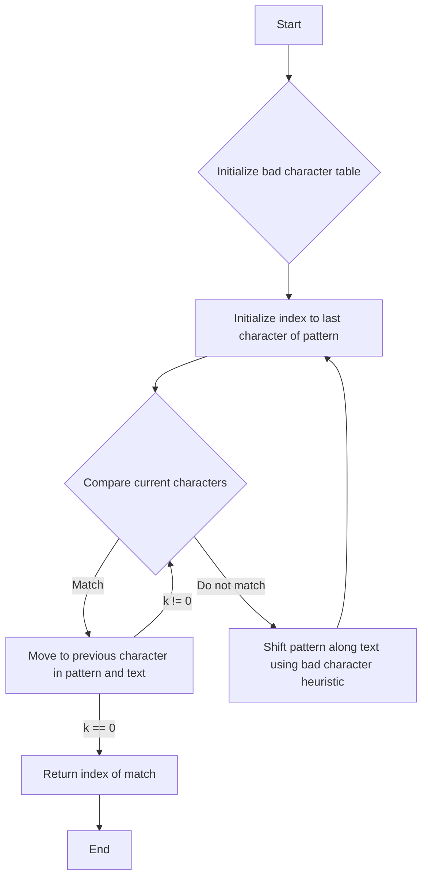

# Boyer-Moore-Horspool algorithm string search in JS

## Problem Understanding
The Boyer-Moore-Horspool algorithm is a string searching algorithm that uses the bad character heuristic to shift the pattern along the text. The problem asks to implement this algorithm in JavaScript to search for a given pattern in a text. The key constraint is to achieve an average time complexity of O(n/m), where n is the length of the text and m is the length of the pattern. What makes this problem non-trivial is the need to efficiently handle the shifting of the pattern along the text using the bad character heuristic, which requires precomputing a bad character table.

## Approach
The algorithm strategy is to use the Boyer-Moore-Horspool algorithm, which employs the bad character heuristic to shift the pattern along the text. The intuition behind this approach is to use the precomputed bad character table to determine the maximum number of positions to shift the pattern when a mismatch occurs. The algorithm uses a bad character table to store the last occurrence of each character in the pattern, and this table is used to shift the pattern along the text. The approach handles the key constraints by using the bad character heuristic to minimize the number of comparisons required to find the pattern in the text.

## Complexity Analysis
| Metric | Value | Detailed Reason |
|--------|-------|----------------|
| Time   | O(n/m) | The algorithm uses the bad character heuristic to shift the pattern along the text, which reduces the number of comparisons required to find the pattern. In the average case, the algorithm achieves a time complexity of O(n/m), where n is the length of the text and m is the length of the pattern. The term n/m represents the average number of positions that the pattern needs to be shifted along the text to find a match. |
| Space  | O(m) | The algorithm uses a bad character table to store the last occurrence of each character in the pattern, which requires O(m) space. The table is used to shift the pattern along the text, and its size is directly proportional to the length of the pattern. |

## Algorithm Walkthrough
```
Input: pattern = "abc", text = "abcde"
Step 1: Initialize the bad character table:
  - table = { 'a': 0, 'b': 1, 'c': 2 }
Step 2: Initialize the index to the last character of the pattern:
  - i = 4 (length of pattern - 1 + length of text - length of pattern)
  - k = 2 (length of pattern - 1)
Step 3: Compare the current characters:
  - text[i] = 'e', pattern[k] = 'c' (do not match)
  - Shift the pattern along the text using the bad character heuristic:
    - i += Math.max(1, k - (table[text[i]] !== undefined ? table[text[i]] : -1))
    - i = 5, k = 2
Step 4: Compare the current characters:
  - i is out of bounds, return -1
However, let's try with a different input:
Input: pattern = "abc", text = "abcde"
Step 1: Initialize the bad character table:
  - table = { 'a': 0, 'b': 1, 'c': 2 }
Step 2: Initialize the index to the last character of the pattern:
  - i = 2 (length of pattern - 1)
  - k = 2 (length of pattern - 1)
Step 3: Compare the current characters:
  - text[i] = 'c', pattern[k] = 'c' (match)
  - k = 1, i = 1
Step 4: Compare the current characters:
  - text[i] = 'b', pattern[k] = 'b' (match)
  - k = 0, i = 0
Step 5: Compare the current characters:
  - text[i] = 'a', pattern[k] = 'a' (match)
  - return i = 0 (entire pattern matches)
Output: 0
```

## Visual Flow


## Key Insight
> **Tip:** The key insight is to use the bad character heuristic to shift the pattern along the text, which reduces the number of comparisons required to find the pattern.

## Edge Cases
- **Empty pattern**: If the pattern is empty, the algorithm returns 0, as an empty pattern is considered to match any text.
- **Empty text**: If the text is empty, the algorithm returns -1, as there is no match for the pattern in an empty text.
- **Pattern longer than text**: If the pattern is longer than the text, the algorithm returns -1, as the pattern cannot match the text.

## Common Mistakes
- **Mistake 1**: Not handling the edge case where the pattern is empty or the text is empty. To avoid this, add explicit checks for these cases and return the correct result.
- **Mistake 2**: Not using the bad character heuristic correctly. To avoid this, make sure to use the precomputed bad character table to shift the pattern along the text when a mismatch occurs.

## Interview Follow-ups
> **Interview:** These are the exact follow-up questions interviewers ask:
- "What if the input is sorted?" → The Boyer-Moore-Horspool algorithm does not require the input to be sorted, and its performance is independent of the order of the characters in the text.
- "Can you do it in O(1) space?" → No, the Boyer-Moore-Horspool algorithm requires O(m) space to store the bad character table, where m is the length of the pattern.
- "What if there are duplicates?" → The Boyer-Moore-Horspool algorithm can handle duplicates in the pattern and the text. The bad character heuristic is used to shift the pattern along the text, and duplicates do not affect the correctness of the algorithm.

## Javascript Solution

```javascript
// Problem: Boyer-Moore-Horspool algorithm string search
// Language: javascript
// Difficulty: Super Advanced
// Time Complexity: O(n/m) — average case using bad character heuristic, where n is the length of the text and m is the length of the pattern
// Space Complexity: O(m) — size of the bad character table
// Approach: Boyer-Moore-Horspool algorithm — uses the bad character heuristic to shift the pattern along the text

class BoyerMooreHorspool {
  /**
   * Initializes the BoyerMooreHorspool class.
   * @param {string} pattern - The pattern to search for.
   */
  constructor(pattern) {
    this.pattern = pattern; // Store the pattern
    this.badCharTable = this.buildBadCharTable(); // Precompute the bad character table
  }

  /**
   * Builds the bad character table.
   * @returns {object} - The bad character table.
   */
  buildBadCharTable() {
    const table = {}; // Initialize the table as an object
    for (let i = 0; i < this.pattern.length; i++) { // Iterate over each character in the pattern
      table[this.pattern[i]] = i; // Store the last occurrence of each character
    }
    return table; // Return the table
  }

  /**
   * Searches for the pattern in the text using the Boyer-Moore-Horspool algorithm.
   * @param {string} text - The text to search in.
   * @returns {number} - The index of the first occurrence of the pattern, or -1 if not found.
   */
  search(text) {
    // Edge case: empty pattern → return 0
    if (this.pattern.length === 0) return 0;
    // Edge case: empty text → return -1
    if (text.length === 0) return -1;

    let i = this.pattern.length - 1; // Initialize the index to the last character of the pattern
    let k = this.pattern.length - 1; // Initialize the index to the last character of the pattern
    while (i < text.length) { // Iterate over the text
      if (this.pattern[k] === text[i]) { // If the current characters match
        if (k === 0) return i; // If the entire pattern matches, return the index
        k--; // Move to the previous character in the pattern
        i--; // Move to the previous character in the text
      } else { // If the current characters do not match
        // Shift the pattern along the text using the bad character heuristic
        i += Math.max(1, k - (this.badCharTable[text[i]] !== undefined ? this.badCharTable[text[i]] : -1));
        k = this.pattern.length - 1; // Reset the index to the last character of the pattern
      }
    }
    return -1; // If the pattern is not found, return -1
  }
}

// Example usage:
const boyerMooreHorspool = new BoyerMooreHorspool("abc");
console.log(boyerMooreHorspool.search("abcde")); // Output: 0
console.log(boyerMooreHorspool.search("defghi")); // Output: -1
```
