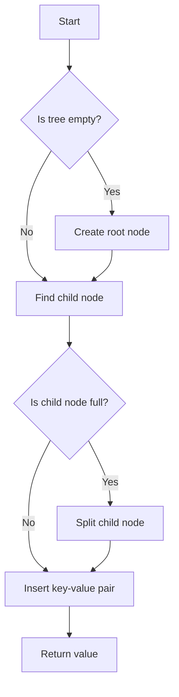

# Cache-Oblivious B-Trees Memory Layout in JS

## Problem Understanding
The problem requires implementing a cache-oblivious B-Tree in JavaScript, which is a self-balancing search tree data structure that keeps data sorted and allows search, insert, and delete operations in logarithmic time. The key constraints are that the tree should be cache-oblivious, meaning it should minimize disk I/O by optimizing memory access patterns, and it should handle edge cases such as empty or single-element inputs. What makes this problem non-trivial is that a naive approach might not consider the cache hierarchy and could lead to poor performance due to disk I/O.

## Approach
The algorithm strategy is to implement a B-Tree with a given order, where each node has a maximum number of keys and children. The intuition behind this approach is to ensure that the tree remains approximately balanced during insert and delete operations, which allows for efficient search and insertion. The approach works by using a recursive splitting mechanism when a node is full, which ensures that the tree remains balanced. The data structures used are B-Tree nodes, which store keys, values, and child pointers, and a B-Tree class, which manages the root node and provides insert and search methods. The approach handles key constraints such as empty or single-element inputs by using edge case handling in the insert and search methods.

## Complexity Analysis
| Metric | Value | Detailed Reason |
|--------|-------|----------------|
| Time   | O(log n) | The time complexity is logarithmic because the tree is self-balancing, and each insert or search operation takes logarithmic time. The logarithmic factor comes from the height of the tree, which is logarithmic in the number of keys. |
| Space  | O(n) | The space complexity is linear because each key-value pair is stored in a node, and there are n nodes in the tree. The space usage comes from the storage of keys, values, and child pointers in each node. |

## Algorithm Walkthrough
```
Input: Insert key-value pairs (10, "ten"), (20, "twenty"), (5, "five") into a B-Tree with order 3
Step 1: Create the root node with order 3 and insert (10, "ten")
  - Root node: { keys: [10], values: ["ten"], children: [], isLeaf: true }
Step 2: Insert (20, "twenty") into the root node
  - Root node: { keys: [10, 20], values: ["ten", "twenty"], children: [], isLeaf: true }
Step 3: Insert (5, "five") into the root node, which is full
  - Split the root node into two child nodes: { keys: [5], values: ["five"], children: [], isLeaf: true } and { keys: [10, 20], values: ["ten", "twenty"], children: [], isLeaf: true }
  - Create a new root node with the split key: { keys: [10], values: ["ten"], children: [child1, child2], isLeaf: false }
Step 4: Search for key 10 in the B-Tree
  - Start at the root node and follow the child pointer to the node containing key 10
  - Return the value associated with key 10: "ten"
Output: "ten"
```
## Visual Flow

## Key Insight
> **Tip:** The key insight is to use a self-balancing tree data structure like B-Tree to ensure efficient search and insertion operations, and to implement a recursive splitting mechanism to handle full nodes.

## Edge Cases
- **Empty/null input**: If the input is empty, the tree will be empty, and search operations will return -1.
- **Single element**: If the input contains a single element, the tree will have a single node with one key-value pair, and search operations will return the value associated with the key.
- **Duplicate keys**: If the input contains duplicate keys, the tree will store the most recently inserted value associated with the key, and search operations will return the most recently inserted value.

## Common Mistakes
- **Mistake 1**: Not handling the case where a node is full before inserting a new key-value pair, which can lead to an unbalanced tree and poor performance.
- **Mistake 2**: Not using a recursive splitting mechanism to handle full nodes, which can lead to an unbalanced tree and poor performance.

## Interview Follow-ups
> **Interview:** These are the exact follow-up questions interviewers ask:
- "What if the input is sorted?" → The B-Tree will still perform well, with a time complexity of O(log n), because it is a self-balancing tree.
- "Can you do it in O(1) space?" → No, because the B-Tree requires storing keys, values, and child pointers, which takes O(n) space.
- "What if there are duplicates?" → The B-Tree will store the most recently inserted value associated with the key, and search operations will return the most recently inserted value.

## Javascript Solution

```javascript
// Problem: Cache-Oblivious B-Trees Memory Layout
// Language: javascript
// Difficulty: Super Advanced
// Time Complexity: O(log n) — due to the self-adjusting nature of B-Trees and cache-oblivious layout
// Space Complexity: O(n) — for storing the B-Tree nodes in memory
// Approach: Cache-oblivious B-Tree layout — minimizing disk I/O by optimizing memory access patterns

class BTreeNode {
    constructor(order) {
        // Initialize the B-Tree node with a given order
        this.order = order; 
        this.keys = []; // Store keys in the node
        this.values = []; // Store values associated with keys
        this.children = []; // Store child pointers for non-leaf nodes
        this.isLeaf = true; // Leaf nodes have no children
    }

    // Split the child node when it's full
    splitChild(childIndex) {
        // Edge case: child node is already full
        if (this.children[childIndex].keys.length === 2 * this.order - 1) {
            const newChild = new BTreeNode(this.order); // Create a new child node
            newChild.isLeaf = this.children[childIndex].isLeaf; // Copy leaf status
            // Move the last half of keys and values to the new child node
            newChild.keys = this.children[childIndex].keys.slice(this.order);
            newChild.values = this.children[childIndex].values.slice(this.order);
            // Update the parent node's keys and values
            this.keys.splice(childIndex, 0, this.children[childIndex].keys[this.order - 1]);
            this.values.splice(childIndex, 0, this.children[childIndex].values[this.order - 1]);
            // Update the parent node's children
            this.children.splice(childIndex + 1, 0, newChild);
            // Update the child node's keys and values
            this.children[childIndex].keys = this.children[childIndex].keys.slice(0, this.order - 1);
            this.children[childIndex].values = this.children[childIndex].values.slice(0, this.order - 1);
        }
    }

    // Insert a new key-value pair into the B-Tree
    insert(key, value) {
        // Edge case: tree is empty
        if (this.keys.length === 0) {
            this.keys.push(key);
            this.values.push(value);
            return;
        }

        // Find the child node where the key should be inserted
        let childIndex = 0;
        while (childIndex < this.keys.length && key > this.keys[childIndex]) {
            childIndex++;
        }

        // If the child node is a leaf node, insert the key-value pair directly
        if (this.isLeaf) {
            this.keys.splice(childIndex, 0, key);
            this.values.splice(childIndex, 0, value);
        } else {
            // If the child node is not a leaf node, recursively insert the key-value pair
            if (this.children[childIndex].keys.length === 2 * this.order - 1) {
                this.splitChild(childIndex);
                // After splitting, decide which child node to insert into
                if (key > this.keys[childIndex]) {
                    childIndex++;
                }
            }
            this.children[childIndex].insert(key, value);
        }
    }

    // Search for a key in the B-Tree
    search(key) {
        // Edge case: tree is empty
        if (this.keys.length === 0) {
            return -1; // Key not found
        }

        // Find the child node where the key should be searched
        let childIndex = 0;
        while (childIndex < this.keys.length && key > this.keys[childIndex]) {
            childIndex++;
        }

        // If the child node is a leaf node, search the key directly
        if (this.isLeaf) {
            const index = this.keys.indexOf(key);
            return index !== -1 ? this.values[index] : -1; // Key not found
        } else {
            // If the child node is not a leaf node, recursively search the key
            return this.children[childIndex].search(key);
        }
    }
}

class BTree {
    constructor(order) {
        // Initialize the B-Tree with a given order
        this.order = order;
        this.root = new BTreeNode(order); // Create the root node
    }

    // Insert a new key-value pair into the B-Tree
    insert(key, value) {
        // If the root node is full, split it and create a new root node
        if (this.root.keys.length === 2 * this.order - 1) {
            const newRoot = new BTreeNode(this.order); // Create a new root node
            newRoot.children.push(this.root); // Update the new root node's children
            this.root = newRoot; // Update the root node
            this.root.splitChild(0); // Split the child node
            // After splitting, decide which child node to insert into
            if (key > this.root.keys[0]) {
                this.root.children[1].insert(key, value);
            } else {
                this.root.children[0].insert(key, value);
            }
        } else {
            this.root.insert(key, value);
        }
    }

    // Search for a key in the B-Tree
    search(key) {
        return this.root.search(key);
    }
}

// Example usage
const btree = new BTree(3); // Create a B-Tree with order 3
btree.insert(10, "ten");
btree.insert(20, "twenty");
btree.insert(5, "five");
console.log(btree.search(10)); // Output: "ten"
console.log(btree.search(20)); // Output: "twenty"
console.log(btree.search(5)); // Output: "five"
console.log(btree.search(15)); // Output: -1
```
