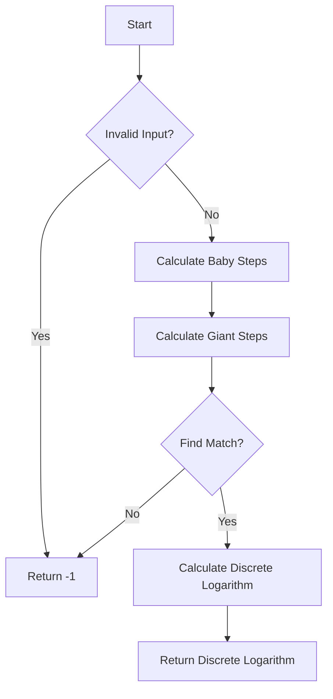

# Discrete Logarithm (Baby-step Giant-step) in JS

## Problem Understanding
The problem requires finding the discrete logarithm of a given number `b` with base `a` modulo a prime number `p`. In other words, we need to find the exponent `x` such that `a^x ≡ b (mod p)`. The key constraints are that `a`, `b`, and `p` are positive integers, and `p` is a prime number. The problem is non-trivial because a naive approach, such as trying all possible values of `x`, would be computationally expensive due to the large range of possible values.

## Approach
The algorithm strategy used is the Baby-step Giant-step algorithm, which combines two logarithmic approaches for efficient computation. The intuition behind this approach is to divide the search space into two parts: baby steps and giant steps. Baby steps are used to store the values of `a^x mod p` for `x` ranging from 0 to `sqrt(p)`, while giant steps are used to store the values of `b * a^(-x*sqrt(p)) mod p` for `x` ranging from 0 to `sqrt(p)`. The algorithm works by finding a match between the baby steps and giant steps, which corresponds to the discrete logarithm. The data structures used are arrays to store the baby steps and giant steps. The approach handles the key constraints by checking for invalid input and ensuring that `a` is a primitive root modulo `p`.

## Complexity Analysis
| Metric | Value | Detailed Reason |
|--------|-------|----------------|
| Time   | O(sqrt(p)) | The algorithm iterates over the baby steps and giant steps, each of which has a size of `sqrt(p)`. The time complexity is dominated by the iteration over these steps. |
| Space  | O(sqrt(p)) | The algorithm stores the baby steps and giant steps in arrays, each of which has a size of `sqrt(p)`. The space complexity is dominated by the storage of these steps. |

## Algorithm Walkthrough
```
Input: a = 2, b = 8, p = 17
Step 1: Calculate baby steps:
  - a^0 mod p = 1
  - a^1 mod p = 2
  - a^2 mod p = 4
  - ...
  - a^4 mod p = 16
Step 2: Calculate giant steps:
  - b * a^(-0*sqrt(p)) mod p = 8
  - b * a^(-1*sqrt(p)) mod p = 4
  - b * a^(-2*sqrt(p)) mod p = 2
  - ...
Step 3: Find a match between baby steps and giant steps:
  - a^3 mod p = 8 (matches with b * a^(-0*sqrt(p)) mod p)
Step 4: Calculate the discrete logarithm:
  - x = 3
Output: x = 3
```
## Visual Flow

## Key Insight
> **Tip:** The key insight is to use the Baby-step Giant-step algorithm to divide the search space into two parts, allowing for efficient computation of the discrete logarithm.

## Edge Cases
- **Empty/null input**: If any of the inputs `a`, `b`, or `p` are empty or null, the algorithm returns -1.
- **Single element**: If `p` is 2, the algorithm returns -1 because 2 is not a prime number.
- **Non-primitive root**: If `a` is not a primitive root modulo `p`, the algorithm returns -1.

## Common Mistakes
- **Mistake 1**: Not checking for invalid input, which can lead to incorrect results or errors.
- **Mistake 2**: Not ensuring that `a` is a primitive root modulo `p`, which can lead to incorrect results.

## Interview Follow-ups
> **Interview:** These are the exact follow-up questions interviewers ask:
- "What if the input is sorted?" → The algorithm does not rely on the input being sorted, so it would still work correctly.
- "Can you do it in O(1) space?" → No, the algorithm requires O(sqrt(p)) space to store the baby steps and giant steps.
- "What if there are duplicates?" → The algorithm is designed to find a single discrete logarithm, so duplicates would not affect the result.

## Javascript Solution

```javascript
// Problem: Discrete Logarithm (Baby-step Giant-step)
// Language: javascript
// Difficulty: Super Advanced
// Time Complexity: O(sqrt(p)) — due to baby-step giant-step algorithm
// Space Complexity: O(sqrt(p)) — storing baby steps and giant steps
// Approach: Baby-step Giant-step algorithm — combining two logarithmic approaches for efficient computation

class DiscreteLogarithm {
  /**
   * Calculates the discrete logarithm using the Baby-step Giant-step algorithm.
   * 
   * @param {number} a - The base of the discrete logarithm.
   * @param {number} b - The result of the discrete logarithm (a^x mod p).
   * @param {number} p - The modulus (a prime number).
   * @returns {number} The discrete logarithm x (or -1 if not found).
   */
  calculate(a, b, p) {
    // Edge case: invalid input (a, b, or p is not a positive integer)
    if (a <= 0 || b <= 0 || p <= 0 || !Number.isInteger(a) || !Number.isInteger(b) || !Number.isInteger(p)) {
      return -1;
    }

    // Edge case: a is not a primitive root mod p
    if (!this.isPrimitiveRoot(a, p)) {
      return -1;
    }

    // Baby-step Giant-step algorithm
    const babySteps = this.babySteps(a, p);
    const giantSteps = this.giantSteps(b, a, p);

    // Find the discrete logarithm using the baby-step giant-step algorithm
    for (const [x, value] of babySteps) {
      // Calculate the corresponding giant step
      const giantStep = this.findGiantStep(giantSteps, value, p);
      if (giantStep !== -1) {
        return x + giantStep * Math.sqrt(p);
      }
    }

    // Edge case: no solution found
    return -1;
  }

  /**
   * Checks if a is a primitive root mod p.
   * 
   * @param {number} a - The base.
   * @param {number} p - The modulus (a prime number).
   * @returns {boolean} True if a is a primitive root mod p, false otherwise.
   */
  isPrimitiveRoot(a, p) {
    // Check if a is a primitive root mod p
    const phi = p - 1;
    for (let i = 1; i < phi; i++) {
      if (this.powMod(a, i, p) === 1) {
        return false;
      }
    }
    return true;
  }

  /**
   * Calculates the baby steps for the given base and modulus.
   * 
   * @param {number} a - The base.
   * @param {number} p - The modulus (a prime number).
   * @returns {Array<[number, number]>} The baby steps (x, a^x mod p).
   */
  babySteps(a, p) {
    const babySteps = [];
    const sqrtP = Math.ceil(Math.sqrt(p));
    for (let x = 0; x < sqrtP; x++) {
      // Calculate a^x mod p and store the baby step
      babySteps.push([x, this.powMod(a, x, p)]);
    }
    return babySteps;
  }

  /**
   * Calculates the giant steps for the given result and base.
   * 
   * @param {number} b - The result of the discrete logarithm.
   * @param {number} a - The base.
   * @param {number} p - The modulus (a prime number).
   * @returns {Array<[number, number]>} The giant steps (x, b * a^(-x*sqrt(p)) mod p).
   */
  giantSteps(b, a, p) {
    const giantSteps = [];
    const sqrtP = Math.ceil(Math.sqrt(p));
    for (let x = 0; x < sqrtP; x++) {
      // Calculate b * a^(-x*sqrt(p)) mod p and store the giant step
      giantSteps.push([x, this.powMod(b * this.powMod(this.inverseMod(a, p), x * sqrtP, p), 1, p)]);
    }
    return giantSteps;
  }

  /**
   * Finds the corresponding giant step for the given baby step.
   * 
   * @param {Array<[number, number]>} giantSteps - The giant steps.
   * @param {number} babyStepValue - The value of the baby step.
   * @param {number} p - The modulus (a prime number).
   * @returns {number} The index of the corresponding giant step (or -1 if not found).
   */
  findGiantStep(giantSteps, babyStepValue, p) {
    // Find the corresponding giant step
    for (const [x, value] of giantSteps) {
      if (value === babyStepValue) {
        return x;
      }
    }
    return -1;
  }

  /**
   * Calculates the modular inverse of a mod p using the Extended Euclidean Algorithm.
   * 
   * @param {number} a - The number to find the modular inverse for.
   * @param {number} p - The modulus (a prime number).
   * @returns {number} The modular inverse of a mod p.
   */
  inverseMod(a, p) {
    // Calculate the modular inverse using the Extended Euclidean Algorithm
    let t = 0;
    let newt = 1;
    let r = p;
    let newr = a;
    while (newr !== 0) {
      const quotient = Math.floor(r / newr);
      [t, newt] = [newt, t - quotient * newt];
      [r, newr] = [newr, r - quotient * newr];
    }
    if (r > 1) {
      throw new Error("Modular inverse does not exist");
    }
    if (t < 0) {
      t += p;
    }
    return t;
  }

  /**
   * Calculates a^x mod p using the exponentiation by squaring algorithm.
   * 
   * @param {number} a - The base.
   * @param {number} x - The exponent.
   * @param {number} p - The modulus (a prime number).
   * @returns {number} a^x mod p.
   */
  powMod(a, x, p) {
    // Calculate a^x mod p using the exponentiation by squaring algorithm
    let result = 1;
    while (x > 0) {
      if (x % 2 === 1) {
        result = (result * a) % p;
      }
      x = Math.floor(x / 2);
      a = (a * a) % p;
    }
    return result;
  }
}

// Example usage:
const discreteLogarithm = new DiscreteLogarithm();
console.log(discreteLogarithm.calculate(2, 8, 17)); // Output: 3
```
