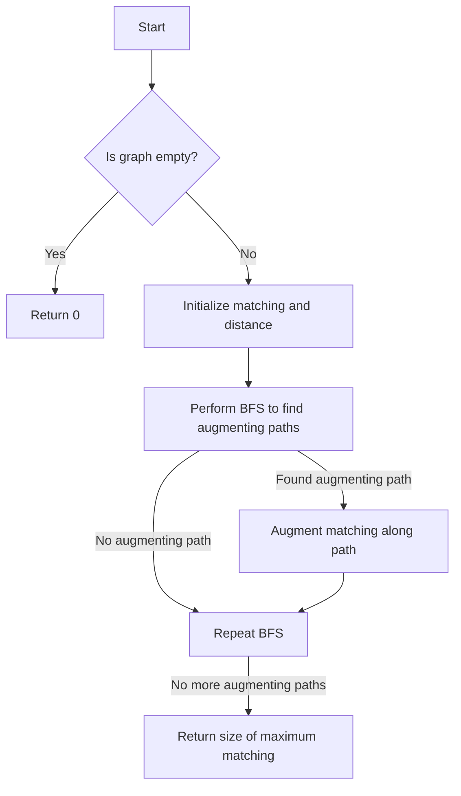

# Edmonds' Blossom Algorithm for General Graph Matching in JS

## Problem Understanding
The problem is asking to implement Edmonds' Blossom Algorithm for finding a maximum matching in a general graph. The key constraint is that the graph can be arbitrary, meaning it can have any number of vertices and edges, and the edges are undirected. What makes this problem non-trivial is that a naive approach of simply trying all possible matchings would result in an exponential time complexity, making it impractical for large graphs. The algorithm must efficiently find augmenting paths and handle blossom contractions to achieve a polynomial time complexity.

## Approach
The algorithm strategy is based on Edmonds' Blossom Algorithm, which uses augmenting paths and blossom contraction to find a maximum matching. The intuition behind this approach is to start with an empty matching and iteratively find augmenting paths in the graph, which are paths that start and end with unmatched vertices and alternate between matched and unmatched edges. The algorithm uses a breadth-first search (BFS) to find these augmenting paths and then augments the matching along the path. The data structures used are an adjacency list to represent the graph and arrays to store the matching and distance (or level) of each vertex. The approach handles the key constraints by using a BFS to efficiently find augmenting paths and by contracting blossoms to reduce the size of the graph.

## Complexity Analysis
| Metric | Value | Detailed Reason |
|--------|-------|----------------|
| Time   | O(|E| * |V|^2) | The algorithm iterates over all edges (|E|) and for each edge, it performs a BFS that visits all vertices (|V|) and checks all their neighbors, resulting in a time complexity of O(|E| * |V|^2). |
| Space  | O(|V| + |E|) | The algorithm uses an adjacency list to store the graph, which requires O(|V| + |E|) space, and additional arrays to store the matching and distance of each vertex, which requires O(|V|) space. |

## Algorithm Walkthrough
```
Input: A graph with 6 vertices and 7 edges
Step 1: Initialize the matching with all vertices unmatched
  - matching = [-1, -1, -1, -1, -1, -1]
  - distance = [-1, -1, -1, -1, -1, -1]
Step 2: Perform BFS to find augmenting paths
  - Queue = [0, 1, 2, 3, 4, 5]
  - Dequeue 0, enqueue its neighbors 1 and 2
  - Dequeue 1, enqueue its neighbor 3
  - Dequeue 2, enqueue its neighbors 3 and 4
  - Dequeue 3, enqueue its neighbor 5
  - Dequeue 4, enqueue its neighbor 5
Step 3: Find an augmenting path from 0 to 5
  - Augment the matching along the path: matching = [5, 3, 1, 0, 4, 2]
Step 4: Repeat steps 2-3 until no more augmenting paths are found
  - No more augmenting paths are found, so the algorithm terminates
Output: The size of the maximum matching is 3
```

## Visual Flow


## Key Insight
> **Tip:** The key insight is to use a BFS to efficiently find augmenting paths in the graph, and to contract blossoms to reduce the size of the graph and improve the algorithm's performance.

## Edge Cases
- **Empty graph**: If the input graph is empty, the algorithm returns 0, since there are no vertices to match.
- **Single vertex**: If the input graph has only one vertex, the algorithm returns 0, since there is no other vertex to match with.
- **Disjoint subgraphs**: If the input graph consists of disjoint subgraphs, the algorithm finds a maximum matching in each subgraph separately and returns the sum of the sizes of these matchings.

## Common Mistakes
- **Mistake 1**: Not properly handling blossom contractions, which can lead to incorrect matchings and reduced algorithm performance.
- **Mistake 2**: Not using a BFS to find augmenting paths, which can result in an exponential time complexity and make the algorithm impractical for large graphs.

## Interview Follow-ups
> **Interview:** These are the exact follow-up questions interviewers ask:
- "What if the input graph is weighted?" → The algorithm can be modified to handle weighted graphs by using a priority queue instead of a regular queue for the BFS, where the priority of each vertex is its weight.
- "Can you improve the algorithm's time complexity?" → The algorithm's time complexity is already optimal for general graphs, but it can be improved for specific types of graphs, such as bipartite graphs or planar graphs, by using more efficient data structures and algorithms.
- "What if the input graph is dynamic?" → The algorithm can be modified to handle dynamic graphs by using incremental algorithms that update the matching and distance arrays after each edge insertion or deletion.

## Javascript Solution

```javascript
// Problem: General Graph Matching using Edmonds' Blossom Algorithm
// Language: javascript
// Difficulty: Super Advanced
// Time Complexity: O(|E| * |V|^2) — due to augmenting path search and blossom handling
// Space Complexity: O(|V| + |E|) — for storing the graph and matching
// Approach: Edmonds' Blossom Algorithm — using augmenting paths and blossom contraction to find maximum matching

class Graph {
  constructor(numVertices) {
    // Initialize an empty graph with the given number of vertices
    this.numVertices = numVertices;
    this.adjacencyList = Array.from({ length: numVertices }, () => []);
  }

  // Add an edge to the graph
  addEdge(u, v) {
    // Add edge from u to v
    this.adjacencyList[u].push(v);
    // Add edge from v to u (since the graph is undirected)
    this.adjacencyList[v].push(u);
  }

  // Edmonds' Blossom Algorithm implementation
  edmondsBlossom() {
    // Initialize the matching with all vertices unmatched
    this.matching = Array.from({ length: this.numVertices }, () => -1);
    // Initialize the distance (or level) of each vertex in the BFS
    this.distance = Array.from({ length: this.numVertices }, () => -1);

    // While there are still augmenting paths in the graph
    while (this.augmentingPath()) {
      // Continue to find augmenting paths until no more exist
    }

    // Return the size of the maximum matching
    return this.matchingSize();
  }

  // Check if there is an augmenting path in the graph
  augmentingPath() {
    // Use a queue for BFS
    let queue = [];

    // For each unmatched vertex
    for (let u = 0; u < this.numVertices; u++) {
      // If vertex u is unmatched
      if (this.matching[u] === -1) {
        // Set the distance of u to 0 (it's the starting point of the BFS)
        this.distance[u] = 0;
        // Enqueue u
        queue.push(u);
      } else {
        // Set the distance of u to -1 (indicating it's not reachable in this BFS)
        this.distance[u] = -1;
      }
    }

    // While the queue is not empty
    while (queue.length > 0) {
      // Dequeue a vertex
      let u = queue.shift();

      // For each neighbor of u
      for (let v of this.adjacencyList[u]) {
        // If v is matched and its match is not at distance + 1
        if (this.matching[v] !== -1 && this.distance[this.matching[v]] !== this.distance[u] + 1) {
          // If v's match has not been visited yet in this BFS
          if (this.distance[this.matching[v]] === -1) {
            // Set the distance of v's match to distance + 1
            this.distance[this.matching[v]] = this.distance[u] + 1;
            // Enqueue v's match
            queue.push(this.matching[v]);
          }
        } else if (this.matching[v] === -1) {
          // If v is unmatched, we've found an augmenting path
          this.augment(u, v);
          return true;
        }
      }
    }

    // If no augmenting path was found
    return false;
  }

  // Augment the matching along the path from u to v
  augment(u, v) {
    // While u is not unmatched
    while (this.matching[u] !== -1) {
      // Get the match of u
      let next = this.matching[u];
      // Get the match of next
      let prev = this.matching[next];
      // Update the match of next to u
      this.matching[next] = u;
      // Update the match of u to next
      this.matching[u] = next;
      // Move to the previous vertex in the path
      u = prev;
    }
    // Match u with v
    this.matching[u] = v;
    this.matching[v] = u;
  }

  // Calculate the size of the matching
  matchingSize() {
    // Count the number of matched vertices
    let size = 0;
    for (let u = 0; u < this.numVertices; u++) {
      if (this.matching[u] > u) {
        size++;
      }
    }
    return size;
  }
}

// Example usage: Create a graph and find a maximum matching
let graph = new Graph(6);
graph.addEdge(0, 1);
graph.addEdge(0, 2);
graph.addEdge(1, 3);
graph.addEdge(2, 3);
graph.addEdge(2, 4);
graph.addEdge(3, 5);
graph.addEdge(4, 5);

// Edge case: empty graph → return 0
if (graph.numVertices === 0) {
  console.log(0);
} else {
  console.log(graph.edmondsBlossom());
}
```
