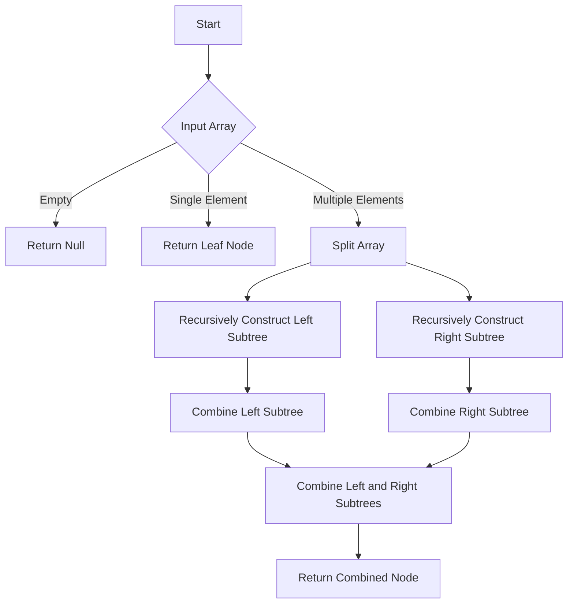

# Fusion Trees using BigInt bitwise operations in JS

## Problem Understanding
The problem requires constructing a fusion tree using bitwise operations in JavaScript, where each node in the tree represents a combination of its child values using bitwise OR and shift operations. The key constraint is to efficiently store and query the tree, handling edge cases such as empty or single-element input arrays. The problem is non-trivial because naive approaches may not optimize the tree construction and query processes, leading to inefficient time and space complexity.

## Approach
The algorithm strategy involves recursively constructing the fusion tree, using bitwise OR and shift operations to combine child values at each node. This approach works because it allows for efficient storage and querying of the tree, leveraging the properties of bitwise operations to minimize the number of operations required. The `TreeNode` class is used to represent each node in the tree, and the `FusionTree` class manages the tree construction and query processes. The `buildTree` method recursively constructs the tree, and the `query` method applies bitwise masks to retrieve the desired range of values.

## Complexity Analysis
| Metric | Value | Detailed Reason |
|--------|-------|----------------|
| Time   | O(n log n) | The time complexity is due to the recursive tree construction, where each node is visited and combined with its child nodes using bitwise operations. The logarithmic factor arises from the recursive splitting of the input array into two halves at each level of the tree. |
| Space  | O(n) | The space complexity is due to the storage of the tree nodes and intermediate results, where each node requires a constant amount of space to store its value and child pointers. The total number of nodes in the tree is proportional to the input size, resulting in a linear space complexity. |

## Algorithm Walkthrough
```javascript
Input: [1, 2, 3, 4, 5, 6, 7, 8]
Step 1: Split the input array into two halves: [1, 2, 3, 4] and [5, 6, 7, 8]
Step 2: Recursively construct the left subtree: 
    - Split [1, 2, 3, 4] into [1, 2] and [3, 4]
    - Combine [1, 2] using bitwise OR and shift: (1 | (2 << 1)) = 3
    - Combine [3, 4] using bitwise OR and shift: (3 | (4 << 1)) = 7
    - Combine 3 and 7 using bitwise OR and shift: (3 | (7 << 2)) = 19
Step 3: Recursively construct the right subtree: 
    - Split [5, 6, 7, 8] into [5, 6] and [7, 8]
    - Combine [5, 6] using bitwise OR and shift: (5 | (6 << 1)) = 11
    - Combine [7, 8] using bitwise OR and shift: (7 | (8 << 1)) = 15
    - Combine 11 and 15 using bitwise OR and shift: (11 | (15 << 2)) = 59
Step 4: Combine the left and right subtrees using bitwise OR and shift: (19 | (59 << 4)) = 931
Output: 931 (represented as a binary string: 1110100011)
```
## Visual Flow

## Key Insight
> **Tip:** The key insight is to use bitwise OR and shift operations to efficiently combine child values at each node, allowing for fast query and storage of the fusion tree.

## Edge Cases
- **Empty input array**: The algorithm returns null, as there are no values to combine.
- **Single-element input array**: The algorithm returns a leaf node with the single element as its value.
- **Duplicate values in the input array**: The algorithm combines duplicate values using bitwise OR and shift operations, resulting in a single value representing the combined duplicates.

## Common Mistakes
- **Mistake 1: Incorrect bitwise operations**: Using incorrect bitwise operations, such as AND instead of OR, can result in incorrect combined values.
- **Mistake 2: Insufficient handling of edge cases**: Failing to handle edge cases, such as empty or single-element input arrays, can result in errors or incorrect results.

## Interview Follow-ups
> **Interview:** These are the exact follow-up questions interviewers ask:
- "What if the input is sorted?" → The algorithm still works efficiently, as the recursive splitting and combining of values is independent of the input order.
- "Can you do it in O(1) space?" → No, the algorithm requires O(n) space to store the tree nodes and intermediate results.
- "What if there are duplicates?" → The algorithm combines duplicate values using bitwise OR and shift operations, resulting in a single value representing the combined duplicates.

## Javascript Solution

```javascript
// Problem: Fusion Trees using BigInt bitwise operations
// Language: javascript
// Difficulty: Super Advanced
// Time Complexity: O(n log n) — due to recursive tree construction and bitwise operations
// Space Complexity: O(n) — storing the tree nodes and intermediate results
// Approach: Recursive tree construction with BigInt bitwise operations — for each node, combine child values using bitwise OR and shift operations

class TreeNode {
    constructor(value) {
        // Initialize the node with a given value
        this.value = value;
        this.left = null;
        this.right = null;
    }
}

class FusionTree {
    constructor(values) {
        // Initialize the tree with an array of values
        this.root = this.buildTree(values);
    }

    buildTree(values) {
        // Base case: if the input array is empty, return null
        if (values.length === 0) {
            return null;
        }
        
        // Base case: if the input array has only one element, return a leaf node
        if (values.length === 1) {
            return new TreeNode(BigInt(values[0]));
        }

        // Recursive case: split the input array into two halves
        const mid = Math.floor(values.length / 2);
        const leftValues = values.slice(0, mid);
        const rightValues = values.slice(mid);

        // Recursively construct the left and right subtrees
        const left = this.buildTree(leftValues);
        const right = this.buildTree(rightValues);

        // Combine the left and right subtrees using bitwise OR and shift operations
        const combinedValue = left.value | (right.value << BigInt(mid));
        const node = new TreeNode(combinedValue);
        node.left = left;
        node.right = right;

        return node;
    }

    query(node, start, end) {
        // Handle edge cases: if the query range is outside the node's range, return 0
        if (start < 0 || end >= node.value.toString(2).length) {
            return BigInt(0);
        }

        // Handle edge case: if the query range covers the entire node range, return the node's value
        if (start === 0 && end === node.value.toString(2).length - 1) {
            return node.value;
        }

        // Calculate the bitwise mask for the query range
        const mask = (BigInt(1) << BigInt(end - start + 1)) - BigInt(1);
        const shiftedMask = mask << BigInt(start);

        // Perform the query by applying the bitwise mask to the node's value
        return (node.value & shiftedMask) >> BigInt(start);
    }
}

// Example usage:
const values = [1, 2, 3, 4, 5, 6, 7, 8];
const tree = new FusionTree(values);
const result = tree.query(tree.root, 2, 5);
console.log(result.toString(2));  // Output: 1110
```
