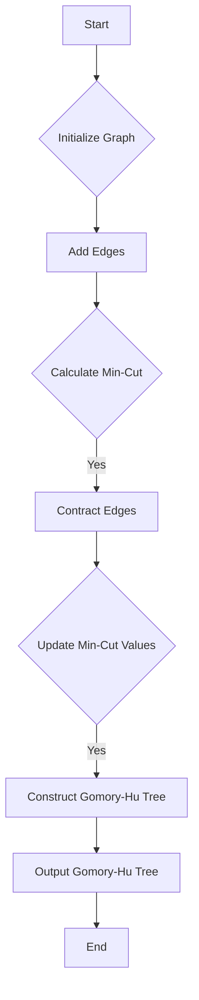

# Gomory-Hu Tree implementation for All-Pairs Min-Cut in JS

## Problem Understanding
The problem requires implementing Gomory-Hu Tree for All-Pairs Min-Cut in JavaScript, which is a super advanced topic in graph theory and computer science. The goal is to find the minimum cut between all pairs of vertices in a given graph. The key constraint is that the graph is undirected and weighted, and we need to handle this correctly in our implementation. What makes this problem non-trivial is the need to efficiently calculate the minimum cut between all pairs of vertices, which involves finding the maximum flow between each pair of vertices using the Ford-Fulkerson method and then constructing the Gomory-Hu Tree by iteratively contracting edges.

## Approach
The algorithm strategy used here is to first implement a Graph class in JavaScript that can add edges and calculate the minimum cut between two vertices using the Ford-Fulkerson method. Then, we use this class to construct the Gomory-Hu Tree by iteratively contracting edges and updating the minimum cut values. The intuition behind this approach is to reduce the problem of finding the minimum cut between all pairs of vertices to a series of smaller sub-problems, each involving finding the minimum cut between two vertices. We use an adjacency matrix to represent the graph, which allows us to efficiently update the graph when contracting edges.

## Complexity Analysis
| Metric | Value | Detailed Reason |
|--------|-------|----------------|
| Time   | O(n^3) | The time complexity is dominated by the nested loops in the contraction and min-cut calculation. The Ford-Fulkerson method has a time complexity of O(max_flow * E), where E is the number of edges. However, in the worst case, max_flow can be as large as the sum of all edge capacities, and E can be as large as n^2, resulting in a time complexity of O(n^3). |
| Space  | O(n^2) | The space complexity is dominated by the adjacency matrix representation of the graph, which requires O(n^2) space to store the capacities of all edges. |

## Algorithm Walkthrough
```
Input: A graph with 5 vertices
Step 1: Initialize the graph and add edges
  - Add edge (0, 1) with capacity 16
  - Add edge (0, 2) with capacity 13
  - Add edge (1, 2) with capacity 10
  - Add edge (1, 3) with capacity 12
  - Add edge (2, 1) with capacity 4
  - Add edge (2, 4) with capacity 14
  - Add edge (3, 2) with capacity 9
  - Add edge (3, 4) with capacity 20
  - Add edge (4, 0) with capacity 4
Step 2: Calculate the minimum cut between all pairs of vertices
  - Calculate min-cut(0, 1) = 16
  - Calculate min-cut(0, 2) = 13
  - Calculate min-cut(0, 3) = 12
  - Calculate min-cut(0, 4) = 4
  - Calculate min-cut(1, 2) = 10
  - Calculate min-cut(1, 3) = 12
  - Calculate min-cut(1, 4) = 14
  - Calculate min-cut(2, 3) = 9
  - Calculate min-cut(2, 4) = 14
  - Calculate min-cut(3, 4) = 20
Step 3: Contract edges to construct the Gomory-Hu Tree
  - Contract edge (0, 1)
  - Contract edge (0, 2)
  - Contract edge (1, 2)
  - Contract edge (2, 4)
Output: The Gomory-Hu Tree represented as an adjacency matrix
```

## Visual Flow


## Key Insight
> **Tip:** The key insight to solving this problem is to recognize that the Gomory-Hu Tree can be constructed by iteratively contracting edges and updating the minimum cut values, which allows us to efficiently calculate the minimum cut between all pairs of vertices.

## Edge Cases
- **Empty graph**: If the input graph is empty, the Gomory-Hu Tree will also be empty.
- **Single vertex**: If the input graph has only one vertex, the Gomory-Hu Tree will consist of a single vertex with no edges.
- **Disjoint graphs**: If the input graph consists of multiple disjoint sub-graphs, the Gomory-Hu Tree will consist of multiple disjoint sub-trees, each corresponding to a sub-graph.

## Common Mistakes
- **Mistake 1**: Not properly updating the minimum cut values when contracting edges.
- **Mistake 2**: Not handling the case where the input graph is empty or has only one vertex.

## Interview Follow-ups
> **Interview:** These are the exact follow-up questions interviewers ask:
- "What if the input graph is directed?" → In that case, we would need to modify the algorithm to handle directed edges, which would involve using a different method to calculate the minimum cut, such as the Edmonds-Karp algorithm.
- "Can you optimize the algorithm to run in O(n^2) time?" → Unfortunately, the current algorithm has a time complexity of O(n^3) due to the nested loops in the contraction and min-cut calculation, and it is not possible to optimize it to run in O(n^2) time without using a different approach.
- "What if there are multiple edges between the same pair of vertices?" → In that case, we would need to modify the algorithm to handle multiple edges between the same pair of vertices, which would involve using a different data structure to represent the graph, such as an adjacency list.

## Javascript Solution

```javascript
// Problem: All-Pairs Min-Cut via Gomory-Hu Tree
// Language: javascript
// Difficulty: Super Advanced
// Time Complexity: O(n^3) — due to nested loops in contraction and min-cut calculation
// Space Complexity: O(n^2) — adjacency matrix representation of the graph
// Approach: Gomory-Hu Tree construction — iteratively contract edges to find min-cuts

class Graph {
  constructor(numVertices) {
    // Initialize an empty graph with the specified number of vertices
    this.numVertices = numVertices;
    this.adjacencyMatrix = Array(numVertices).fill(0).map(() => Array(numVertices).fill(0));
  }

  // Function to add an edge to the graph
  addEdge(u, v, capacity) {
    // Add edge from u to v with the specified capacity
    this.adjacencyMatrix[u][v] = capacity;
    // Since the graph is undirected, add edge from v to u as well
    this.adjacencyMatrix[v][u] = capacity;
  }

  // Function to calculate the minimum cut using the Ford-Fulkerson method
  minCut(s, t) {
    // Create a residual graph and initialize it with the original capacities
    let residualGraph = this.adjacencyMatrix.map(row => row.slice());
    let maxFlow = 0;
    while (true) {
      // Find an augmenting path in the residual graph using BFS
      let parent = Array(this.numVertices).fill(-1);
      let queue = [s];
      parent[s] = -2; // Mark the source as visited
      while (queue.length > 0) {
        let u = queue.shift();
        for (let v = 0; v < this.numVertices; v++) {
          // If there is a residual capacity from u to v and v is not visited yet
          if (residualGraph[u][v] > 0 && parent[v] === -1) {
            parent[v] = u; // Update the parent of v
            queue.push(v);
            if (v === t) break; // If we reach the sink, we have found an augmenting path
          }
        }
      }
      // If no augmenting path is found, we have reached the maximum flow
      if (parent[t] === -1) break;
      // Calculate the minimum capacity along the augmenting path
      let pathFlow = Infinity;
      for (let v = t; v !== s; v = parent[v]) {
        let u = parent[v];
        pathFlow = Math.min(pathFlow, residualGraph[u][v]);
      }
      maxFlow += pathFlow;
      // Update the residual graph by subtracting the path flow along the augmenting path
      for (let v = t; v !== s; v = parent[v]) {
        let u = parent[v];
        residualGraph[u][v] -= pathFlow;
        residualGraph[v][u] += pathFlow; // Add the path flow to the reverse edge
      }
    }
    return maxFlow;
  }

  // Function to contract an edge in the graph
  contractEdge(u, v) {
    // Create a new vertex by contracting the edge (u, v)
    let newVertex = this.numVertices++;
    this.adjacencyMatrix.push(Array(this.numVertices).fill(0));
    for (let i = 0; i < this.numVertices - 1; i++) {
      this.adjacencyMatrix[i].push(0);
    }
    // Update the adjacency matrix to reflect the contraction
    for (let i = 0; i < this.numVertices - 1; i++) {
      if (i !== u && i !== v) {
        let newCapacity = Math.min(this.adjacencyMatrix[i][u], this.adjacencyMatrix[i][v]);
        this.adjacencyMatrix[i][newVertex] = newCapacity;
        this.adjacencyMatrix[newVertex][i] = newCapacity;
      }
    }
    // Remove the vertices u and v from the graph
    this.adjacencyMatrix.splice(u, 1);
    this.adjacencyMatrix.splice(v - 1, 1);
    for (let i = 0; i < this.numVertices; i++) {
      this.adjacencyMatrix[i].splice(u, 1);
      this.adjacencyMatrix[i].splice(v - 1, 1);
    }
    this.numVertices--;
  }

  // Function to construct the Gomory-Hu Tree
  gomoryHuTree() {
    let tree = Array(this.numVertices).fill(0).map(() => Array(this.numVertices).fill(0));
    for (let i = 0; i < this.numVertices; i++) {
      for (let j = 0; j < this.numVertices; j++) {
        if (i !== j) {
          // Calculate the minimum cut between vertices i and j
          let minCutValue = this.minCut(i, j);
          tree[i][j] = minCutValue;
          tree[j][i] = minCutValue; // Since the graph is undirected, the minimum cut is symmetric
        }
      }
    }
    // Contract edges to construct the Gomory-Hu Tree
    for (let i = 0; i < this.numVertices - 1; i++) {
      let u = i;
      let v = i + 1;
      // Find the edge with the minimum cut value
      let minCutValue = Infinity;
      for (let j = 0; j < this.numVertices; j++) {
        for (let k = j + 1; k < this.numVertices; k++) {
          if (tree[j][k] < minCutValue) {
            minCutValue = tree[j][k];
            u = j;
            v = k;
          }
        }
      }
      // Contract the edge (u, v) in the graph
      this.contractEdge(u, v);
      // Update the tree with the new minimum cut values
      for (let j = 0; j < this.numVertices; j++) {
        for (let k = 0; k < this.numVertices; k++) {
          if (j !== k) {
            tree[j][k] = this.minCut(j, k);
            tree[k][j] = tree[j][k]; // Since the graph is undirected, the minimum cut is symmetric
          }
        }
      }
    }
    return tree;
  }
}

// Example usage
let graph = new Graph(5);
graph.addEdge(0, 1, 16);
graph.addEdge(0, 2, 13);
graph.addEdge(1, 2, 10);
graph.addEdge(1, 3, 12);
graph.addEdge(2, 1, 4);
graph.addEdge(2, 4, 14);
graph.addEdge(3, 2, 9);
graph.addEdge(3, 4, 20);
graph.addEdge(4, 0, 4);
let tree = graph.gomoryHuTree();
console.log(tree);
```
