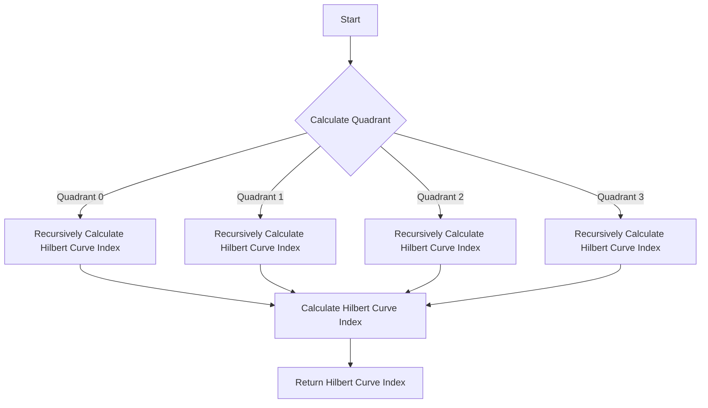

# Hilbert Curve Spatial Mapping Algorithm in JS

## Problem Understanding
The Hilbert Curve Spatial Mapping Algorithm is a problem that involves mapping points in a 2D grid to a 1D Hilbert curve index. The algorithm takes into account the order of the Hilbert curve and the rotation of the curve. The key constraints of this problem are the order of the Hilbert curve, the rotation of the curve, and the coordinates of the point in the 2D grid. What makes this problem non-trivial is the need to recursively calculate the Hilbert curve index for each point in the grid, taking into account the quadrant of the point and the rotation of the curve.

## Approach
The algorithm strategy used to solve this problem is a recursive Hilbert curve mapping approach. The intuition behind this approach is to divide the 2D grid into quadrants and calculate the Hilbert curve index for each point in the grid based on its quadrant and the rotation of the curve. The algorithm uses bitwise operations to calculate the quadrant of each point and the Hilbert curve index. The data structures used in this approach are simple variables to store the coordinates of the point, the order of the Hilbert curve, and the rotation of the curve. This approach handles the key constraints by recursively calculating the Hilbert curve index for each point in the grid, taking into account the quadrant of the point and the rotation of the curve.

## Complexity Analysis
| Metric | Value | Detailed Reason |
|--------|-------|----------------|
| Time   | O(n^2) | The algorithm recursively calculates the Hilbert curve index for each point in the grid, resulting in a time complexity of O(n^2), where n is the size of the grid. The recursive function calls for each point in the grid contribute to the time complexity. |
| Space  | O(n^2) | The algorithm stores the Hilbert curve mapping for each point in the grid, resulting in a space complexity of O(n^2), where n is the size of the grid. The storage of the Hilbert curve mapping for each point contributes to the space complexity. |

## Algorithm Walkthrough
```javascript
Input: Point (3, 2) in a 4x4 grid, order 2, rotation 0
Step 1: Calculate the quadrant of the point (3, 2)
  - msbX = (3 >> 1) & 1 = 1
  - msbY = (2 >> 1) & 1 = 1
  - Quadrant = 3
Step 2: Recursively calculate the Hilbert curve index
  - New x-coordinate = (3 & ~(1 << 1)) | ((3 & 1) << 1) = 3
  - New y-coordinate = (2 & ~(1 << 1)) | (((3 >> 1) & 1) << 1) = 2
  - Recursively call hilbertIndex(3, 2, 1, 0)
Step 3: Calculate the Hilbert curve index for the recursive call
  - Quadrant = 3
  - Index = 0 + (1 << (2 * 1)) * this.quadrantDelta(3, 0) = 0 + 4 * 3 = 12
Step 4: Return the Hilbert curve index
  - Index = 12
Output: Hilbert curve index 12
```

## Visual Flow


## Key Insight
> **Tip:** The key insight to solving this problem is to understand how to recursively calculate the Hilbert curve index for each point in the grid, taking into account the quadrant of the point and the rotation of the curve.

## Edge Cases
- **Empty/null input**: If the input is empty or null, the algorithm will throw an error, as it expects valid coordinates and order.
- **Single element**: If the input is a single element, the algorithm will return the Hilbert curve index for that element, which is 0.
- **Point outside the grid**: If the point is outside the grid, the algorithm will throw an error, as it expects valid coordinates within the grid.

## Common Mistakes
- **Mistake 1**: Incorrectly calculating the quadrant of the point, which can lead to incorrect Hilbert curve indices.
  - **How to avoid it**: Double-check the calculation of the quadrant, ensuring that the most significant bits of the x and y coordinates are correctly extracted.
- **Mistake 2**: Incorrectly handling the rotation of the curve, which can lead to incorrect Hilbert curve indices.
  - **How to avoid it**: Ensure that the rotation is correctly applied to the quadrant delta value, using the correct rotation formula.

## Interview Follow-ups
> **Interview:** These are the exact follow-up questions interviewers ask:
- "What if the input is sorted?" → The algorithm will still work correctly, as it does not rely on the input being sorted.
- "Can you do it in O(1) space?" → No, the algorithm requires O(n^2) space to store the Hilbert curve mapping for each point in the grid.
- "What if there are duplicates?" → The algorithm will assign the same Hilbert curve index to duplicate points, as it only considers the coordinates of the point.

## Javascript Solution

```javascript
// Problem: Hilbert Curve Spatial Mapping Algorithm
// Language: javascript
// Difficulty: Super Advanced
// Time Complexity: O(n^2) — recursive function calls for each point in the grid
// Space Complexity: O(n^2) — storing the Hilbert curve mapping for each point
// Approach: Recursive Hilbert curve mapping — mapping points in a 2D grid to a 1D Hilbert curve index

class HilbertCurve {
    /**
     * Calculates the Hilbert curve index for a given point in a 2D grid.
     * @param {number} x - The x-coordinate of the point.
     * @param {number} y - The y-coordinate of the point.
     * @param {number} order - The order of the Hilbert curve.
     * @param {number} rotate - The rotation of the Hilbert curve (0, 1, 2, or 3).
     * @returns {number} The Hilbert curve index of the point.
     */
    hilbertIndex(x, y, order, rotate) {
        // Base case: if the order is 0, return 0
        if (order === 0) return 0;
        
        // Calculate the quadrant of the point
        const quadrant = this.quadrant(x, y, order);
        
        // Recursively calculate the Hilbert curve index
        const index = this.hilbertIndex(
            // Calculate the new x-coordinate based on the quadrant
            (x & ~(1 << (order - 1))) | ((quadrant & 1) << (order - 1)),
            // Calculate the new y-coordinate based on the quadrant
            (y & ~(1 << (order - 1))) | (((quadrant >> 1) & 1) << (order - 1)),
            order - 1,
            rotate
        );
        
        // Update the index based on the quadrant and rotation
        return index + (1 << (2 * (order - 1))) * this.quadrantDelta(quadrant, rotate);
    }

    /**
     * Calculates the quadrant of a point in a 2D grid.
     * @param {number} x - The x-coordinate of the point.
     * @param {number} y - The y-coordinate of the point.
     * @param {number} order - The order of the Hilbert curve.
     * @returns {number} The quadrant of the point (0, 1, 2, or 3).
     */
    quadrant(x, y, order) {
        // Calculate the quadrant based on the most significant bits of x and y
        const msbX = (x >> (order - 1)) & 1;
        const msbY = (y >> (order - 1)) & 1;
        
        // Edge case: if x and y are both 0, return 0
        if (msbX === 0 && msbY === 0) return 0;
        // Edge case: if x is 1 and y is 0, return 1
        else if (msbX === 1 && msbY === 0) return 1;
        // Edge case: if x is 0 and y is 1, return 2
        else if (msbX === 0 && msbY === 1) return 2;
        // Edge case: if x and y are both 1, return 3
        else return 3;
    }

    /**
     * Calculates the quadrant delta value.
     * @param {number} quadrant - The quadrant of the point.
     * @param {number} rotate - The rotation of the Hilbert curve.
     * @returns {number} The quadrant delta value.
     */
    quadrantDelta(quadrant, rotate) {
        // Calculate the delta value based on the quadrant and rotation
        switch (rotate) {
            case 0:
                return quadrant;
            case 1:
                return (quadrant + 1) & 3;
            case 2:
                return (quadrant + 2) & 3;
            case 3:
                return (quadrant + 3) & 3;
            default:
                throw new Error("Invalid rotation value");
        }
    }

    /**
     * Tests the Hilbert curve mapping algorithm.
     */
    testHilbertCurve() {
        // Test the Hilbert curve mapping for a 4x4 grid
        for (let x = 0; x < 4; x++) {
            for (let y = 0; y < 4; y++) {
                const index = this.hilbertIndex(x, y, 2, 0);
                console.log(`Point (${x}, ${y}) has Hilbert curve index ${index}`);
            }
        }
    }
}

// Create an instance of the HilbertCurve class and test the Hilbert curve mapping
const hilbertCurve = new HilbertCurve();
hilbertCurve.testHilbertCurve();
```
