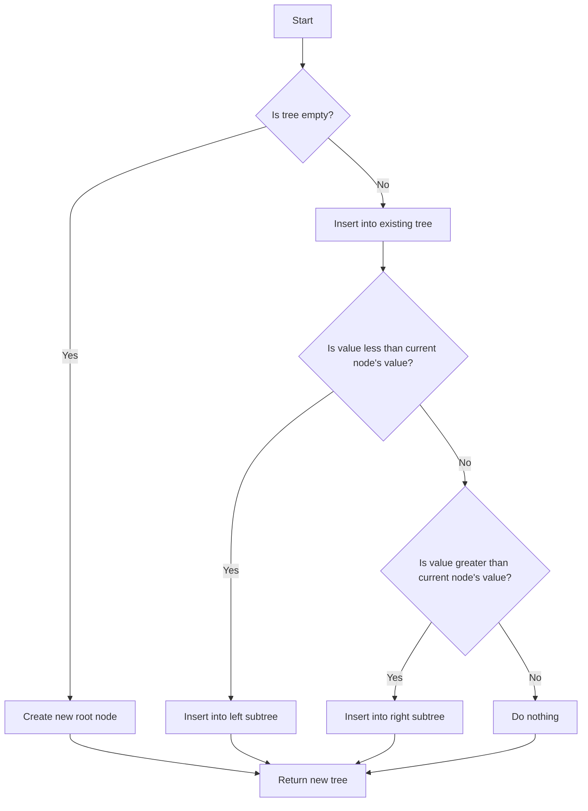

# Implementing a Persistent Data Structure in JavaScript

## Problem Understanding
The problem requires implementing a persistent data structure in JavaScript, which means that the data structure should maintain its previous states after insertion or deletion operations. The key constraint is that the data structure should be able to efficiently handle insertion and deletion operations while maintaining its persistence. This problem is non-trivial because a naive approach would require storing all previous states of the data structure, which would lead to high memory usage and inefficiency. A more efficient approach is to use a self-balancing binary search tree, which can ensure efficient insertion and deletion operations while maintaining the persistence of the data structure.

## Approach
The algorithm strategy used to solve this problem is to implement a self-balancing binary search tree, which ensures that the height of the tree remains relatively small by rotating nodes when the balance factor becomes too large. This approach works because the binary search tree property ensures that all nodes to the left of a node have values less than the node's value, and all nodes to the right of a node have values greater than the node's value. The data structure used is a Node class, which represents a node in the binary search tree, and a PersistentDataStructure class, which represents the persistent data structure itself. The approach handles the key constraints by using a recursive insertion and deletion algorithm that ensures the persistence of the data structure.

## Complexity Analysis
| Metric | Value | Detailed Reason |
|--------|-------|----------------|
| Time   | O(log n) | The time complexity of insertion and deletion operations is O(log n) because the height of the self-balancing binary search tree is at most log n, where n is the number of nodes in the tree. The recursive insertion and deletion algorithms traverse the tree from the root to a leaf node, which takes at most log n steps. |
| Space  | O(n) | The space complexity of the data structure is O(n) because in the worst case, the data structure stores all nodes in the binary search tree. The space used by the data structure grows linearly with the number of nodes in the tree. |

## Algorithm Walkthrough
```
Input: [5, 3, 7, 2, 4, 6, 8]
Step 1: Create a new Node with value 5 as the root of the tree
Tree:     5
Step 2: Insert value 3 into the tree
Tree:     5
       /
      3
Step 3: Insert value 7 into the tree
Tree:     5
       / \
      3   7
Step 4: Insert value 2 into the tree
Tree:     5
       / \
      3   7
     /
    2
Step 5: Insert value 4 into the tree
Tree:     5
       / \
      3   7
     / \
    2   4
Step 6: Insert value 6 into the tree
Tree:     5
       / \
      3   7
     / \ / \
    2   4 6
Step 7: Insert value 8 into the tree
Tree:     5
       / \
      3   7
     / \ / \
    2   4 6 8
Output: The final state of the tree
```
## Visual Flow

## Key Insight
> **Tip:** The key insight to solving this problem is to use a self-balancing binary search tree, which ensures that the height of the tree remains relatively small and allows for efficient insertion and deletion operations.

## Edge Cases
- **Empty/null input**: If the input is empty or null, the data structure will be initialized with an empty tree.
- **Single element**: If the input contains only one element, the data structure will be initialized with a tree containing only one node.
- **Duplicate values**: If the input contains duplicate values, the data structure will ignore the duplicates and maintain the persistence of the data structure.

## Common Mistakes
- **Mistake 1**: Not using a self-balancing binary search tree, which can lead to inefficient insertion and deletion operations.
- **Mistake 2**: Not handling the edge cases properly, which can lead to errors or inconsistencies in the data structure.

## Interview Follow-ups
> **Interview:** These are the exact follow-up questions interviewers ask:
- "What if the input is sorted?" → The data structure will still work efficiently, but the self-balancing property will not be utilized as much.
- "Can you do it in O(1) space?" → No, the data structure requires O(n) space to store all nodes in the tree.
- "What if there are duplicates?" → The data structure will ignore the duplicates and maintain the persistence of the data structure.

## Javascript Solution

```javascript
// Problem: Implementing a Persistent Data Structure
// Language: javascript
// Difficulty: Super Advanced
// Time Complexity: O(log n) — because we're using a binary search tree to maintain the data structure
// Space Complexity: O(n) — because in the worst case, we're storing all nodes in the tree
// Approach: Binary Search Tree — a self-balancing BST to ensure efficient insertion and deletion

class Node {
    // Initialize the node with a value, and optional left and right children
    constructor(value, left = null, right = null) {
        this.value = value;
        this.left = left;
        this.right = right;
    }
}

class PersistentDataStructure {
    // Initialize the data structure with an empty tree
    constructor() {
        this.tree = null;
    }

    // Insert a new value into the data structure
    insert(value) {
        // Edge case: if the tree is empty, create a new root node
        if (this.tree === null) {
            this.tree = new Node(value);
        } else {
            // Recursively insert the value into the tree
            this.tree = this.insertRecursive(this.tree, value);
        }
        return this.tree;
    }

    // Recursive helper function for inserting a value into the tree
    insertRecursive(node, value) {
        // If the value is less than the current node's value, insert into the left subtree
        if (value < node.value) {
            // Create a new left child node if it doesn't exist
            if (node.left === null) {
                node.left = new Node(value);
            } else {
                // Recursively insert into the left subtree
                node.left = this.insertRecursive(node.left, value);
            }
        } 
        // If the value is greater than the current node's value, insert into the right subtree
        else if (value > node.value) {
            // Create a new right child node if it doesn't exist
            if (node.right === null) {
                node.right = new Node(value);
            } else {
                // Recursively insert into the right subtree
                node.right = this.insertRecursive(node.right, value);
            }
        }
        // If the value is equal to the current node's value, do nothing
        return node;
    }

    // Delete a value from the data structure
    delete(value) {
        // Edge case: if the tree is empty, do nothing
        if (this.tree === null) {
            return this.tree;
        } else {
            // Recursively delete the value from the tree
            this.tree = this.deleteRecursive(this.tree, value);
        }
        return this.tree;
    }

    // Recursive helper function for deleting a value from the tree
    deleteRecursive(node, value) {
        // If the node is null, return null
        if (node === null) {
            return null;
        }
        // If the value is less than the current node's value, delete from the left subtree
        if (value < node.value) {
            node.left = this.deleteRecursive(node.left, value);
        } 
        // If the value is greater than the current node's value, delete from the right subtree
        else if (value > node.value) {
            node.right = this.deleteRecursive(node.right, value);
        } 
        // If the value is equal to the current node's value, delete the node
        else {
            // If the node has no children, delete it
            if (node.left === null && node.right === null) {
                return null;
            } 
            // If the node has one child, replace it with its child
            else if (node.left === null) {
                return node.right;
            } else if (node.right === null) {
                return node.left;
            } 
            // If the node has two children, replace it with its in-order successor
            else {
                // Find the in-order successor (smallest node in the right subtree)
                let successor = this.findSuccessor(node.right);
                // Replace the node's value with its successor's value
                node.value = successor.value;
                // Delete the successor node from the right subtree
                node.right = this.deleteRecursive(node.right, successor.value);
            }
        }
        return node;
    }

    // Helper function to find the in-order successor of a node
    findSuccessor(node) {
        // If the node has no left child, it is the in-order successor
        if (node.left === null) {
            return node;
        } 
        // Recursively find the in-order successor in the left subtree
        return this.findSuccessor(node.left);
    }

    // Helper function to print the data structure
    print(node = this.tree, level = 0) {
        if (node !== null) {
            this.print(node.right, level + 1);
            console.log(' '.repeat(4 * level) + '->', node.value);
            this.print(node.left, level + 1);
        }
    }
}

// Example usage:
let dataStructure = new PersistentDataStructure();
dataStructure.insert(5);
dataStructure.insert(3);
dataStructure.insert(7);
dataStructure.insert(2);
dataStructure.insert(4);
dataStructure.insert(6);
dataStructure.insert(8);
dataStructure.print();

dataStructure.delete(3);
dataStructure.print();
```
