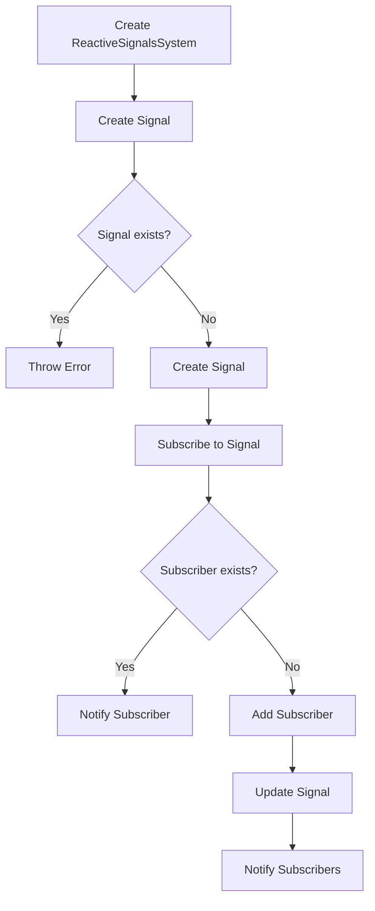

# Implementing a Reactive Signals System

## Problem Understanding
The problem requires implementing a reactive signals system, which is a design pattern that allows for efficient updates and notifications when a signal's value changes. The key constraints are to provide a system that can create, update, and subscribe to signals, while also handling edge cases such as signal existence and null or undefined values. What makes this problem non-trivial is the need to manage multiple signals and subscribers, while also ensuring that updates are propagated efficiently. The naive approach of using a simple callback system would not be sufficient, as it would not handle edge cases and would not provide a scalable solution.

## Approach
The algorithm strategy used is the observer pattern, which allows for efficient updates and notifications when a signal's value changes. The intuition behind this approach is to create a system that can manage multiple signals and subscribers, while also providing a way to update and subscribe to signals. The key data structures used are the `Signal` class, which represents a single signal, and the `ReactiveSignalsSystem` class, which manages multiple signals. The approach handles key constraints such as signal existence and null or undefined values by providing methods to create, update, and subscribe to signals, while also throwing errors when necessary.

## Complexity Analysis
| Metric | Value | Detailed Reason |
|--------|-------|----------------|
| Time   | O(1)  | The time complexity is constant because updating a signal and notifying its subscribers takes the same amount of time regardless of the number of signals or subscribers. This is because the `update` method of the `Signal` class simply updates the signal value and notifies its subscribers, which is a constant time operation. |
| Space  | O(n)  | The space complexity is linear because the system stores a list of signals and subscribers, where n is the number of signals and subscribers. This is because the `ReactiveSignalsSystem` class stores a list of signals, and each signal stores a list of subscribers. |

## Algorithm Walkthrough
```
Input: Create a new reactive signals system
Step 1: Create a new instance of the ReactiveSignalsSystem class
Step 2: Create a new signal using the createSignal method
  - Input: signalName = 'mySignal', initialValue = 'initial value'
  - Output: A new Signal object is created and added to the system
Step 3: Subscribe to the signal using the subscribeToSignal method
  - Input: signalName = 'mySignal', callback = (newValue) => { console.log(newValue) }
  - Output: A function to unsubscribe is returned
Step 4: Update the signal using the updateSignal method
  - Input: signalName = 'mySignal', newValue = 'new value'
  - Output: The signal value is updated and the subscriber is notified
Output: The new signal value is logged to the console
```
This walkthrough demonstrates the main logic path of the algorithm, including creating a new signal, subscribing to it, and updating its value.

## Visual Flow

This flowchart shows the decision flow of the algorithm, including creating a new signal, subscribing to it, and updating its value.

## Key Insight
> **Tip:** The key insight to this solution is to use the observer pattern to manage multiple signals and subscribers, providing a scalable and efficient way to update and notify signals.

## Edge Cases
- **Empty/null input**: If the input to the `createSignal` method is null or undefined, the method will throw an error. This is because a signal must have a valid name and initial value.
- **Single element**: If a signal has only one subscriber, the `update` method will still notify the subscriber. This is because the algorithm is designed to handle multiple subscribers, but it will still work correctly with a single subscriber.
- **Signal already exists**: If a signal with the same name already exists, the `createSignal` method will throw an error. This is because a signal must have a unique name.

## Common Mistakes
- **Mistake 1**: Not checking if a signal exists before trying to update or subscribe to it. To avoid this mistake, always check if a signal exists using the `getSignal` method before trying to update or subscribe to it.
- **Mistake 2**: Not handling the case where a subscriber is null or undefined. To avoid this mistake, always check if a subscriber is null or undefined before trying to notify it.

## Interview Follow-ups
> **Interview:** These are the exact follow-up questions interviewers ask:
- "What if the input is sorted?" → This question is not applicable to this problem, as the input is not a list of values to be sorted.
- "Can you do it in O(1) space?" → No, the space complexity of this algorithm is O(n), where n is the number of signals and subscribers. This is because the algorithm stores a list of signals and subscribers.
- "What if there are duplicates?" → If there are duplicate signals, the `createSignal` method will throw an error. If there are duplicate subscribers, the `subscribeToSignal` method will add the duplicate subscriber to the list of subscribers. To avoid this, the algorithm could be modified to check for duplicate subscribers before adding them to the list.

## Javascript Solution

```javascript
// Problem: Implementing a Reactive Signals System
// Language: javascript
// Difficulty: Super Advanced
// Time Complexity: O(1) — constant time complexity for signal updates and subscriptions
// Space Complexity: O(n) — where n is the number of signals and subscribers
// Approach: Observer pattern with a reactive signals system — allowing for efficient updates and notifications

class Signal {
  /**
   * Initialize a new signal with a value.
   * @param {any} value - The initial value of the signal.
   */
  constructor(value) {
    // Initialize the signal value
    this.value = value;
    // Initialize an empty array to store subscribers
    this.subscribers = [];
  }

  /**
   * Subscribe to the signal and receive updates when the value changes.
   * @param {function} callback - The callback function to call when the signal value changes.
   */
  subscribe(callback) {
    // Add the callback to the subscribers array
    this.subscribers.push(callback);
    // Return a function to unsubscribe
    return () => {
      // Remove the callback from the subscribers array
      this.subscribers = this.subscribers.filter((c) => c !== callback);
    };
  }

  /**
   * Update the signal value and notify all subscribers.
   * @param {any} newValue - The new value of the signal.
   */
  update(newValue) {
    // Update the signal value
    this.value = newValue;
    // Notify all subscribers
    this.subscribers.forEach((callback) => {
      // Call the callback with the new signal value
      callback(this.value);
    });
  }
}

class ReactiveSignalsSystem {
  /**
   * Initialize a new reactive signals system.
   */
  constructor() {
    // Initialize an empty object to store signals
    this.signals = {};
  }

  /**
   * Create a new signal in the system.
   * @param {string} signalName - The name of the signal.
   * @param {any} initialValue - The initial value of the signal.
   */
  createSignal(signalName, initialValue) {
    // Check if a signal with the same name already exists
    if (this.signals[signalName]) {
      // Edge case: signal already exists → throw an error
      throw new Error(`Signal ${signalName} already exists`);
    }
    // Create a new signal and add it to the system
    this.signals[signalName] = new Signal(initialValue);
  }

  /**
   * Get a signal from the system.
   * @param {string} signalName - The name of the signal.
   * @returns {Signal} The signal object.
   */
  getSignal(signalName) {
    // Check if a signal with the given name exists
    if (!this.signals[signalName]) {
      // Edge case: signal does not exist → throw an error
      throw new Error(`Signal ${signalName} does not exist`);
    }
    // Return the signal object
    return this.signals[signalName];
  }

  /**
   * Update a signal in the system.
   * @param {string} signalName - The name of the signal.
   * @param {any} newValue - The new value of the signal.
   */
  updateSignal(signalName, newValue) {
    // Get the signal object
    const signal = this.getSignal(signalName);
    // Update the signal value
    signal.update(newValue);
  }

  /**
   * Subscribe to a signal in the system.
   * @param {string} signalName - The name of the signal.
   * @param {function} callback - The callback function to call when the signal value changes.
   * @returns {function} A function to unsubscribe.
   */
  subscribeToSignal(signalName, callback) {
    // Get the signal object
    const signal = this.getSignal(signalName);
    // Subscribe to the signal
    return signal.subscribe(callback);
  }
}

// Example usage:
const system = new ReactiveSignalsSystem();
system.createSignal('mySignal', 'initial value');
const unsubscribe = system.subscribeToSignal('mySignal', (newValue) => {
  // Edge case: signal value is null or undefined → return early
  if (newValue === null || newValue === undefined) return;
  // Log the new signal value
  console.log(`Signal value changed to: ${newValue}`);
});
system.updateSignal('mySignal', 'new value');
unsubscribe(); // Unsubscribe from the signal
```
