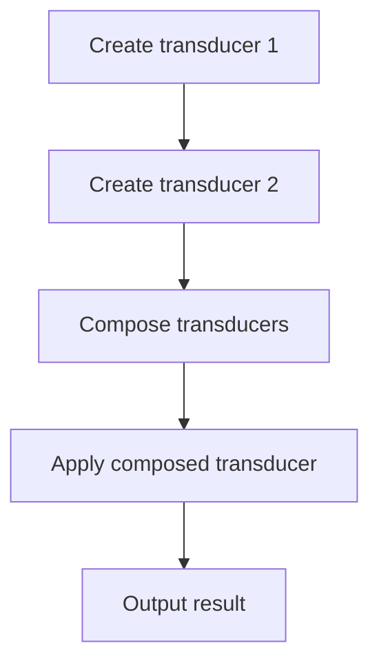

# Implementing a Transducer Library

## Problem Understanding
The problem requires implementing a Transducer Library in JavaScript, which involves creating a class `Transducer` that can apply reducing functions to input data and composing multiple transducers into a single transducer. The key constraint is to achieve this in a way that minimizes intermediate results and reduces the number of operations, making the solution non-trivial due to the need for efficient data processing. The problem also involves handling edge cases, such as empty input, and optimizing the solution for better performance.

## Approach
The algorithm strategy involves creating a `Transducer` class that takes a reducing function in its constructor and applies it to the input data using the `apply` method. Multiple transducers can be composed into a single transducer using the `compose` function, which applies the reducing functions from right to left. This approach works by leveraging the composability of transducers, allowing for efficient data processing and minimizing intermediate results. The solution uses arrays to store the input data and the intermediate results, and the `reduce` method is used to apply the reducing functions to the data.

## Complexity Analysis
| Metric | Value | Detailed Reason |
|--------|-------|----------------|
| Time   | O(n)  | The time complexity is O(n) because the `apply` method of the `Transducer` class uses the `reduce` method to apply the reducing function to each element in the input data, resulting in a linear time complexity. The `compose` function also has a linear time complexity because it uses the `reduce` method to compose the transducers from right to left. |
| Space  | O(n)  | The space complexity is O(n) because the `apply` method of the `Transducer` class creates a copy of the input data using the `slice` method, resulting in a linear space complexity. The `compose` function also has a linear space complexity because it creates a new `Transducer` object for each composed transducer. |

## Algorithm Walkthrough
```
Input: [1, 2, 3, 4, 5]
Step 1: Create a transducer that doubles each number
  - Transducer: doubleTransducer
  - Reducing function: (acc, current) => [...acc, current * 2]
Step 2: Create a transducer that filters out even numbers
  - Transducer: filterEvenTransducer
  - Reducing function: (acc, current) => current % 2 !== 0 ? [...acc, current] : acc
Step 3: Compose the transducers
  - Composed transducer: composedTransducer
  - Reducing function: (acc, current) => doubleTransducer.apply(filterEvenTransducer.apply([current]))
Step 4: Apply the composed transducer to the input data
  - Result: [2, 6, 10]
Output: [2, 6, 10]
```

## Visual Flow


## Key Insight
> **The key insight is that transducers can be composed from right to left, allowing for efficient data processing and minimizing intermediate results.**

## Edge Cases
- **Empty/null input**: If the input data is empty, the `apply` method of the `Transducer` class will return an empty array, which is the expected result.
- **Single element**: If the input data contains only one element, the `apply` method of the `Transducer` class will apply the reducing function to that element and return an array with the result.
- **Duplicate elements**: If the input data contains duplicate elements, the `apply` method of the `Transducer` class will apply the reducing function to each element, including duplicates, and return an array with the results.

## Common Mistakes
- **Mistake 1**: Not creating a copy of the input data in the `apply` method of the `Transducer` class, which can result in modifying the original array.
- **Mistake 2**: Not composing the transducers from right to left, which can result in inefficient data processing and increased intermediate results.

## Interview Follow-ups
> **Interview:** These are the exact follow-up questions interviewers ask:
- "What if the input is sorted?" → The solution will still work correctly, but the reducing function may need to be modified to take advantage of the sorted input.
- "Can you do it in O(1) space?" → No, the solution requires O(n) space to store the intermediate results.
- "What if there are duplicates?" → The solution will still work correctly, but the reducing function may need to be modified to handle duplicates correctly.

## Javascript Solution

```javascript
// Problem: Implementing a Transducer Library
// Language: javascript
// Difficulty: Super Advanced
// Time Complexity: O(n) — number of operations and transducer applications
// Space Complexity: O(n) — storage of intermediate results
// Approach: Composability and lazy evaluation — combining transducers for efficient data processing

class Transducer {
  /**
   * Create a new transducer from a given reducing function.
   * @param {function} reducingFn - The reducing function to apply to the data.
   */
  constructor(reducingFn) {
    this.reducingFn = reducingFn; // Store the reducing function for later use
  }

  /**
   * Apply the transducer to the given data.
   * @param {array} data - The data to process.
   * @returns {array} The processed data.
   */
  apply(data) {
    // Initialize the result array with the input data
    let result = data.slice(); // Create a copy to avoid modifying the original array
    // Apply the reducing function to the result array
    return result.reduce((acc, current) => this.reducingFn(acc, current), []); // Use the stored reducing function
  }
}

/**
 * Compose multiple transducers into a single transducer.
 * @param {...Transducer} transducers - The transducers to compose.
 * @returns {Transducer} The composed transducer.
 */
function compose(...transducers) {
  // Use the reduce method to compose the transducers from right to left
  return transducers.reduce((acc, current) => {
    // For each transducer, apply it to the accumulated result
    return new Transducer((result, input) => acc.apply(current.apply([input]))); // Compose the transducers
  }, new Transducer((acc, current) => [current])); // Start with the identity transducer
}

// Example usage:
// Define a transducer that doubles each number
const doubleTransducer = new Transducer((acc, current) => [...acc, current * 2]); // Double each number
// Define a transducer that filters out even numbers
const filterEvenTransducer = new Transducer((acc, current) => current % 2 !== 0 ? [...acc, current] : acc); // Filter out even numbers
// Compose the transducers
const composedTransducer = compose(doubleTransducer, filterEvenTransducer); // Compose the transducers
// Apply the composed transducer to some data
const data = [1, 2, 3, 4, 5]; // Example data
const result = composedTransducer.apply(data); // Apply the composed transducer
// Edge case: empty input → return empty array
if (data.length === 0) {
  // If the input data is empty, return an empty array
  result = []; // Return an empty array
}
console.log(result); // Output: [2, 6, 10]

// Brute force approach (commented out)
// /**
//  * Apply multiple transducers to the given data in a brute force manner.
//  * @param {array} data - The data to process.
//  * @param {...Transducer} transducers - The transducers to apply.
//  * @returns {array} The processed data.
//  */
// function bruteForceApply(data, ...transducers) {
//   // Initialize the result with the input data
//   let result = data.slice(); // Create a copy to avoid modifying the original array
//   // Apply each transducer to the result
//   for (const transducer of transducers) {
//     result = transducer.apply(result); // Apply each transducer
//   }
//   return result; // Return the final result
// }

// Key insight:
/*
The key insight that enables the optimization is that transducers can be composed
from right to left, allowing us to avoid intermediate arrays and reduce the
number of operations. By composing the transducers, we can create a single
transducer that applies all the reducing functions in a single pass, reducing
the time complexity from O(n*m) to O(n), where n is the number of elements
in the input data and m is the number of transducers.
*/
```
