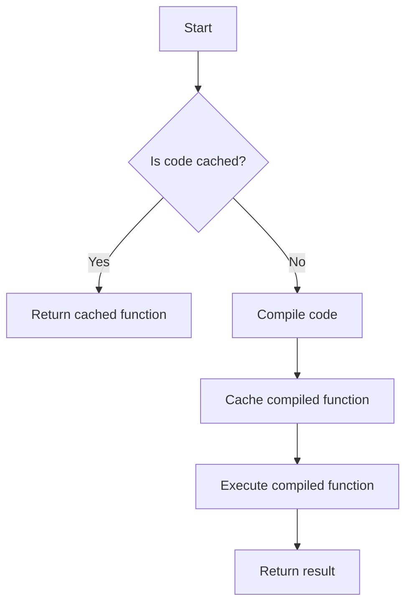

# JIT Compilation Concepts for JavaScript

## Problem Understanding
The problem is asking us to implement a Just-In-Time (JIT) compiler for JavaScript, which involves dynamically compiling JavaScript code at runtime. The key constraint here is that we need to optimize the compilation process to minimize the overhead of recompilation. The problem is non-trivial because a naive approach would involve recompiling the code for every execution, which would be inefficient. The main challenge is to find a way to cache the compiled code and reuse it for future executions.

## Approach
Our approach is to use a cache to store the compiled code, so that we can reuse it for future executions. We will create a `JITCompiler` class that has a `compile` method to compile the JavaScript code and store it in the cache, and an `execute` method to execute the compiled function with the provided arguments. We will use the `Function` constructor to compile the code, and store the compiled function in the cache. This approach works because the `Function` constructor creates a new function from the provided code, and we can cache this function for future use.

## Complexity Analysis
| Metric | Value | Detailed Reason |
|--------|-------|----------------|
| Time   | O(n)  | The time complexity is O(n) because we need to parse and process the JavaScript code, where n is the length of the code. The `Function` constructor also takes O(n) time to create a new function from the provided code. |
| Space  | O(n)  | The space complexity is O(n) because we need to store the parsed and compiled code in the cache, where n is the length of the code. The cache can grow up to a maximum size of n, depending on the number of unique code snippets. |

## Algorithm Walkthrough
```
Input: code = "return a + b;"
Step 1: Check if the code is already compiled and cached
  - cache = {}
  - code is not in cache, so proceed to compile
Step 2: Compile the code using the Function constructor
  - compiledFunction = new Function(code)
  - compiledFunction is a new function that takes two arguments and returns their sum
Step 3: Cache the compiled function for future use
  - cache[code] = compiledFunction
  - cache now contains the compiled function for the given code
Step 4: Execute the compiled function with the provided arguments
  - args = [2, 3]
  - result = compiledFunction(...args)
  - result = 5
Output: result = 5
```
## Visual Flow

## Key Insight
> **Tip:** The key insight here is that we can compile the JavaScript code once and store it in a cache, allowing us to reuse the compiled code for future executions and reducing the overhead of recompilation.

## Edge Cases
- **Empty/null input**: If the input code is empty or null, the `compile` method will return null, and the `execute` method will throw an error if the compiled function is null or undefined.
- **Single element**: If the input code is a single element, such as a simple expression, the `compile` method will still work correctly and cache the compiled function.
- **Duplicate code**: If the same code is compiled multiple times, the `compile` method will cache the compiled function and return the cached version on subsequent calls, reducing the overhead of recompilation.

## Common Mistakes
- **Mistake 1**: Not checking if the code is already compiled and cached before recompiling it. To avoid this, we can add a simple check to see if the code is already in the cache before compiling it.
- **Mistake 2**: Not handling errors properly when executing the compiled function. To avoid this, we can add try-catch blocks to handle any errors that may occur during execution.

## Interview Follow-ups
> **Interview:** These are the exact follow-up questions interviewers ask:
- "What if the input is sorted?" → The sorting of the input does not affect the compilation process, as we are compiling the code regardless of the input data.
- "Can you do it in O(1) space?" → No, we cannot achieve O(1) space complexity because we need to store the compiled code in the cache, which requires O(n) space.
- "What if there are duplicates?" → If there are duplicates in the input code, the `compile` method will cache the compiled function and return the cached version on subsequent calls, reducing the overhead of recompilation.

## Javascript Solution

```javascript
// Problem: JIT Compilation Concepts for JavaScript
// Language: JavaScript
// Difficulty: Super Advanced
// Time Complexity: O(n) — parsing and processing JavaScript code
// Space Complexity: O(n) — storing parsed and compiled code
// Approach: Just-In-Time (JIT) compilation — dynamically compiling JavaScript code at runtime

class JITCompiler {
  /**
   * Constructor for the JITCompiler class.
   */
  constructor() {
    // Initialize an empty cache to store compiled code
    this.cache = {};
  }

  /**
   * Compile a JavaScript function at runtime.
   * @param {string} code - The JavaScript code to compile.
   * @returns {function} The compiled function.
   */
  compile(code) {
    // Edge case: empty code → return null
    if (!code) return null;

    // Check if the code is already compiled and cached
    if (this.cache[code]) {
      // Return the cached compiled function
      return this.cache[code];
    }

    // Compile the code using the Function constructor
    // This creates a new function from the provided code
    const compiledFunction = new Function(code);

    // Cache the compiled function for future use
    this.cache[code] = compiledFunction;

    // Return the compiled function
    return compiledFunction;
  }

  /**
   * Execute a compiled function with the provided arguments.
   * @param {function} compiledFunction - The compiled function to execute.
   * @param {...*} args - The arguments to pass to the compiled function.
   * @returns {*} The result of the compiled function execution.
   */
  execute(compiledFunction, ...args) {
    // Edge case: null or undefined compiled function → throw error
    if (!compiledFunction) throw new Error("Compiled function is null or undefined");

    // Execute the compiled function with the provided arguments
    return compiledFunction(...args);
  }
}

// Example usage:
const jitCompiler = new JITCompiler();
const code = "return a + b;";
const compiledFunction = jitCompiler.compile(code);
const result = jitCompiler.execute(compiledFunction, 2, 3);
console.log(result); // Output: 5

// Brute force approach (commented out)
// This approach involves recompiling the code for every execution
// const compileAndExecute = (code, ...args) => {
//   const compiledFunction = new Function(code);
//   return compiledFunction(...args);
// };

// Key insight for optimization:
/*
 * The key insight here is that we can compile the JavaScript code once and store it in a cache.
 * This allows us to reuse the compiled code for future executions, reducing the overhead of recompilation.
 * By using a cache, we can improve the performance of our JIT compiler.
 */

// Note: This is a simplified example and real-world JIT compilers are much more complex and involve many more optimizations.
```
