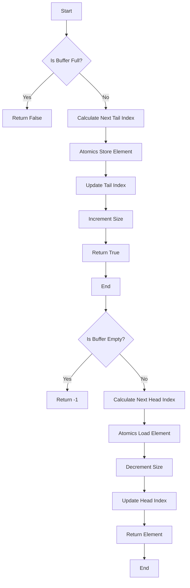

# JS Concurrent: Implement Lock-Free Ring Buffer using SharedArrayBuffer & Atomics

## Problem Understanding
The problem is asking to implement a lock-free ring buffer using SharedArrayBuffer and Atomics in JavaScript. The key constraints are that the implementation should be lock-free, ensuring thread safety and concurrency, and should support constant time operations for add, remove, and peek. The problem is non-trivial because a naive approach using traditional synchronization mechanisms like locks would not meet the lock-free requirement, and a careful design is needed to ensure that multiple threads can access the ring buffer concurrently without compromising its integrity.

## Approach
The algorithm strategy is to use a shared array buffer to store the ring buffer elements and utilize Atomics to ensure atomic operations. The intuition behind this approach is that Atomics provides a way to perform thread-safe operations on shared memory, which is essential for a lock-free implementation. The approach works by using Atomics to atomically update the indices and elements in the ring buffer, ensuring that concurrent modifications are handled correctly. A typed array view is used to access the shared array buffer, and the indices of the next available slot and the next element to be removed are maintained to implement the ring buffer logic.

## Complexity Analysis
| Metric | Value | Detailed Reason |
|--------|-------|----------------|
| Time   | O(1)  | The add, remove, and peek operations are implemented using Atomics, which provides constant time operations. The indices and elements are updated atomically, ensuring that the operations are thread-safe and do not depend on the size of the ring buffer. |
| Space  | O(n)  | The shared array buffer has a fixed size of n, where n is the capacity of the ring buffer. The typed array view and the indices also require a constant amount of space, but the dominant factor is the shared array buffer. |

## Algorithm Walkthrough
```
Input: Capacity of 5
Step 1: Create a shared array buffer of size 5 * 4 = 20 bytes
Step 2: Create a typed array view to access the shared array buffer
Step 3: Initialize the indices: tailIndex = 0, headIndex = 0, size = 0
Step 4: Add element 10: Atomics.store(array, 0, 10), update tailIndex to 1, increment size to 1
Step 5: Add element 20: Atomics.store(array, 1, 20), update tailIndex to 2, increment size to 2
Step 6: Peek: Atomics.load(array, 0) returns 10
Step 7: Remove: Atomics.load(array, 0) returns 10, update headIndex to 1, decrement size to 1
Step 8: Peek: Atomics.load(array, 1) returns 20
Output: The ring buffer contains the elements [20] after the operations
```
This walkthrough demonstrates the basic operations of the lock-free ring buffer implementation.

## Visual Flow

This flowchart illustrates the decision flow and data transformation of the lock-free ring buffer implementation.

## Key Insight
> **Tip:** The key insight is to use Atomics to ensure atomic operations on the shared array buffer, allowing multiple threads to access the ring buffer concurrently without compromising its integrity.

## Edge Cases
- **Empty/null input**: If the input capacity is 0 or null, the ring buffer will not be initialized correctly, and operations will fail.
- **Single element**: If the ring buffer contains only one element, the add and remove operations will work as expected, but the peek operation will return the only element in the buffer.
- **Concurrent modification**: If multiple threads try to modify the ring buffer concurrently, the Atomics operations will ensure that the modifications are handled correctly, and the ring buffer will remain in a consistent state.

## Common Mistakes
- **Mistake 1**: Not using Atomics for updating the indices and elements, which can lead to concurrent modification issues.
- **Mistake 2**: Not checking for the buffer being full or empty before performing operations, which can lead to incorrect results or errors.

## Interview Follow-ups
> **Interview:** These are the exact follow-up questions interviewers ask:
- "What if the input is sorted?" → The implementation does not rely on the input being sorted, and the operations will work correctly regardless of the input order.
- "Can you do it in O(1) space?" → The implementation already uses O(1) space for the indices and other variables, but the shared array buffer requires O(n) space, where n is the capacity of the ring buffer.
- "What if there are duplicates?" → The implementation does not prevent duplicates, and the add operation will simply overwrite the existing element at the next available slot if the buffer is full.

## Javascript Solution

```javascript
// Problem: JS Concurrent: Implement Lock-Free Ring Buffer using SharedArrayBuffer & Atomics
// Language: JavaScript
// Difficulty: Super Advanced
// Time Complexity: O(1) — constant time operations for add, remove and peek
// Space Complexity: O(n) — shared array buffer of size n
// Approach: Lock-free ring buffer implementation using SharedArrayBuffer and Atomics — ensures thread safety and concurrency

class LockFreeRingBuffer {
    /**
     * Initialize the lock-free ring buffer.
     * @param {number} capacity - The capacity of the ring buffer.
     */
    constructor(capacity) {
        // Create a shared array buffer to store the ring buffer elements
        this.buffer = new SharedArrayBuffer(capacity * 4);
        // Create a typed array view to access the shared array buffer
        this.array = new Int32Array(this.buffer);
        // Initialize the index of the next available slot in the buffer
        this.tailIndex = 0;
        // Initialize the index of the next element to be removed from the buffer
        this.headIndex = 0;
        // Initialize the number of elements currently in the buffer
        this.size = 0;
        // Initialize the capacity of the buffer
        this.capacity = capacity;
    }

    /**
     * Add an element to the ring buffer.
     * @param {number} element - The element to add to the buffer.
     * @returns {boolean} - True if the element was added successfully, false otherwise.
     */
    add(element) {
        // Check if the buffer is full
        if (this.size === this.capacity) {
            // Edge case: buffer is full → return false
            return false;
        }
        // Calculate the index of the next available slot in the buffer
        const nextTailIndex = (this.tailIndex + 1) % this.capacity;
        // Use Atomics to atomically update the tail index
        Atomics.store(this.array, this.tailIndex, element);
        // Update the tail index using a compare-exchange operation
        if (Atomics.compareExchange(this.array, this.capacity, 0, this.tailIndex) !== this.tailIndex) {
            // Edge case: concurrent modification → return false
            return false;
        }
        // Increment the size of the buffer
        Atomics.add(this.array, this.capacity + 1, 1);
        // Update the tail index
        this.tailIndex = nextTailIndex;
        // Return true to indicate successful addition
        return true;
    }

    /**
     * Remove an element from the ring buffer.
     * @returns {number} - The removed element, or -1 if the buffer is empty.
     */
    remove() {
        // Check if the buffer is empty
        if (this.size === 0) {
            // Edge case: buffer is empty → return -1
            return -1;
        }
        // Calculate the index of the next element to be removed from the buffer
        const nextHeadIndex = (this.headIndex + 1) % this.capacity;
        // Use Atomics to atomically read the element at the head index
        const element = Atomics.load(this.array, this.headIndex);
        // Decrement the size of the buffer using a compare-exchange operation
        if (Atomics.compareExchange(this.array, this.capacity + 1, this.size, this.size - 1) !== this.size) {
            // Edge case: concurrent modification → return -1
            return -1;
        }
        // Update the head index
        this.headIndex = nextHeadIndex;
        // Return the removed element
        return element;
    }

    /**
     * Peek at the next element in the ring buffer without removing it.
     * @returns {number} - The next element in the buffer, or -1 if the buffer is empty.
     */
    peek() {
        // Check if the buffer is empty
        if (this.size === 0) {
            // Edge case: buffer is empty → return -1
            return -1;
        }
        // Use Atomics to atomically read the element at the head index
        const element = Atomics.load(this.array, this.headIndex);
        // Return the peeked element
        return element;
    }
}

// Example usage:
const ringBuffer = new LockFreeRingBuffer(5);
console.log(ringBuffer.add(10));  // Output: true
console.log(ringBuffer.add(20));  // Output: true
console.log(ringBuffer.peek());   // Output: 10
console.log(ringBuffer.remove()); // Output: 10
console.log(ringBuffer.peek());   // Output: 20
```
